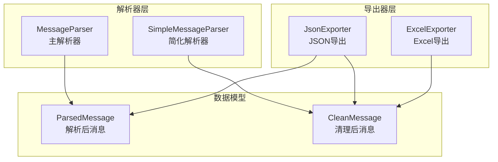
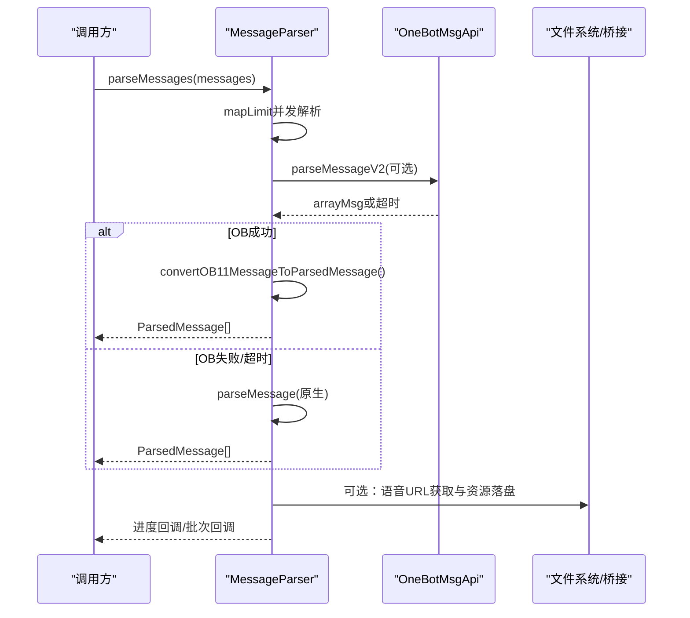
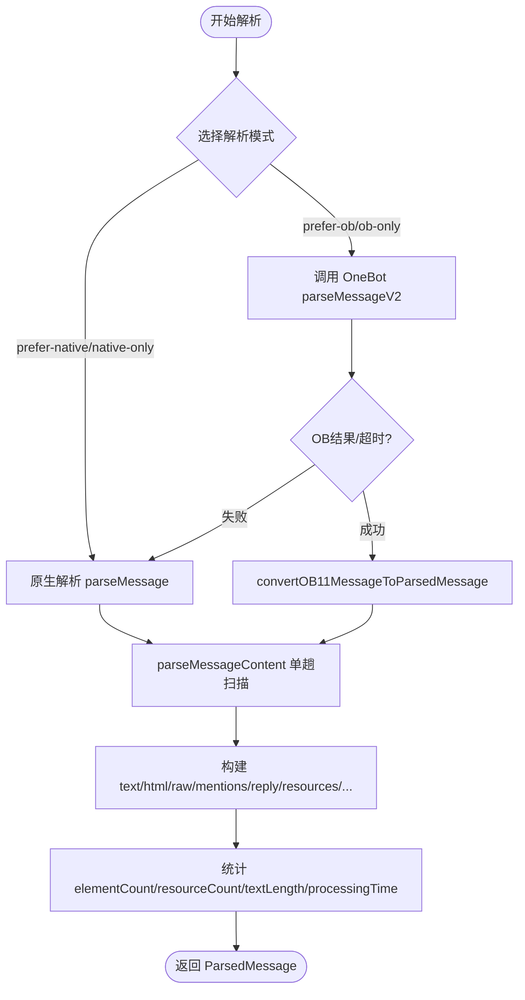
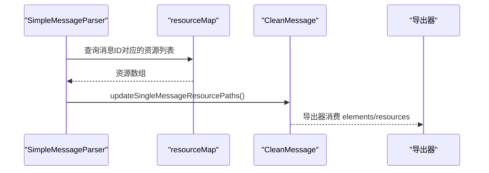
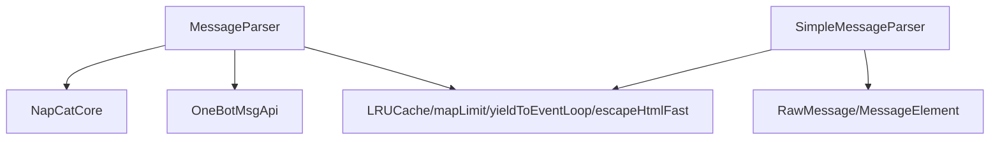

# 消息解析

<cite>
**本文档引用的文件**
- [MessageParser.ts](file://plugins/qq-chat-exporter/lib/core/parser/MessageParser.ts)
- [SimpleMessageParser.ts](file://plugins/qq-chat-exporter/lib/core/parser/SimpleMessageParser.ts)
- [MessageParser.d.ts](file://plugins/qq-chat-exporter/dist/core/parser/MessageParser.d.ts)
- [SimpleMessageParser.d.ts](file://plugins/qq-chat-exporter/dist/core/parser/SimpleMessageParser.d.ts)
- [ExcelExporter.ts](file://plugins/qq-chat-exporter/lib/core/exporter/ExcelExporter.ts)
- [JsonExporter.ts](file://plugins/qq-chat-exporter/lib/core/exporter/JsonExporter.ts)
- [JsonExporter.js](file://plugins/qq-chat-exporter/dist/core/exporter/JsonExporter.js)
</cite>

## 目录
1. [简介](#简介)
2. [项目结构](#项目结构)
3. [核心组件](#核心组件)
4. [架构总览](#架构总览)
5. [详细组件分析](#详细组件分析)
6. [依赖关系分析](#依赖关系分析)
7. [性能考量](#性能考量)
8. [故障排查指南](#故障排查指南)
9. [结论](#结论)
10. [附录](#附录)

## 简介
本文件聚焦于消息解析模块，系统性阐述 MessageParser 与 SimpleMessageParser 的架构设计与实现机制，覆盖多格式消息处理、富文本与HTML生成、特殊字符转义、Markdown语法支持、资源路径更新、以及扩展与自定义解析器支持。文档同时提供解析流程的可视化图示与最佳实践建议，帮助开发者快速理解并高效使用该模块。

## 项目结构
消息解析模块位于插件工程的 core/parser 目录下，主要包含两类解析器：
- MessageParser：功能完备、支持 OneBot 回退、内存控制、流式分批解析的主解析器
- SimpleMessageParser：轻量、高并发、面向导出器的简化解析器



图表来源
- [MessageParser.ts](file://plugins/qq-chat-exporter/lib/core/parser/MessageParser.ts#L415-L622)
- [SimpleMessageParser.ts](file://plugins/qq-chat-exporter/lib/core/parser/SimpleMessageParser.ts#L244-L312)
- [ExcelExporter.ts](file://plugins/qq-chat-exporter/lib/core/exporter/ExcelExporter.ts#L420-L477)
- [JsonExporter.ts](file://plugins/qq-chat-exporter/lib/core/exporter/JsonExporter.ts#L897-L916)

章节来源
- [MessageParser.ts](file://plugins/qq-chat-exporter/lib/core/parser/MessageParser.ts#L1-L120)
- [SimpleMessageParser.ts](file://plugins/qq-chat-exporter/lib/core/parser/SimpleMessageParser.ts#L1-L120)

## 核心组件
- MessageParser：支持高并发、分批流式解析、OneBot 回退、LRU 引用索引、内存软限制与周期性 GC；可生成 text/html/raw 三类内容，并提取 mentions/reply/resources/emojis/location/card/multiForward/calendar/special 等丰富元数据。
- SimpleMessageParser：专注导出场景，提供 parseMessages/parseMessagesStream/parseSingleMessage 等接口，内置 HTML 转义、资源路径更新、纯媒体过滤、统计计算等能力。

章节来源
- [MessageParser.ts](file://plugins/qq-chat-exporter/lib/core/parser/MessageParser.ts#L415-L622)
- [SimpleMessageParser.ts](file://plugins/qq-chat-exporter/lib/core/parser/SimpleMessageParser.ts#L244-L364)
- [MessageParser.d.ts](file://plugins/qq-chat-exporter/dist/core/parser/MessageParser.d.ts#L127-L192)
- [SimpleMessageParser.d.ts](file://plugins/qq-chat-exporter/dist/core/parser/SimpleMessageParser.d.ts#L67-L121)

## 架构总览
MessageParser 采用“原生解析 + OneBot 回退”的双轨策略，支持多种消息类型与复杂嵌套元素的统一建模；SimpleMessageParser 则以“高并发 + 有序输出 + 流式生成器”为核心，兼顾内存占用与性能。



图表来源
- [MessageParser.ts](file://plugins/qq-chat-exporter/lib/core/parser/MessageParser.ts#L500-L573)
- [MessageParser.ts](file://plugins/qq-chat-exporter/lib/core/parser/MessageParser.ts#L629-L670)

章节来源
- [MessageParser.ts](file://plugins/qq-chat-exporter/lib/core/parser/MessageParser.ts#L575-L670)

## 详细组件分析

### MessageParser 主解析器
- 并发与流式：mapLimit 保持顺序的并发执行；parseMessagesStream 支持分批回调，适合大数据量场景。
- OneBot 回退：当配置为 prefer-native/prefer-ob/native-only/ob-only 时，自动选择解析路径并在超时或失败时回退。
- 引用解析：维护 LRU messageMap，支持 replyElement 的多维度查找（replayMsgId/msgSeq/clientSeq/records）。
- 内容提取：统一解析 text/html/raw/mentions/reply/resources/emojis/location/card/multiForward/calendar/special。
- 性能优化：ChunkedBuilder、escapeHtmlFast、LRU 缓存、周期性 yieldToEventLoop、可选 GC 与内存软限制。



图表来源
- [MessageParser.ts](file://plugins/qq-chat-exporter/lib/core/parser/MessageParser.ts#L500-L573)
- [MessageParser.ts](file://plugins/qq-chat-exporter/lib/core/parser/MessageParser.ts#L916-L953)
- [MessageParser.ts](file://plugins/qq-chat-exporter/lib/core/parser/MessageParser.ts#L958-L1370)

章节来源
- [MessageParser.ts](file://plugins/qq-chat-exporter/lib/core/parser/MessageParser.ts#L916-L1370)
- [MessageParser.d.ts](file://plugins/qq-chat-exporter/dist/core/parser/MessageParser.d.ts#L100-L192)

### SimpleMessageParser 简化解析器
- 高并发与有序输出：parseMessages 使用 mapLimit 并发解析，保持输入顺序。
- 流式生成器：parseMessagesStream 逐条产出，适合边解析边导出的低内存场景。
- 元素解析：parseElement 对 text/face/market_face/pic/file/video/ptt/reply/multiForward/ark/grayTip/long_msg/av_record/markdown/giphy/inline_keyboard/calendar/yolo_game_result/face_bubble/tofu_record/task_top_msg 等进行统一建模。
- HTML 与文本：elementToText 将各元素转换为 text/html 片段；escapeHtmlFast 提升转义性能。
- 资源路径更新：updateResourcePaths/updateSingleMessageResourcePaths 支持按类型顺序匹配资源并修正本地路径与URL。
- 纯媒体过滤与统计：isPureMediaMessage/filterMessages/calculateStatistics 提供导出前的数据清洗与统计能力。

```mermaid
classDiagram
class SimpleMessageParser {
+parseMessages(messages) CleanMessage[]
+parseMessagesStream(messages, resourceMap) AsyncGenerator
+parseSingleMessage(message) CleanMessage
-parseMessage(message) CleanMessage
-parseMessageContent(elements) MessageContent
-parseElement(element, message) MessageElementData
-elementToText(element, htmlEnabled) {text, html}
-extractResource(element) ResourceData
-updateResourcePaths(messages, resourceMap) void
-updateSingleMessageResourcePaths(message, resources) void
-isPureMediaMessage(message) boolean
-calculateStatistics(messages) MessageStatistics
}
```

图表来源
- [SimpleMessageParser.ts](file://plugins/qq-chat-exporter/lib/core/parser/SimpleMessageParser.ts#L244-L364)
- [SimpleMessageParser.ts](file://plugins/qq-chat-exporter/lib/core/parser/SimpleMessageParser.ts#L445-L965)
- [SimpleMessageParser.ts](file://plugins/qq-chat-exporter/lib/core/parser/SimpleMessageParser.ts#L1139-L1209)

章节来源
- [SimpleMessageParser.ts](file://plugins/qq-chat-exporter/lib/core/parser/SimpleMessageParser.ts#L244-L965)
- [SimpleMessageParser.d.ts](file://plugins/qq-chat-exporter/dist/core/parser/SimpleMessageParser.d.ts#L67-L121)

### 富文本与HTML生成
- MessageParser：generateHtmlFromOB11 与 elementToText 在生成 HTML 时对文本进行 escapeHtmlFast，确保安全；支持 at/image/file/video/voice/reply/special 等段落的 HTML 输出。
- SimpleMessageParser：elementToText 为每种元素类型提供统一的 text/html 片段，便于导出器组合。

章节来源
- [MessageParser.ts](file://plugins/qq-chat-exporter/lib/core/parser/MessageParser.ts#L867-L906)
- [MessageParser.ts](file://plugins/qq-chat-exporter/lib/core/parser/MessageParser.ts#L976-L1351)
- [SimpleMessageParser.ts](file://plugins/qq-chat-exporter/lib/core/parser/SimpleMessageParser.ts#L853-L965)

### 特殊字符转义与安全
- escapeHtmlFast：单次扫描替换 &<>"'，避免多次正则匹配造成的性能损耗。
- HTML 生成时对文本内容进行转义，防止 XSS 与标签破坏。

章节来源
- [MessageParser.ts](file://plugins/qq-chat-exporter/lib/core/parser/MessageParser.ts#L144-L169)
- [MessageParser.ts](file://plugins/qq-chat-exporter/lib/core/parser/MessageParser.ts#L909-L911)

### Markdown语法支持
- MessageParser：ElementType.MARKDOWN 元素直接将内容写入 text/html。
- SimpleMessageParser：ElementType.MARKDOWN 元素同样支持，便于导出器渲染。

章节来源
- [MessageParser.ts](file://plugins/qq-chat-exporter/lib/core/parser/MessageParser.ts#L1252-L1257)
- [SimpleMessageParser.ts](file://plugins/qq-chat-exporter/lib/core/parser/SimpleMessageParser.ts#L705-L714)

### 资源路径更新与导出集成
- SimpleMessageParser.updateSingleMessageResourcePaths：按类型顺序匹配资源，修正 elements 与 resources 的 localPath/url，并保留类型子目录结构，便于导出器定位。
- ExcelExporter/JsonExporter：将解析结果转换为导出器期望的元素数组，包含 text/at/image/file/video/audio/markdown/json/location/calendar 等类型。



图表来源
- [SimpleMessageParser.ts](file://plugins/qq-chat-exporter/lib/core/parser/SimpleMessageParser.ts#L1139-L1209)
- [ExcelExporter.ts](file://plugins/qq-chat-exporter/lib/core/exporter/ExcelExporter.ts#L420-L477)
- [JsonExporter.js](file://plugins/qq-chat-exporter/dist/core/exporter/JsonExporter.js#L216-L227)

章节来源
- [SimpleMessageParser.ts](file://plugins/qq-chat-exporter/lib/core/parser/SimpleMessageParser.ts#L1139-L1209)
- [ExcelExporter.ts](file://plugins/qq-chat-exporter/lib/core/exporter/ExcelExporter.ts#L420-L477)
- [JsonExporter.ts](file://plugins/qq-chat-exporter/lib/core/exporter/JsonExporter.ts#L897-L916)

### 扩展机制与自定义解析器
- MessageParser：支持配置项（如 obMode/fallback/html/rawStrategy/progressEvery/yieldEvery/memorySoftLimitMB 等）灵活切换解析路径与行为；parseMessagesStream 支持外部 onBatch 回调，便于自定义导出流程。
- SimpleMessageParser：提供 parseMessagesStream 生成器接口，便于与自定义导出器对接；可通过 options 调整并发与进度输出。

章节来源
- [MessageParser.ts](file://plugins/qq-chat-exporter/lib/core/parser/MessageParser.ts#L380-L411)
- [MessageParser.ts](file://plugins/qq-chat-exporter/lib/core/parser/MessageParser.ts#L629-L670)
- [SimpleMessageParser.ts](file://plugins/qq-chat-exporter/lib/core/parser/SimpleMessageParser.ts#L226-L240)
- [SimpleMessageParser.ts](file://plugins/qq-chat-exporter/lib/core/parser/SimpleMessageParser.ts#L318-L357)

## 依赖关系分析
- MessageParser 依赖 NapCatCore 与 OneBotMsgApi，用于原生解析与 OneBot 回退；内部使用 LRUCache、mapLimit、yieldToEventLoop、escapeHtmlFast 等工具。
- SimpleMessageParser 依赖 RawMessage/MessageElement 类型，内部实现高性能字符串构建与 HTML 转义；通过资源映射表与文件系统路径修正实现资源导出。



图表来源
- [MessageParser.ts](file://plugins/qq-chat-exporter/lib/core/parser/MessageParser.ts#L415-L446)
- [SimpleMessageParser.ts](file://plugins/qq-chat-exporter/lib/core/parser/SimpleMessageParser.ts#L1-L120)

章节来源
- [MessageParser.ts](file://plugins/qq-chat-exporter/lib/core/parser/MessageParser.ts#L415-L446)
- [SimpleMessageParser.ts](file://plugins/qq-chat-exporter/lib/core/parser/SimpleMessageParser.ts#L1-L120)

## 性能考量
- 并发控制：resolveConcurrency 自适应 CPU 核心数；mapLimit 保持顺序的同时最大化吞吐。
- 内存管理：MessageParser 支持 messageIndexCapacity、gcBetweenBatches、memorySoftLimitMB、gcMinIntervalMs 等参数；SimpleMessageParser 通过流式生成器降低峰值内存。
- I/O 优化：ChunkedBuilder 减少字符串拼接开销；escapeHtmlFast 一次性扫描转义；fastJsonParse 优先使用 simdjson。
- 事件让渡：yieldToEventLoop 防止长时间占用事件循环，提升交互体验。

章节来源
- [MessageParser.ts](file://plugins/qq-chat-exporter/lib/core/parser/MessageParser.ts#L38-L59)
- [MessageParser.ts](file://plugins/qq-chat-exporter/lib/core/parser/MessageParser.ts#L474-L497)
- [SimpleMessageParser.ts](file://plugins/qq-chat-exporter/lib/core/parser/SimpleMessageParser.ts#L12-L55)

## 故障排查指南
- 解析失败：MessageParser/ SimpleMessageParser 均提供 createErrorMessage，将错误信息封装为标准 CleanMessage/ParsedMessage，便于导出器识别与后续处理。
- 引用解析异常：MessageParser 的 parseReplyElement 与 SimpleMessageParser 的 extractReplyContent 支持多维度查找被引用消息 ID，若仍失败，检查 messageMap 与 records 字段完整性。
- 资源路径缺失：使用 updateResourcePaths/updateSingleMessageResourcePaths 修正 elements/resources 的 localPath/url；确认资源映射表与类型子目录结构一致。
- OneBot 回退：当 ob-only 或超时时，MessageParser 会回退到原生解析；可通过配置项调整回退策略与超时时间。

章节来源
- [MessageParser.ts](file://plugins/qq-chat-exporter/lib/core/parser/MessageParser.ts#L1314-L1336)
- [SimpleMessageParser.ts](file://plugins/qq-chat-exporter/lib/core/parser/SimpleMessageParser.ts#L980-L1024)
- [MessageParser.ts](file://plugins/qq-chat-exporter/lib/core/parser/MessageParser.ts#L1374-L1412)
- [SimpleMessageParser.ts](file://plugins/qq-chat-exporter/lib/core/parser/SimpleMessageParser.ts#L1245-L1363)

## 结论
消息解析模块通过 MessageParser 与 SimpleMessageParser 的分工协作，实现了从高并发原生解析到轻量化导出适配的完整链路。其在性能、安全性与可扩展性方面均具备良好设计，能够稳定支撑大规模聊天数据的解析与导出需求。

## 附录
- 示例用法（以路径代替具体代码片段）
  - 使用 MessageParser 解析消息列表并流式写出
    - [parseMessages](file://plugins/qq-chat-exporter/lib/core/parser/MessageParser.ts#L580-L622)
    - [parseMessagesStream](file://plugins/qq-chat-exporter/lib/core/parser/MessageParser.ts#L629-L670)
  - 使用 SimpleMessageParser 解析消息列表与流式生成
    - [parseMessages](file://plugins/qq-chat-exporter/lib/core/parser/SimpleMessageParser.ts#L266-L312)
    - [parseMessagesStream](file://plugins/qq-chat-exporter/lib/core/parser/SimpleMessageParser.ts#L318-L357)
  - 导出器集成
    - [ExcelExporter.convertContentToElements](file://plugins/qq-chat-exporter/lib/core/exporter/ExcelExporter.ts#L420-L477)
    - [JsonExporter.convertParsedMessagesToCleanMessages](file://plugins/qq-chat-exporter/lib/core/exporter/JsonExporter.ts#L912-L916)
    - [JsonExporter.useFallbackParser](file://plugins/qq-chat-exporter/lib/core/exporter/JsonExporter.ts#L904-L907)