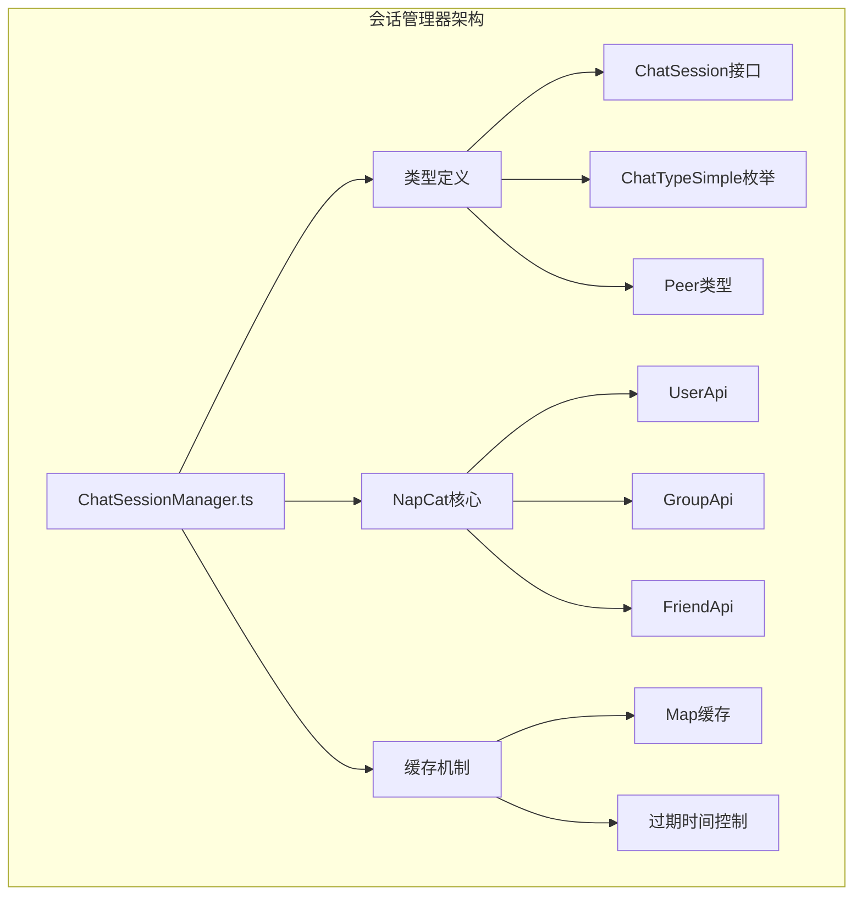
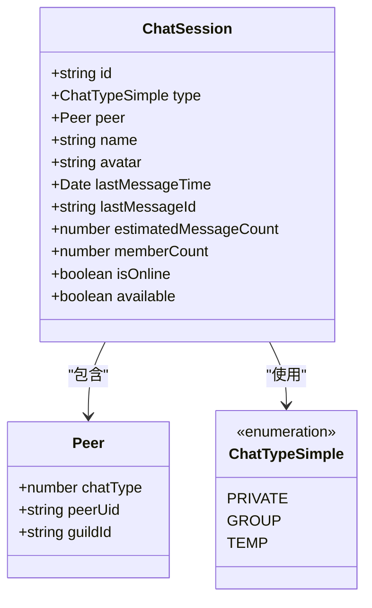
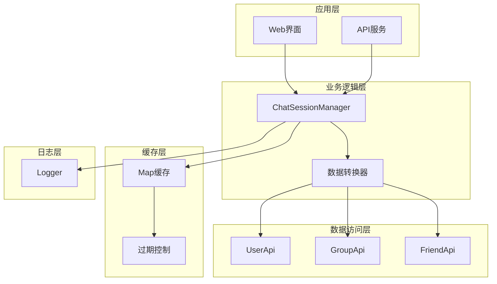
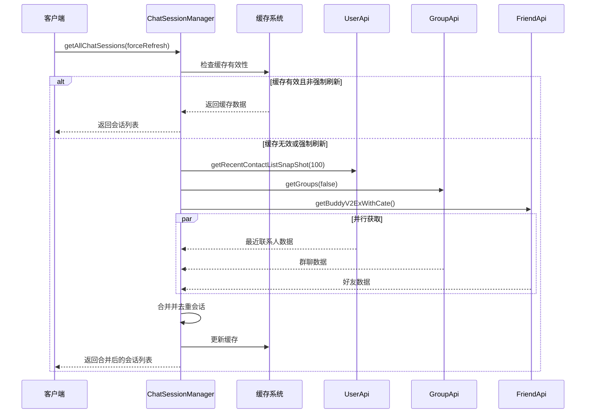
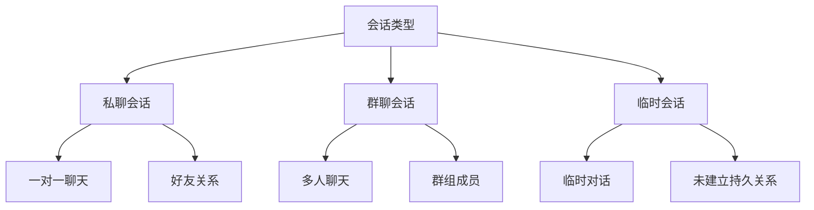
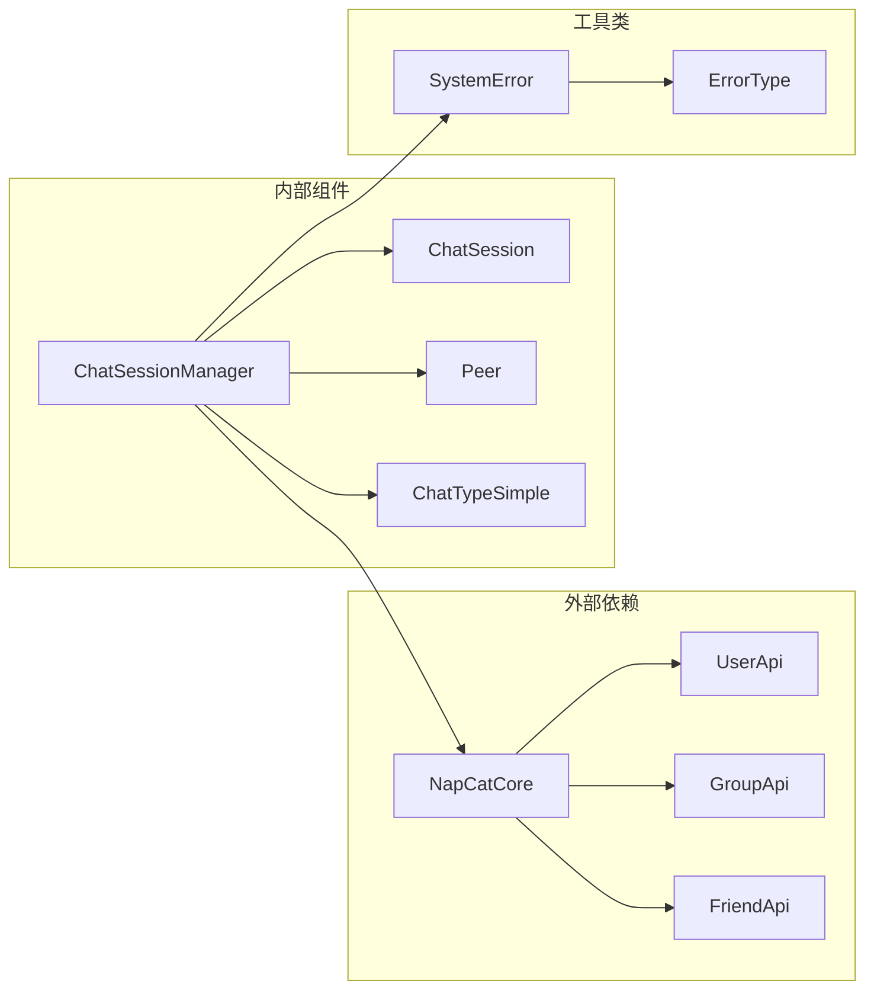

# 会话管理器

<cite>
**本文档引用的文件**
- [ChatSessionManager.ts](file://plugins/qq-chat-exporter/lib/core/chat/ChatSessionManager.ts)
- [index.ts](file://plugins/qq-chat-exporter/lib/types/index.ts)
- [use-session-filter.ts](file://qce-v4-tool/hooks/use-session-filter.ts)
- [session-list.tsx](file://qce-v4-tool/components/ui/session-list.tsx)
</cite>

## 目录
1. [简介](#简介)
2. [项目结构](#项目结构)
3. [核心组件](#核心组件)
4. [架构概览](#架构概览)
5. [详细组件分析](#详细组件分析)
6. [依赖关系分析](#依赖关系分析)
7. [性能考虑](#性能考虑)
8. [故障排除指南](#故障排除指南)
9. [结论](#结论)

## 简介

会话管理器是QQ聊天导出器项目中的核心组件，负责获取、管理和缓存QQ聊天会话信息。该组件提供了完整的会话管理功能，包括最近联系人、群聊和好友的统一管理，支持高效的缓存机制和灵活的数据获取策略。

会话管理器基于NapCat框架构建，通过底层API获取真实的聊天数据，并提供统一的会话格式化和查询接口。该组件在保证数据准确性的同时，优化了性能表现，为用户提供流畅的会话管理体验。

## 项目结构

会话管理器位于插件项目的聊天核心模块中，采用清晰的分层架构设计：



**图表来源**
- [ChatSessionManager.ts](file://plugins/qq-chat-exporter/lib/core/chat/ChatSessionManager.ts#L1-L353)
- [index.ts](file://plugins/qq-chat-exporter/lib/types/index.ts#L400-L426)

**章节来源**
- [ChatSessionManager.ts](file://plugins/qq-chat-exporter/lib/core/chat/ChatSessionManager.ts#L1-L353)
- [index.ts](file://plugins/qq-chat-exporter/lib/types/index.ts#L400-L426)

## 核心组件

### ChatSessionManager类

ChatSessionManager是会话管理器的核心类，提供了完整的会话管理功能：

#### 主要特性
- **多源数据聚合**：同时获取最近联系人、群聊和好友信息
- **智能缓存机制**：避免频繁调用API，提升性能
- **统一会话格式**：将不同来源的数据标准化为统一格式
- **灵活查询接口**：支持按ID查找和关键词搜索

#### 关键属性
- `sessionCache`: 会话缓存映射表
- `cacheExpiration`: 缓存过期时间（默认5分钟）
- `cacheTimestamp`: 缓存时间戳

**章节来源**
- [ChatSessionManager.ts](file://plugins/qq-chat-exporter/lib/core/chat/ChatSessionManager.ts#L15-L33)

### 会话数据模型

会话管理器使用统一的ChatSession接口来表示所有类型的聊天会话：



**图表来源**
- [index.ts](file://plugins/qq-chat-exporter/lib/types/index.ts#L400-L426)

**章节来源**
- [index.ts](file://plugins/qq-chat-exporter/lib/types/index.ts#L400-L426)

## 架构概览

会话管理器采用分层架构设计，确保了良好的模块化和可维护性：



**图表来源**
- [ChatSessionManager.ts](file://plugins/qq-chat-exporter/lib/core/chat/ChatSessionManager.ts#L1-L353)

### 数据流处理

会话管理器的数据流处理遵循以下模式：

1. **缓存检查**：首先检查缓存的有效性
2. **并行获取**：同时从多个API源获取数据
3. **数据合并**：合并并去重不同来源的会话
4. **格式化处理**：统一转换为标准会话格式
5. **缓存更新**：更新内存缓存和时间戳

**章节来源**
- [ChatSessionManager.ts](file://plugins/qq-chat-exporter/lib/core/chat/ChatSessionManager.ts#L42-L102)

## 详细组件分析

### getAllChatSessions方法详解

getAllChatSessions是会话管理器的核心方法，负责获取所有类型的聊天会话：



**图表来源**
- [ChatSessionManager.ts](file://plugins/qq-chat-exporter/lib/core/chat/ChatSessionManager.ts#L42-L102)

#### 方法执行流程

1. **缓存验证**：检查缓存是否有效（5分钟有效期）
2. **并行数据获取**：使用Promise.all并行获取三类数据
3. **数据合并策略**：
   - 最近联系人优先级最高
   - 群聊和好友在最近联系人不存在时添加
4. **缓存更新**：更新内存缓存和时间戳

**章节来源**
- [ChatSessionManager.ts](file://plugins/qq-chat-exporter/lib/core/chat/ChatSessionManager.ts#L42-L102)

### 会话ID格式规范

会话管理器采用统一的ID格式规范：

| 会话类型 | ID格式 | 示例 |
|---------|--------|------|
| 群聊 | `group_{groupCode}` | `group_123456789` |
| 私聊 | `private_{uid}` | `private_UiD123456` |

这种格式设计确保了：
- **唯一性**：通过前缀区分不同类型
- **可读性**：ID直接反映会话类型
- **兼容性**：与后续的消息处理逻辑无缝对接

**章节来源**
- [ChatSessionManager.ts](file://plugins/qq-chat-exporter/lib/core/chat/ChatSessionManager.ts#L162-L255)

### 会话类型分类

会话管理器支持三种主要的会话类型：



**图表来源**
- [index.ts](file://plugins/qq-chat-exporter/lib/types/index.ts#L45-L52)

**章节来源**
- [index.ts](file://plugins/qq-chat-exporter/lib/types/index.ts#L45-L52)

### 数据获取策略

会话管理器采用了多种数据获取策略来优化性能：

#### 1. 并行数据获取
使用Promise.all同时获取三类数据，显著减少总等待时间

#### 2. 智能缓存策略
- **5分钟缓存周期**：平衡数据新鲜度和性能
- **按需刷新**：支持强制刷新以获取最新数据
- **内存缓存**：使用Map结构提供O(1)查找性能

#### 3. 数据去重机制
通过会话ID进行去重，确保同一会话不会重复出现

**章节来源**
- [ChatSessionManager.ts](file://plugins/qq-chat-exporter/lib/core/chat/ChatSessionManager.ts#L54-L81)

### 性能优化措施

会话管理器实施了多项性能优化措施：

#### 内存管理
- **Map缓存**：使用高效的数据结构存储会话信息
- **及时清理**：提供clearCache方法手动清理缓存
- **内存监控**：通过getSessionStats提供缓存状态信息

#### 网络优化
- **并行请求**：同时发起多个API请求
- **错误隔离**：单个API失败不影响其他数据获取
- **降级处理**：API失败时返回空数组而非抛出异常

#### 计算优化
- **懒加载**：仅在需要时才刷新缓存
- **增量更新**：支持部分数据刷新
- **快速查找**：使用ID索引快速定位会话

**章节来源**
- [ChatSessionManager.ts](file://plugins/qq-chat-exporter/lib/core/chat/ChatSessionManager.ts#L325-L352)

## 依赖关系分析

会话管理器的依赖关系清晰明确，遵循单一职责原则：



**图表来源**
- [ChatSessionManager.ts](file://plugins/qq-chat-exporter/lib/core/chat/ChatSessionManager.ts#L7-L9)

### 外部依赖分析

会话管理器主要依赖于NapCat框架提供的API：

- **NapCatCore**：提供核心API访问能力
- **UserApi**：获取最近联系人信息
- **GroupApi**：获取群聊列表
- **FriendApi**：获取好友列表

### 内部依赖分析

组件间的依赖关系简洁明了：

- **类型依赖**：ChatSessionManager依赖类型定义
- **错误处理**：统一使用SystemError进行错误包装
- **日志系统**：集成到NapCat的日志框架

**章节来源**
- [ChatSessionManager.ts](file://plugins/qq-chat-exporter/lib/core/chat/ChatSessionManager.ts#L7-L9)

## 性能考虑

会话管理器在设计时充分考虑了性能因素：

### 缓存策略
- **过期时间**：5分钟的合理缓存周期平衡了数据新鲜度和性能
- **内存使用**：Map结构提供高效的键值存储
- **缓存统计**：提供getSessionStats方法监控缓存状态

### 并发处理
- **异步操作**：所有API调用都是异步的
- **Promise.all**：并行执行多个独立的API请求
- **错误隔离**：单个请求失败不影响整体性能

### 内存优化
- **及时释放**：提供clearCache方法清理内存
- **增量更新**：支持部分数据刷新而非全量更新
- **对象复用**：避免不必要的对象创建

## 故障排除指南

### 常见问题及解决方案

#### 1. 会话数据为空
**症状**：getAllChatSessions返回空数组
**可能原因**：
- NapCat连接失败
- API权限不足
- 网络连接问题

**解决方法**：
```typescript
// 检查会话统计信息
const stats = sessionManager.getSessionStats();
console.log(`总会话数: ${stats.total}`);
console.log(`缓存状态: ${stats.cached}`);
```

#### 2. 性能问题
**症状**：获取会话数据响应缓慢
**可能原因**：
- 缓存失效导致频繁API调用
- 网络延迟过高

**解决方法**：
```typescript
// 使用缓存数据
const sessions = await sessionManager.getAllChatSessions(false);

// 或者强制刷新缓存
await sessionManager.getAllChatSessions(true);
await sessionManager.clearCache();
```

#### 3. 错误处理
**症状**：API调用失败抛出异常
**解决方法**：
会话管理器自动捕获并记录错误，同时抛出SystemError异常

**章节来源**
- [ChatSessionManager.ts](file://plugins/qq-chat-exporter/lib/core/chat/ChatSessionManager.ts#L92-L101)

### 调试技巧

#### 日志分析
会话管理器提供了详细的日志输出：
- `[ChatSessionManager] 使用缓存数据` - 缓存命中
- `[ChatSessionManager] 获取最近联系人...` - 数据获取开始
- `[ChatSessionManager] 获取到 X 个最近联系人` - 数据获取完成

#### 性能监控
```typescript
// 获取会话统计信息
const stats = sessionManager.getSessionStats();
console.log(`缓存年龄: ${stats.cacheAge}ms`);
console.log(`群聊数量: ${stats.groups}`);
console.log(`私聊数量: ${stats.private}`);
```

## 结论

会话管理器作为QQ聊天导出器的核心组件，展现了优秀的架构设计和实现质量。其主要优势包括：

### 设计优势
- **模块化设计**：清晰的职责分离和依赖关系
- **高性能实现**：智能缓存和并行处理机制
- **易用性强**：简洁的API接口和完善的错误处理

### 功能完整性
- 支持多种会话类型（私聊、群聊、临时会话）
- 提供完整的数据获取和查询功能
- 实现了高效的缓存管理机制

### 可扩展性
- 基于NapCat框架，易于集成新的API功能
- 统一的数据格式便于后续功能扩展
- 清晰的架构为未来优化奠定基础

会话管理器为整个QQ聊天导出器项目提供了稳定可靠的基础，确保了用户能够获得流畅的会话管理体验。