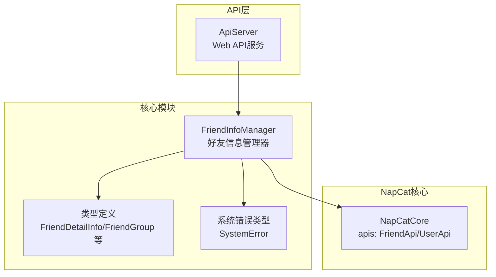
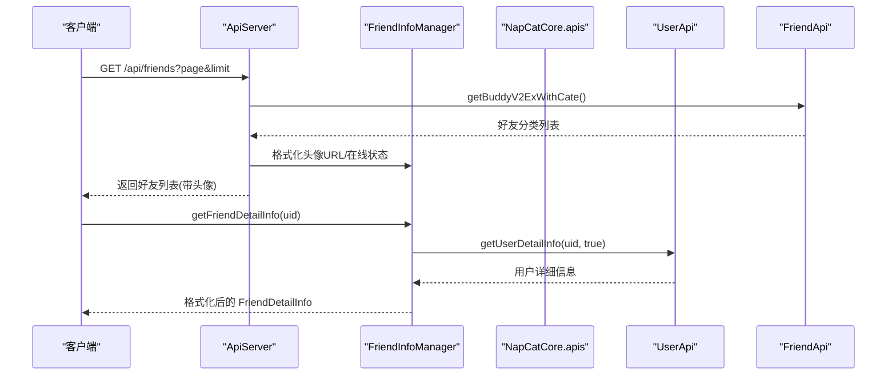
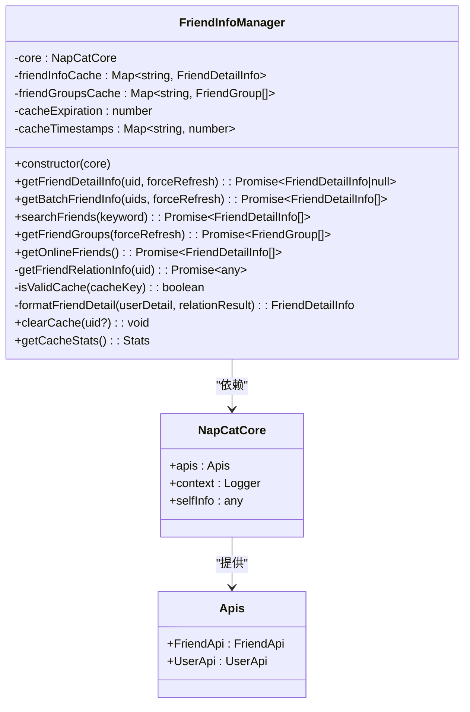
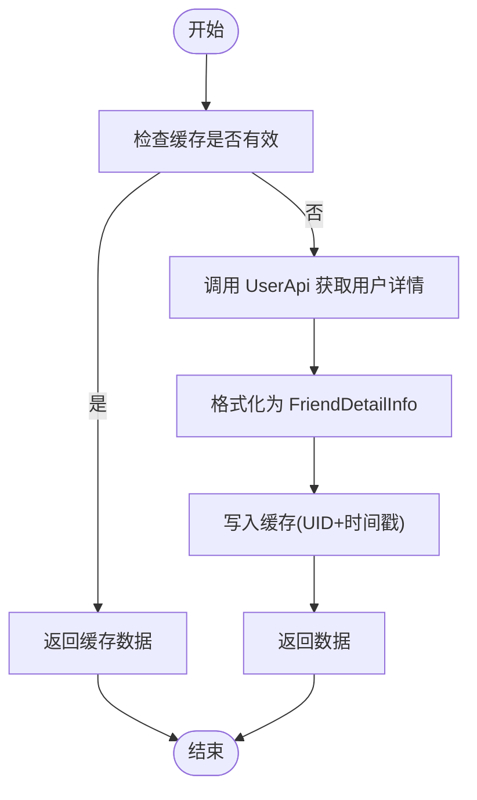
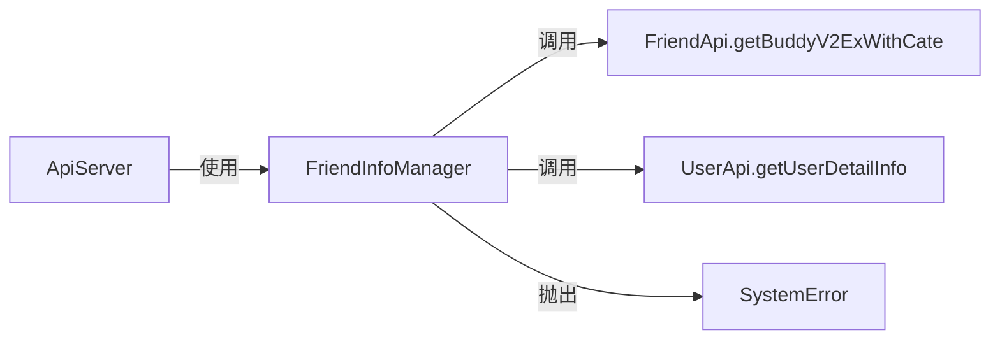

# 好友信息管理

<cite>
**本文引用的文件**
- [FriendInfoManager.ts](file://plugins/qq-chat-exporter/lib/core/chat/FriendInfoManager.ts)
- [FriendInfoManager.d.ts](file://plugins/qq-chat-exporter/dist/core/chat/FriendInfoManager.d.ts)
- [ApiServer.ts](file://plugins/qq-chat-exporter/lib/api/ApiServer.ts)
- [index.ts](file://plugins/qq-chat-exporter/lib/types/index.ts)
- [gen-overlay.cjs](file://plugins/qq-chat-exporter/tools/gen-overlay.cjs)
</cite>

## 目录
1. [简介](#简介)
2. [项目结构](#项目结构)
3. [核心组件](#核心组件)
4. [架构总览](#架构总览)
5. [详细组件分析](#详细组件分析)
6. [依赖关系分析](#依赖关系分析)
7. [性能考量](#性能考量)
8. [故障排查指南](#故障排查指南)
9. [结论](#结论)
10. [附录](#附录)

## 简介
本文件面向“好友信息管理”模块，围绕 FriendInfoManager 类进行系统性技术文档整理，覆盖以下主题：
- 好友信息的获取、缓存与更新机制
- 好友头像处理、昵称获取、个性签名管理
- 好友列表获取 API 的使用与数据格式化
- 在线状态管理与头像 URL 处理
- 具体代码示例的路径指引（不直接展示代码）
- 数据同步策略与性能优化措施

该模块基于 NapCat 核心能力，通过 FriendApi 与 UserApi 获取好友基础信息与详细资料，并对返回数据进行统一格式化与缓存管理。

## 项目结构
与好友信息管理相关的关键文件与职责如下：
- FriendInfoManager.ts：核心实现，负责好友信息获取、缓存、格式化与查询
- FriendInfoManager.d.ts：类型声明，定义对外暴露的方法与数据结构
- ApiServer.ts：提供 Web API 层，用于对外暴露好友列表与头像等信息
- index.ts：系统错误与通用类型定义，用于异常处理与上下文传递
- gen-overlay.cjs：NapCat 核心类型生成工具，确保 FriendApi/UserApi 类型可用

图表来源
- [FriendInfoManager.ts](file://plugins/qq-chat-exporter/lib/core/chat/FriendInfoManager.ts#L134-L525)
- [FriendInfoManager.d.ts](file://plugins/qq-chat-exporter/dist/core/chat/FriendInfoManager.d.ts#L127-L202)
- [ApiServer.ts](file://plugins/qq-chat-exporter/lib/api/ApiServer.ts#L1479-L1502)
- [gen-overlay.cjs](file://plugins/qq-chat-exporter/tools/gen-overlay.cjs#L281-L301)

章节来源
- [FriendInfoManager.ts](file://plugins/qq-chat-exporter/lib/core/chat/FriendInfoManager.ts#L1-L525)
- [FriendInfoManager.d.ts](file://plugins/qq-chat-exporter/dist/core/chat/FriendInfoManager.d.ts#L1-L203)
- [ApiServer.ts](file://plugins/qq-chat-exporter/lib/api/ApiServer.ts#L1479-L1502)
- [gen-overlay.cjs](file://plugins/qq-chat-exporter/tools/gen-overlay.cjs#L281-L301)

## 核心组件
- FriendInfoManager：提供好友详细信息获取、批量获取、搜索、在线好友筛选、分组信息获取与缓存管理
- FriendDetailInfo/FriendGroup/FriendInteraction/FriendExtInfo：标准化的好友信息数据模型
- NapCatCore.apis：FriendApi（好友列表）、UserApi（用户详情）等底层 API
- SystemError：统一的系统错误封装，便于上层捕获与处理

章节来源
- [FriendInfoManager.ts](file://plugins/qq-chat-exporter/lib/core/chat/FriendInfoManager.ts#L134-L525)
- [FriendInfoManager.d.ts](file://plugins/qq-chat-exporter/dist/core/chat/FriendInfoManager.d.ts#L127-L202)
- [index.ts](file://plugins/qq-chat-exporter/lib/types/index.ts#L481-L506)

## 架构总览
FriendInfoManager 作为核心控制器，协调 NapCat 的 FriendApi 与 UserApi，结合本地缓存与格式化逻辑，向上层提供统一的好友信息服务；同时，ApiServer 将好友列表与头像等信息通过 HTTP 接口暴露给外部系统。

图表来源
- [ApiServer.ts](file://plugins/qq-chat-exporter/lib/api/ApiServer.ts#L1479-L1502)
- [FriendInfoManager.ts](file://plugins/qq-chat-exporter/lib/core/chat/FriendInfoManager.ts#L164-L209)
- [gen-overlay.cjs](file://plugins/qq-chat-exporter/tools/gen-overlay.cjs#L281-L301)

## 详细组件分析

### FriendInfoManager 类设计与实现
- 职责边界清晰：专注好友信息的获取、缓存、格式化与查询
- 缓存策略：Map + 时间戳，10 分钟过期；支持按 UID 清除与全量清理
- 并发控制：批量获取采用分批（每批 10 个）+ 短延迟，避免触发风控
- 错误处理：统一抛出 SystemError，便于上层捕获与记录

图表来源
- [FriendInfoManager.ts](file://plugins/qq-chat-exporter/lib/core/chat/FriendInfoManager.ts#L134-L525)
- [gen-overlay.cjs](file://plugins/qq-chat-exporter/tools/gen-overlay.cjs#L281-L301)

章节来源
- [FriendInfoManager.ts](file://plugins/qq-chat-exporter/lib/core/chat/FriendInfoManager.ts#L134-L525)

### 好友信息获取与缓存更新机制
- 单条获取：优先命中缓存；未命中或强制刷新时调用 UserApi 获取详细资料，随后格式化并写入缓存
- 批量获取：分批并发（每批 10），避免瞬时高并发；对失败项进行降级处理（记录警告并跳过）
- 缓存有效性：基于时间戳判断，10 分钟有效期；支持按 UID 或全量清理

图表来源
- [FriendInfoManager.ts](file://plugins/qq-chat-exporter/lib/core/chat/FriendInfoManager.ts#L164-L209)

章节来源
- [FriendInfoManager.ts](file://plugins/qq-chat-exporter/lib/core/chat/FriendInfoManager.ts#L164-L209)

### 好友头像处理、昵称获取、个性签名管理
- 头像 URL：优先使用 UserApi 返回的 avatarUrl；若无，则由 ApiServer 生成默认头像 URL（基于 QQ 号）
- 昵称与备注：优先使用 nick，其次 nickname，最后回退为“用户+uin”
- 个性签名：优先使用 longNick/personalNote
- 在线状态映射：根据 status 数值映射为 online/busy/away/invisible/offline

章节来源
- [FriendInfoManager.ts](file://plugins/qq-chat-exporter/lib/core/chat/FriendInfoManager.ts#L401-L491)
- [ApiServer.ts](file://plugins/qq-chat-exporter/lib/api/ApiServer.ts#L1489-L1499)

### 好友列表获取 API 的使用
- 列表接口：/api/friends?page&limit，内部使用 FriendApi.getBuddyV2ExWithCate 获取完整好友列表
- 头像增强：在返回数据中附加 avatarUrl 字段，便于前端直接渲染
- 分页：对聚合后的好友列表进行分页切片

章节来源
- [ApiServer.ts](file://plugins/qq-chat-exporter/lib/api/ApiServer.ts#L1479-L1502)

### 好友信息格式化与数据模型
FriendDetailInfo/FriendGroup/FriendInteraction/FriendExtInfo 等接口定义了完整的数据模型，涵盖：
- 基础字段：uid/uin/nick/remark/avatarUrl/personalSign
- 个人属性：gender/age/birthday/constellation/bloodType/profession/company/school/hometown/location/email/mobile
- 等级与身份：qqLevel/vipLevel/isSuperVip/isBigVip
- 在线状态：isOnline/onlineStatus/clientType/lastOnlineTime/friendSince
- 互动与扩展：interaction/extInfo（包含认证、社交标签、兴趣爱好、空间权限、是否允许加好友、来源等）

章节来源
- [FriendInfoManager.d.ts](file://plugins/qq-chat-exporter/dist/core/chat/FriendInfoManager.d.ts#L10-L122)
- [FriendInfoManager.ts](file://plugins/qq-chat-exporter/lib/core/chat/FriendInfoManager.ts#L13-L128)

### 在线状态管理
- 获取在线好友：通过 FriendApi.getBuddyV2ExWithCate 获取完整列表，筛选 status.status === 1 的用户
- 并发获取详细信息：对在线好友集合执行并行获取，最终汇总为 FriendDetailInfo 列表
- 日志输出：记录在线好友数量与总好友数量的比例，便于监控

章节来源
- [FriendInfoManager.ts](file://plugins/qq-chat-exporter/lib/core/chat/FriendInfoManager.ts#L343-L366)

### 搜索好友与分组信息
- 搜索：基于昵称、备注、QQ 号、UID 进行模糊匹配；匹配后获取详细信息
- 分组：当前返回默认分组“我的好友”，并统计好友数量；后续可扩展为真实分组 API

章节来源
- [FriendInfoManager.ts](file://plugins/qq-chat-exporter/lib/core/chat/FriendInfoManager.ts#L259-L286)
- [FriendInfoManager.ts](file://plugins/qq-chat-exporter/lib/core/chat/FriendInfoManager.ts#L294-L336)

### 代码示例路径（不含具体代码）
- 获取单个好友详细信息
  - [getFriendDetailInfo(uid, forceRefresh)](file://plugins/qq-chat-exporter/lib/core/chat/FriendInfoManager.ts#L164-L209)
- 批量获取好友信息
  - [getBatchFriendInfo(uids, forceRefresh)](file://plugins/qq-chat-exporter/lib/core/chat/FriendInfoManager.ts#L218-L251)
- 搜索好友
  - [searchFriends(keyword)](file://plugins/qq-chat-exporter/lib/core/chat/FriendInfoManager.ts#L259-L286)
- 获取在线好友列表
  - [getOnlineFriends()](file://plugins/qq-chat-exporter/lib/core/chat/FriendInfoManager.ts#L343-L366)
- 获取好友分组信息
  - [getFriendGroups(forceRefresh)](file://plugins/qq-chat-exporter/lib/core/chat/FriendInfoManager.ts#L294-L336)
- 清除缓存
  - [clearCache(uid?)](file://plugins/qq-chat-exporter/lib/core/chat/FriendInfoManager.ts#L496-L509)
- 获取缓存统计
  - [getCacheStats()](file://plugins/qq-chat-exporter/lib/core/chat/FriendInfoManager.ts#L514-L524)

## 依赖关系分析
- 内部依赖
  - NapCatCore.apis.FriendApi：获取好友列表（含分类）
  - NapCatCore.apis.UserApi：获取用户详细信息
  - SystemError：统一错误封装
- 外部依赖
  - ApiServer：对外提供 /api/friends 接口，内部复用 FriendApi 与格式化逻辑

图表来源
- [FriendInfoManager.ts](file://plugins/qq-chat-exporter/lib/core/chat/FriendInfoManager.ts#L262-L276)
- [FriendInfoManager.ts](file://plugins/qq-chat-exporter/lib/core/chat/FriendInfoManager.ts#L177-L182)
- [index.ts](file://plugins/qq-chat-exporter/lib/types/index.ts#L481-L506)
- [ApiServer.ts](file://plugins/qq-chat-exporter/lib/api/ApiServer.ts#L1479-L1502)

章节来源
- [FriendInfoManager.ts](file://plugins/qq-chat-exporter/lib/core/chat/FriendInfoManager.ts#L134-L525)
- [index.ts](file://plugins/qq-chat-exporter/lib/types/index.ts#L481-L506)
- [ApiServer.ts](file://plugins/qq-chat-exporter/lib/api/ApiServer.ts#L1479-L1502)

## 性能考量
- 并发控制：批量获取采用分批（每批 10）+ 短延迟（200ms），降低请求压力
- 缓存命中：10 分钟有效期，减少重复网络请求；支持按需刷新
- 并行解析：获取用户详情与关系信息采用 Promise.allSettled，避免阻塞
- 日志与可观测：关键路径输出日志，便于定位性能瓶颈

章节来源
- [FriendInfoManager.ts](file://plugins/qq-chat-exporter/lib/core/chat/FriendInfoManager.ts#L222-L242)
- [FriendInfoManager.ts](file://plugins/qq-chat-exporter/lib/core/chat/FriendInfoManager.ts#L184-L187)
- [FriendInfoManager.ts](file://plugins/qq-chat-exporter/lib/core/chat/FriendInfoManager.ts#L391-L396)

## 故障排查指南
- 获取好友信息失败
  - 检查 UserApi 调用返回是否为空
  - 查看 SystemError 抛出的上下文（uid、operation）
  - 参考路径：[getFriendDetailInfo 错误分支](file://plugins/qq-chat-exporter/lib/core/chat/FriendInfoManager.ts#L199-L208)
- 批量获取异常
  - 观察分批循环与 Promise.all 的降级处理
  - 参考路径：[getBatchFriendInfo](file://plugins/qq-chat-exporter/lib/core/chat/FriendInfoManager.ts#L218-L251)
- 搜索无结果
  - 确认 FriendApi.getBuddyV2ExWithCate 是否返回完整列表
  - 检查关键字匹配逻辑（昵称/备注/号码/UID）
  - 参考路径：[searchFriends](file://plugins/qq-chat-exporter/lib/core/chat/FriendInfoManager.ts#L259-L286)
- 在线状态异常
  - 核对 status.status 数值映射
  - 参考路径：[formatFriendDetail 在线状态映射](file://plugins/qq-chat-exporter/lib/core/chat/FriendInfoManager.ts#L411-L433)
- 缓存问题
  - 使用 clearCache 清理指定 UID 或全量缓存
  - 使用 getCacheStats 查看缓存规模
  - 参考路径：[clearCache/getCacheStats](file://plugins/qq-chat-exporter/lib/core/chat/FriendInfoManager.ts#L496-L524)

章节来源
- [FriendInfoManager.ts](file://plugins/qq-chat-exporter/lib/core/chat/FriendInfoManager.ts#L199-L208)
- [FriendInfoManager.ts](file://plugins/qq-chat-exporter/lib/core/chat/FriendInfoManager.ts#L218-L251)
- [FriendInfoManager.ts](file://plugins/qq-chat-exporter/lib/core/chat/FriendInfoManager.ts#L259-L286)
- [FriendInfoManager.ts](file://plugins/qq-chat-exporter/lib/core/chat/FriendInfoManager.ts#L411-L433)
- [FriendInfoManager.ts](file://plugins/qq-chat-exporter/lib/core/chat/FriendInfoManager.ts#L496-L524)

## 结论
FriendInfoManager 通过规范化的数据模型、完善的缓存与并发控制策略，提供了稳定可靠的好友信息服务。配合 ApiServer 的 HTTP 接口，能够高效支撑前端展示与业务集成。建议在生产环境中：
- 合理使用 forceRefresh 刷新缓存
- 监控批量获取的失败率与日志
- 对外暴露的头像 URL 保持与 UserApi 返回一致，必要时回退默认头像策略

## 附录
- NapCat 核心类型来源：通过工具自动生成，确保 FriendApi/UserApi 类型可用
  - [NapCatCore 类型定义](file://plugins/qq-chat-exporter/tools/gen-overlay.cjs#L281-L301)