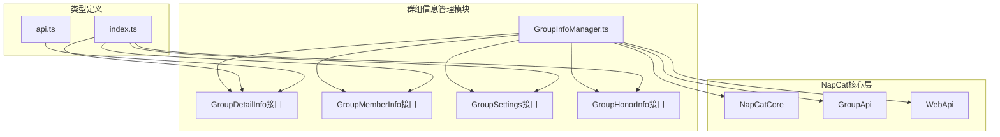
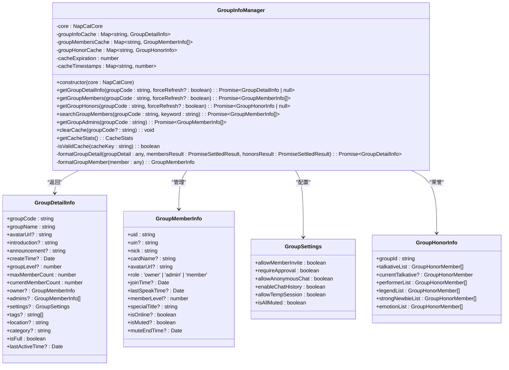
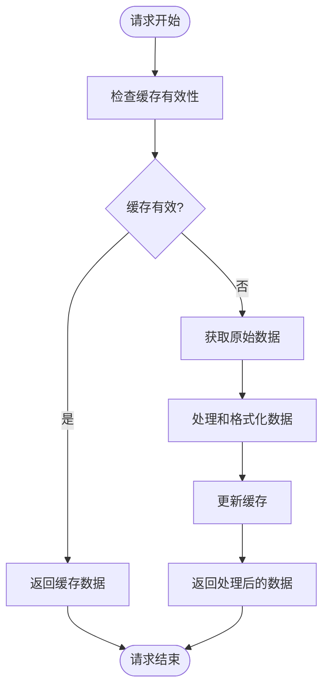
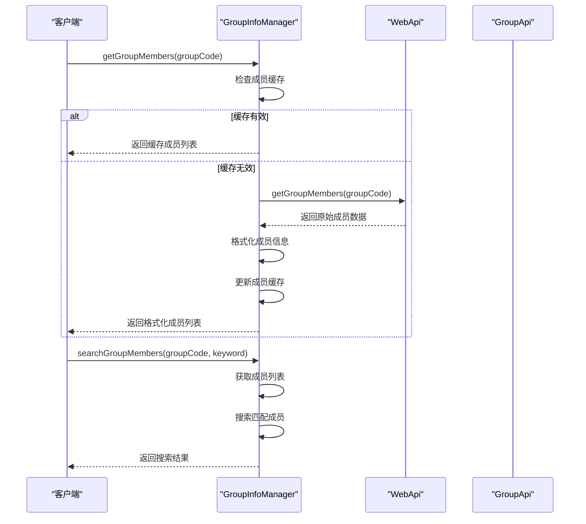
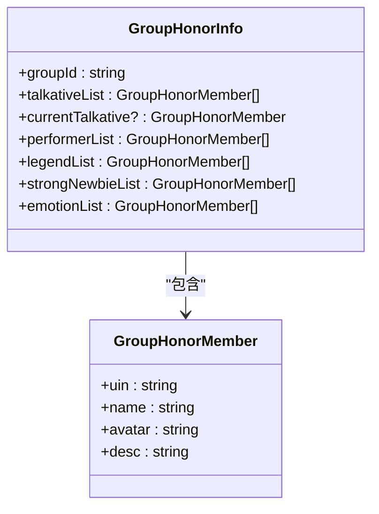
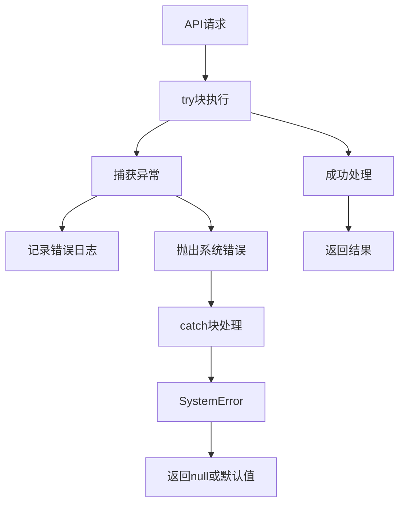
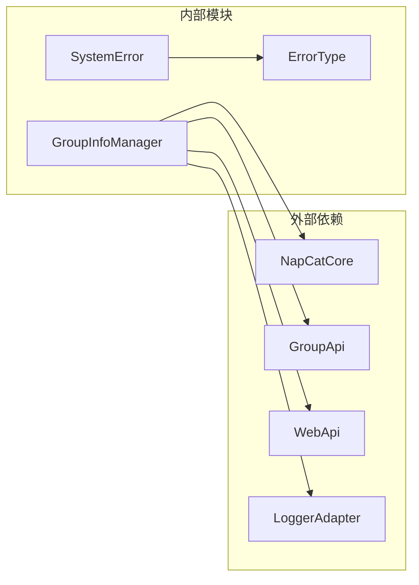
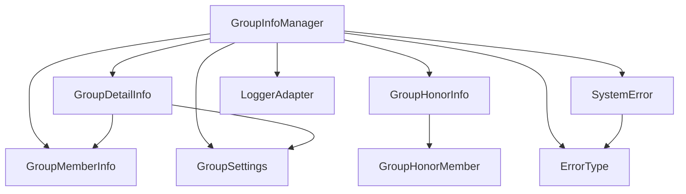

# 群组信息管理

<cite>
**本文档引用的文件**
- [GroupInfoManager.ts](file://plugins/qq-chat-exporter/lib/core/chat/GroupInfoManager.ts)
- [GroupInfoManager.js](file://plugins/qq-chat-exporter/dist/core/chat/GroupInfoManager.js)
- [index.ts](file://plugins/qq-chat-exporter/lib/types/index.ts)
- [ApiServer.js](file://plugins/qq-chat-exporter/dist/api/ApiServer.js)
- [api.ts](file://qce-v4-tool/types/api.ts)
</cite>

## 目录
1. [简介](#简介)
2. [项目结构](#项目结构)
3. [核心组件](#核心组件)
4. [架构概览](#架构概览)
5. [详细组件分析](#详细组件分析)
6. [依赖关系分析](#依赖关系分析)
7. [性能考虑](#性能考虑)
8. [故障排除指南](#故障排除指南)
9. [结论](#结论)

## 简介

群组信息管理模块是QQ聊天记录导出系统中的核心组件，负责获取和管理QQ群组的详细信息。该模块通过NapCat框架提供的底层API，为用户提供完整的群组数据获取能力，包括群成员管理、群设置配置、群荣誉信息等。

本模块采用现代化的TypeScript设计，提供了完整的类型安全保证和错误处理机制。通过智能缓存策略和并行数据获取优化，确保在高并发场景下的性能表现。

## 项目结构

群组信息管理模块位于插件项目的聊天核心模块中，与系统的其他核心组件紧密集成：



**图表来源**
- [GroupInfoManager.ts](file://plugins/qq-chat-exporter/lib/core/chat/GroupInfoManager.ts#L1-L50)
- [index.ts](file://plugins/qq-chat-exporter/lib/types/index.ts#L1-L50)

**章节来源**
- [GroupInfoManager.ts](file://plugins/qq-chat-exporter/lib/core/chat/GroupInfoManager.ts#L1-L80)
- [index.ts](file://plugins/qq-chat-exporter/lib/types/index.ts#L1-L100)

## 核心组件

### GroupInfoManager类

GroupInfoManager是整个群组信息管理模块的核心类，提供了以下主要功能：

- **群组详细信息获取**：通过NapCat的GroupApi获取群组基础信息
- **群成员管理**：获取、搜索和管理群成员信息
- **群荣誉信息**：获取群内各种荣誉和成就信息
- **缓存管理**：智能缓存策略确保性能优化
- **错误处理**：完善的错误捕获和系统化错误报告

### 主要接口定义

模块定义了多个核心接口来描述群组相关数据结构：

- **GroupDetailInfo**：群组详细信息接口
- **GroupMemberInfo**：群成员信息接口  
- **GroupSettings**：群组设置接口
- **GroupHonorInfo**：群荣誉信息接口

**章节来源**
- [GroupInfoManager.ts](file://plugins/qq-chat-exporter/lib/core/chat/GroupInfoManager.ts#L10-L137)
- [index.ts](file://plugins/qq-chat-exporter/lib/types/index.ts#L13-L48)

## 架构概览

群组信息管理模块采用分层架构设计，确保各组件职责清晰分离：



**图表来源**
- [GroupInfoManager.ts](file://plugins/qq-chat-exporter/lib/core/chat/GroupInfoManager.ts#L138-L477)
- [GroupInfoManager.ts](file://plugins/qq-chat-exporter/lib/core/chat/GroupInfoManager.ts#L13-L132)

## 详细组件分析

### 缓存策略设计

模块实现了智能的多级缓存策略，确保在高并发场景下的性能表现：



**图表来源**
- [GroupInfoManager.ts](file://plugins/qq-chat-exporter/lib/core/chat/GroupInfoManager.ts#L171-L217)

缓存特性：
- **10分钟过期时间**：平衡数据新鲜度和性能
- **三类独立缓存**：群组信息、成员信息、荣誉信息
- **智能失效检测**：基于时间戳的缓存有效性检查
- **强制刷新支持**：允许开发者强制刷新缓存

### 群成员管理功能

群成员管理是模块的核心功能之一，提供了完整的成员生命周期管理：



**图表来源**
- [GroupInfoManager.ts](file://plugins/qq-chat-exporter/lib/core/chat/GroupInfoManager.ts#L226-L337)

成员管理特性：
- **多种搜索方式**：支持昵称、群名片、QQ号、UID搜索
- **角色权限管理**：区分群主、管理员、普通成员
- **状态信息跟踪**：在线状态、禁言状态、发言时间等
- **实时信息获取**：通过WebAPI获取最详细的成员信息

### 群荣誉信息处理

模块支持获取群内的各种荣誉和成就信息：



**图表来源**
- [GroupInfoManager.ts](file://plugins/qq-chat-exporter/lib/core/chat/GroupInfoManager.ts#L100-L132)

荣誉类型包括：
- **龙王**：长期活跃成员
- **群聊之火**：活跃表演者
- **群聊炽焰**：传奇成员
- **冒尖小春笋**：新成员成就
- **快乐之源**：情感贡献者

### 错误处理机制

模块实现了完善的错误处理机制：



**图表来源**
- [GroupInfoManager.ts](file://plugins/qq-chat-exporter/lib/core/chat/GroupInfoManager.ts#L207-L217)

错误类型包括：
- **API调用错误**：网络请求失败
- **数据解析错误**：数据格式不正确
- **权限错误**：无权访问某些信息
- **超时错误**：请求响应超时

**章节来源**
- [GroupInfoManager.ts](file://plugins/qq-chat-exporter/lib/core/chat/GroupInfoManager.ts#L138-L477)
- [index.ts](file://plugins/qq-chat-exporter/lib/types/index.ts#L458-L506)

## 依赖关系分析

### 外部依赖

模块依赖于NapCat框架提供的核心API：



**图表来源**
- [GroupInfoManager.ts](file://plugins/qq-chat-exporter/lib/core/chat/GroupInfoManager.ts#L7-L8)

### 内部依赖关系

模块内部各组件之间的依赖关系：



**图表来源**
- [GroupInfoManager.ts](file://plugins/qq-chat-exporter/lib/core/chat/GroupInfoManager.ts#L13-L132)
- [index.ts](file://plugins/qq-chat-exporter/lib/types/index.ts#L458-L506)

**章节来源**
- [GroupInfoManager.ts](file://plugins/qq-chat-exporter/lib/core/chat/GroupInfoManager.ts#L1-L50)
- [index.ts](file://plugins/qq-chat-exporter/lib/types/index.ts#L431-L453)

## 性能考虑

### 缓存优化策略

模块采用了多层次的缓存优化策略：

1. **内存缓存**：使用Map结构存储缓存数据
2. **时间戳管理**：精确控制缓存失效时间
3. **并行数据获取**：使用Promise.allSettled并行获取多个数据源
4. **智能刷新机制**：支持强制刷新和自动缓存检测

### 并发处理

模块支持高并发场景下的稳定运行：

- **异步操作**：所有API调用都是异步的
- **Promise.allSettled**：即使部分请求失败也不会影响整体流程
- **错误隔离**：单个请求的失败不会影响其他请求

### 内存管理

- **缓存清理**：提供手动清理缓存的方法
- **统计信息**：提供缓存使用情况的统计信息
- **内存监控**：定期检查缓存大小防止内存泄漏

## 故障排除指南

### 常见问题及解决方案

#### 缓存相关问题

**问题**：获取的数据不是最新的
**解决方案**：使用`forceRefresh`参数强制刷新缓存
```typescript
const groupInfo = await groupInfoManager.getGroupDetailInfo(groupId, true);
```

**问题**：缓存占用过多内存
**解决方案**：清理特定群的缓存或清理所有缓存
```typescript
// 清理特定群缓存
groupInfoManager.clearCache(groupId);

// 清理所有缓存
groupInfoManager.clearCache();
```

#### API调用失败

**问题**：群组信息获取失败
**解决方案**：检查网络连接和权限设置，查看错误日志获取详细信息

**问题**：成员信息为空
**解决方案**：确认群组ID正确性，检查用户权限，尝试重新获取

### 调试技巧

1. **启用详细日志**：查看模块的调试日志输出
2. **检查缓存状态**：使用`getCacheStats()`获取缓存使用情况
3. **验证API权限**：确认NapCat实例具有足够的权限访问群组信息

**章节来源**
- [GroupInfoManager.ts](file://plugins/qq-chat-exporter/lib/core/chat/GroupInfoManager.ts#L441-L477)

## 结论

群组信息管理模块是一个设计精良、功能完整的群组数据管理组件。它通过以下特点确保了高质量的服务：

- **类型安全**：完整的TypeScript类型定义保证了编译时的安全性
- **性能优化**：智能缓存策略和并行数据获取确保了高性能
- **错误处理**：完善的错误处理机制提供了稳定的用户体验
- **扩展性**：清晰的架构设计便于功能扩展和维护

该模块为QQ聊天记录导出系统提供了坚实的群组数据基础，支持各种复杂的群组管理需求。通过合理使用缓存和错误处理机制，能够满足生产环境下的各种性能和稳定性要求。