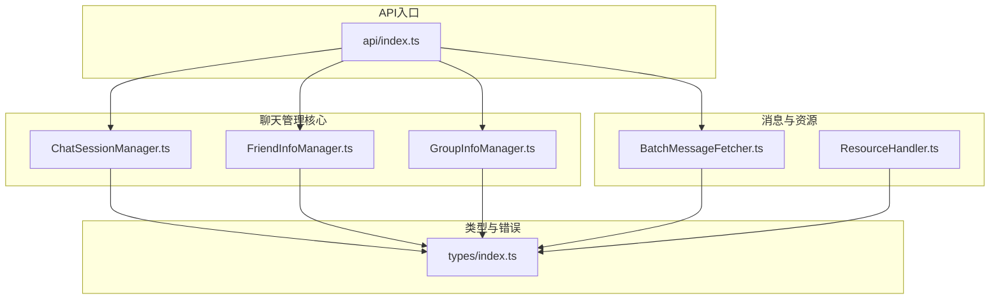
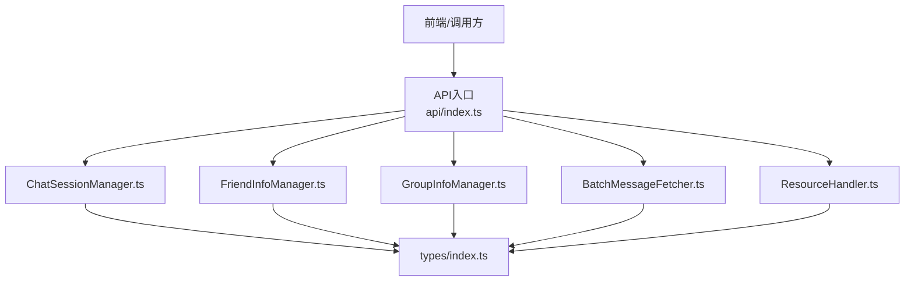
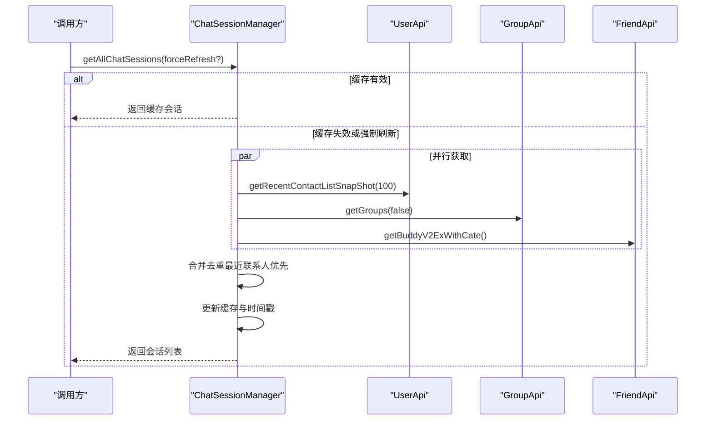
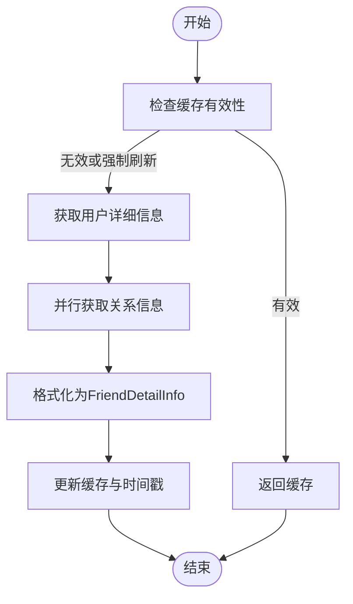
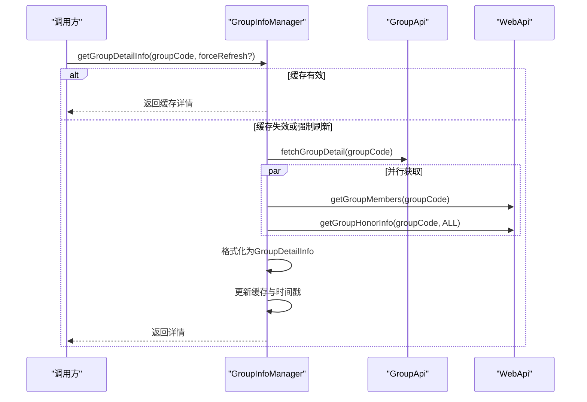
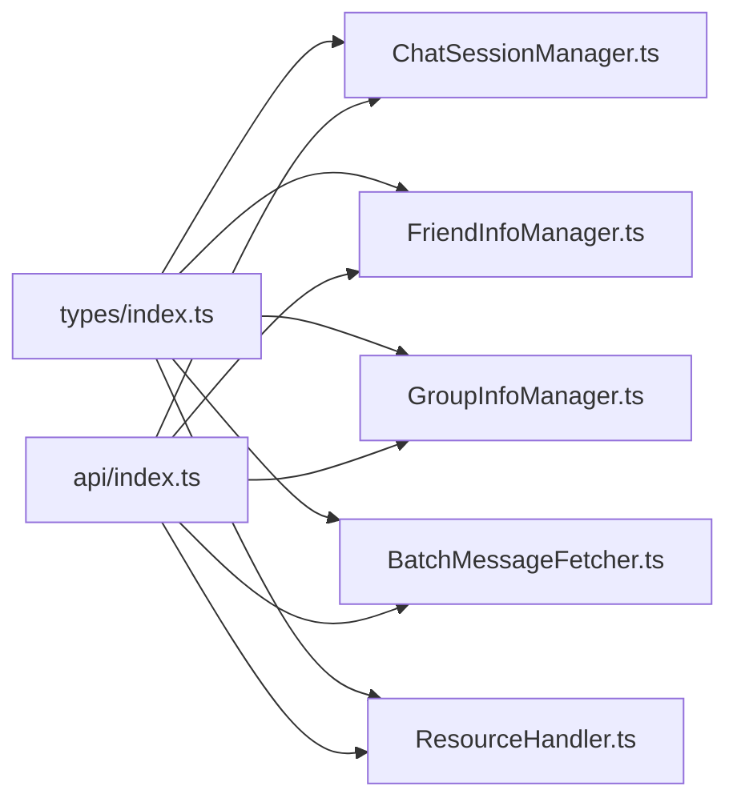

# 聊天管理

<cite>
**本文引用的文件**
- [ChatSessionManager.ts](file://plugins/qq-chat-exporter/lib/core/chat/ChatSessionManager.ts)
- [FriendInfoManager.ts](file://plugins/qq-chat-exporter/lib/core/chat/FriendInfoManager.ts)
- [GroupInfoManager.ts](file://plugins/qq-chat-exporter/lib/core/chat/GroupInfoManager.ts)
- [index.ts（类型定义）](file://plugins/qq-chat-exporter/lib/types/index.ts)
- [BatchMessageFetcher.ts](file://plugins/qq-chat-exporter/lib/core/fetcher/BatchMessageFetcher.ts)
- [ResourceHandler.ts](file://plugins/qq-chat-exporter/lib/core/resource/ResourceHandler.ts)
- [index.ts（API入口）](file://plugins/qq-chat-exporter/lib/api/index.ts)
</cite>

## 目录
1. [引言](#引言)
2. [项目结构](#项目结构)
3. [核心组件](#核心组件)
4. [架构总览](#架构总览)
5. [详细组件分析](#详细组件分析)
6. [依赖分析](#依赖分析)
7. [性能考量](#性能考量)
8. [故障排查指南](#故障排查指南)
9. [结论](#结论)
10. [附录](#附录)

## 引言
本文件面向“聊天管理”模块，系统性梳理并说明以下三类核心能力：
- 会话管理：通过 ChatSessionManager 统一获取与缓存最近联系人、群聊与好友会话，提供会话列表、按ID查询、搜索与统计能力。
- 好友信息管理：通过 FriendInfoManager 获取与缓存好友详细资料、在线状态、分组与互动信息，支持批量获取与搜索。
- 群组信息管理：通过 GroupInfoManager 获取与缓存群组详情、成员列表、群荣誉与设置，支持成员搜索与管理员提取。

同时，文档结合消息历史检索（BatchMessageFetcher）、资源处理（ResourceHandler）与类型定义（types），给出数据同步策略与性能优化建议，并提供使用示例与排障指引。

## 项目结构
围绕“聊天管理”的关键文件组织如下：
- 会话管理：ChatSessionManager.ts
- 好友信息：FriendInfoManager.ts
- 群组信息：GroupInfoManager.ts
- 类型与错误：types/index.ts
- 消息历史检索：core/fetcher/BatchMessageFetcher.ts
- 资源处理：core/resource/ResourceHandler.ts
- API入口：api/index.ts

**图表来源**
- [ChatSessionManager.ts](file://plugins/qq-chat-exporter/lib/core/chat/ChatSessionManager.ts#L1-L353)
- [FriendInfoManager.ts](file://plugins/qq-chat-exporter/lib/core/chat/FriendInfoManager.ts#L1-L525)
- [GroupInfoManager.ts](file://plugins/qq-chat-exporter/lib/core/chat/GroupInfoManager.ts#L1-L477)
- [index.ts（类型定义）](file://plugins/qq-chat-exporter/lib/types/index.ts#L400-L476)
- [BatchMessageFetcher.ts](file://plugins/qq-chat-exporter/lib/core/fetcher/BatchMessageFetcher.ts#L1-L200)
- [ResourceHandler.ts](file://plugins/qq-chat-exporter/lib/core/resource/ResourceHandler.ts#L1122-L1149)
- [index.ts（API入口）](file://plugins/qq-chat-exporter/lib/api/index.ts#L1-L35)

**章节来源**
- [ChatSessionManager.ts](file://plugins/qq-chat-exporter/lib/core/chat/ChatSessionManager.ts#L1-L353)
- [FriendInfoManager.ts](file://plugins/qq-chat-exporter/lib/core/chat/FriendInfoManager.ts#L1-L525)
- [GroupInfoManager.ts](file://plugins/qq-chat-exporter/lib/core/chat/GroupInfoManager.ts#L1-L477)
- [index.ts（类型定义）](file://plugins/qq-chat-exporter/lib/types/index.ts#L400-L476)
- [BatchMessageFetcher.ts](file://plugins/qq-chat-exporter/lib/core/fetcher/BatchMessageFetcher.ts#L1-L200)
- [ResourceHandler.ts](file://plugins/qq-chat-exporter/lib/core/resource/ResourceHandler.ts#L1122-L1149)
- [index.ts（API入口）](file://plugins/qq-chat-exporter/lib/api/index.ts#L1-L35)

## 核心组件
- ChatSessionManager：统一获取最近联系人、群聊与好友会话；合并去重；提供按ID查询、搜索与统计；内置5分钟缓存。
- FriendInfoManager：获取好友详细资料、在线状态、分组与互动信息；支持批量获取与搜索；10分钟缓存。
- GroupInfoManager：获取群组详情、成员、荣誉与设置；支持成员搜索与管理员提取；10分钟缓存。

上述组件均基于 NapCat 的底层 API，通过核心上下文的日志与错误封装，确保可观测性与稳定性。

**章节来源**
- [ChatSessionManager.ts](file://plugins/qq-chat-exporter/lib/core/chat/ChatSessionManager.ts#L42-L102)
- [FriendInfoManager.ts](file://plugins/qq-chat-exporter/lib/core/chat/FriendInfoManager.ts#L164-L217)
- [GroupInfoManager.ts](file://plugins/qq-chat-exporter/lib/core/chat/GroupInfoManager.ts#L171-L217)

## 架构总览
下图展示“聊天管理”在系统中的位置与交互关系：

**图表来源**
- [index.ts（API入口）](file://plugins/qq-chat-exporter/lib/api/index.ts#L1-L35)
- [ChatSessionManager.ts](file://plugins/qq-chat-exporter/lib/core/chat/ChatSessionManager.ts#L1-L353)
- [FriendInfoManager.ts](file://plugins/qq-chat-exporter/lib/core/chat/FriendInfoManager.ts#L1-L525)
- [GroupInfoManager.ts](file://plugins/qq-chat-exporter/lib/core/chat/GroupInfoManager.ts#L1-L477)
- [BatchMessageFetcher.ts](file://plugins/qq-chat-exporter/lib/core/fetcher/BatchMessageFetcher.ts#L1-L200)
- [ResourceHandler.ts](file://plugins/qq-chat-exporter/lib/core/resource/ResourceHandler.ts#L1122-L1149)
- [index.ts（类型定义）](file://plugins/qq-chat-exporter/lib/types/index.ts#L400-L476)

## 详细组件分析

### ChatSessionManager 会话管理器
职责与特性：
- 获取最近联系人、群聊与好友会话，合并去重，优先最近联系人。
- 并行拉取三大类会话，提升整体吞吐。
- 5分钟缓存，支持强制刷新与统计查询。
- 提供按ID查询与关键词搜索。

关键流程（获取全部会话）：

**图表来源**
- [ChatSessionManager.ts](file://plugins/qq-chat-exporter/lib/core/chat/ChatSessionManager.ts#L42-L102)
- [ChatSessionManager.ts](file://plugins/qq-chat-exporter/lib/core/chat/ChatSessionManager.ts#L108-L141)
- [ChatSessionManager.ts](file://plugins/qq-chat-exporter/lib/core/chat/ChatSessionManager.ts#L147-L191)
- [ChatSessionManager.ts](file://plugins/qq-chat-exporter/lib/core/chat/ChatSessionManager.ts#L196-L241)

使用示例（路径参考）：
- 获取全部会话：[getAllChatSessions](file://plugins/qq-chat-exporter/lib/core/chat/ChatSessionManager.ts#L42-L102)
- 按ID获取会话：[getChatSession](file://plugins/qq-chat-exporter/lib/core/chat/ChatSessionManager.ts#L281-L297)
- 搜索会话：[searchChatSessions](file://plugins/qq-chat-exporter/lib/core/chat/ChatSessionManager.ts#L305-L320)
- 清空缓存：[clearCache](file://plugins/qq-chat-exporter/lib/core/chat/ChatSessionManager.ts#L325-L329)
- 统计信息：[getSessionStats](file://plugins/qq-chat-exporter/lib/core/chat/ChatSessionManager.ts#L334-L352)

**章节来源**
- [ChatSessionManager.ts](file://plugins/qq-chat-exporter/lib/core/chat/ChatSessionManager.ts#L42-L102)
- [ChatSessionManager.ts](file://plugins/qq-chat-exporter/lib/core/chat/ChatSessionManager.ts#L108-L141)
- [ChatSessionManager.ts](file://plugins/qq-chat-exporter/lib/core/chat/ChatSessionManager.ts#L147-L191)
- [ChatSessionManager.ts](file://plugins/qq-chat-exporter/lib/core/chat/ChatSessionManager.ts#L196-L241)
- [ChatSessionManager.ts](file://plugins/qq-chat-exporter/lib/core/chat/ChatSessionManager.ts#L281-L297)
- [ChatSessionManager.ts](file://plugins/qq-chat-exporter/lib/core/chat/ChatSessionManager.ts#L305-L320)
- [ChatSessionManager.ts](file://plugins/qq-chat-exporter/lib/core/chat/ChatSessionManager.ts#L325-L329)
- [ChatSessionManager.ts](file://plugins/qq-chat-exporter/lib/core/chat/ChatSessionManager.ts#L334-L352)

### FriendInfoManager 好友信息管理
职责与特性：
- 获取好友详细资料（昵称、备注、头像、签名、等级、VIP、在线状态等）。
- 并行获取关系信息，格式化为统一结构。
- 批量获取控制并发与速率，避免触发风控。
- 支持按关键词搜索、获取在线好友、获取分组信息（基于分类API汇总）。

关键流程（批量获取好友信息）：

**图表来源**
- [FriendInfoManager.ts](file://plugins/qq-chat-exporter/lib/core/chat/FriendInfoManager.ts#L164-L217)
- [FriendInfoManager.ts](file://plugins/qq-chat-exporter/lib/core/chat/FriendInfoManager.ts#L218-L251)
- [FriendInfoManager.ts](file://plugins/qq-chat-exporter/lib/core/chat/FriendInfoManager.ts#L372-L386)
- [FriendInfoManager.ts](file://plugins/qq-chat-exporter/lib/core/chat/FriendInfoManager.ts#L401-L491)

使用示例（路径参考）：
- 获取好友详情：[getFriendDetailInfo](file://plugins/qq-chat-exporter/lib/core/chat/FriendInfoManager.ts#L164-L217)
- 批量获取好友：[getBatchFriendInfo](file://plugins/qq-chat-exporter/lib/core/chat/FriendInfoManager.ts#L218-L251)
- 搜索好友：[searchFriends](file://plugins/qq-chat-exporter/lib/core/chat/FriendInfoManager.ts#L259-L286)
- 获取在线好友：[getOnlineFriends](file://plugins/qq-chat-exporter/lib/core/chat/FriendInfoManager.ts#L343-L367)
- 获取好友分组：[getFriendGroups](file://plugins/qq-chat-exporter/lib/core/chat/FriendInfoManager.ts#L294-L336)
- 清空缓存：[clearCache](file://plugins/qq-chat-exporter/lib/core/chat/FriendInfoManager.ts#L496-L509)
- 统计信息：[getCacheStats](file://plugins/qq-chat-exporter/lib/core/chat/FriendInfoManager.ts#L514-L525)

**章节来源**
- [FriendInfoManager.ts](file://plugins/qq-chat-exporter/lib/core/chat/FriendInfoManager.ts#L164-L217)
- [FriendInfoManager.ts](file://plugins/qq-chat-exporter/lib/core/chat/FriendInfoManager.ts#L218-L251)
- [FriendInfoManager.ts](file://plugins/qq-chat-exporter/lib/core/chat/FriendInfoManager.ts#L259-L286)
- [FriendInfoManager.ts](file://plugins/qq-chat-exporter/lib/core/chat/FriendInfoManager.ts#L294-L336)
- [FriendInfoManager.ts](file://plugins/qq-chat-exporter/lib/core/chat/FriendInfoManager.ts#L343-L367)
- [FriendInfoManager.ts](file://plugins/qq-chat-exporter/lib/core/chat/FriendInfoManager.ts#L496-L509)
- [FriendInfoManager.ts](file://plugins/qq-chat-exporter/lib/core/chat/FriendInfoManager.ts#L514-L525)

### GroupInfoManager 群组信息管理
职责与特性：
- 获取群组详情（名称、公告、简介、成员上限、当前人数、设置、标签、位置、分类、活跃时间等）。
- 获取群成员列表（WebAPI，含角色、入群时间、最后发言、禁言状态等）。
- 获取群荣誉（龙王、群聊之火、传奇等榜单）。
- 支持成员搜索、管理员提取、缓存与统计。

关键流程（获取群组详情）：

**图表来源**
- [GroupInfoManager.ts](file://plugins/qq-chat-exporter/lib/core/chat/GroupInfoManager.ts#L171-L217)
- [GroupInfoManager.ts](file://plugins/qq-chat-exporter/lib/core/chat/GroupInfoManager.ts#L226-L260)
- [GroupInfoManager.ts](file://plugins/qq-chat-exporter/lib/core/chat/GroupInfoManager.ts#L269-L312)
- [GroupInfoManager.ts](file://plugins/qq-chat-exporter/lib/core/chat/GroupInfoManager.ts#L369-L407)

使用示例（路径参考）：
- 获取群详情：[getGroupDetailInfo](file://plugins/qq-chat-exporter/lib/core/chat/GroupInfoManager.ts#L171-L217)
- 获取群成员：[getGroupMembers](file://plugins/qq-chat-exporter/lib/core/chat/GroupInfoManager.ts#L226-L260)
- 获取群荣誉：[getGroupHonors](file://plugins/qq-chat-exporter/lib/core/chat/GroupInfoManager.ts#L269-L312)
- 搜索群成员：[searchGroupMembers](file://plugins/qq-chat-exporter/lib/core/chat/GroupInfoManager.ts#L321-L337)
- 获取管理员：[getGroupAdmins](file://plugins/qq-chat-exporter/lib/core/chat/GroupInfoManager.ts#L345-L354)
- 清空缓存：[clearCache](file://plugins/qq-chat-exporter/lib/core/chat/GroupInfoManager.ts#L441-L459)
- 统计信息：[getCacheStats](file://plugins/qq-chat-exporter/lib/core/chat/GroupInfoManager.ts#L464-L476)

**章节来源**
- [GroupInfoManager.ts](file://plugins/qq-chat-exporter/lib/core/chat/GroupInfoManager.ts#L171-L217)
- [GroupInfoManager.ts](file://plugins/qq-chat-exporter/lib/core/chat/GroupInfoManager.ts#L226-L260)
- [GroupInfoManager.ts](file://plugins/qq-chat-exporter/lib/core/chat/GroupInfoManager.ts#L269-L312)
- [GroupInfoManager.ts](file://plugins/qq-chat-exporter/lib/core/chat/GroupInfoManager.ts#L321-L337)
- [GroupInfoManager.ts](file://plugins/qq-chat-exporter/lib/core/chat/GroupInfoManager.ts#L345-L354)
- [GroupInfoManager.ts](file://plugins/qq-chat-exporter/lib/core/chat/GroupInfoManager.ts#L441-L459)
- [GroupInfoManager.ts](file://plugins/qq-chat-exporter/lib/core/chat/GroupInfoManager.ts#L464-L476)

### 数据模型与类型
- 会话信息：ChatSession（包含 id、type、peer、name、avatar、lastMessageTime、lastMessageId、estimatedMessageCount、memberCount、isOnline、available 等）。
- 好友信息：FriendDetailInfo（包含 uid、uin、昵称、备注、头像、个性签名、性别、年龄、生日、星座、血型、职业、公司、学校、家乡、现居地、邮箱、手机、QQ等级、VIP等级、是否为超级/大会员、是否在线、在线状态、客户端类型、最后在线时间、好友关系建立时间、互动信息、扩展信息等）。
- 群组信息：GroupDetailInfo（包含 groupCode、groupName、avatarUrl、introduction、announcement、createTime、groupLevel、maxMemberCount、currentMemberCount、owner、admins、settings、tags、location、category、isFull、lastActiveTime 等）。
- 群成员信息：GroupMemberInfo（包含 uid/uin、nick、cardName、avatarUrl、role、joinTime、lastSpeakTime、memberLevel、specialTitle、isOnline、isMuted、muteEndTime 等）。
- 群设置：GroupSettings（包含 allowMemberInvite、requireApproval、allowAnonymousChat、enableChatHistory、allowTempSession、isAllMuted）。
- 群荣誉：GroupHonorInfo（包含 talkativeList、currentTalkative、performerList、legendList、strongNewbieList、emotionList）。

**章节来源**
- [index.ts（类型定义）](file://plugins/qq-chat-exporter/lib/types/index.ts#L400-L476)
- [FriendInfoManager.ts](file://plugins/qq-chat-exporter/lib/core/chat/FriendInfoManager.ts#L13-L114)
- [GroupInfoManager.ts](file://plugins/qq-chat-exporter/lib/core/chat/GroupInfoManager.ts#L13-L98)

## 依赖分析
- 组件耦合
  - 三个管理器均依赖 NapCatCore 与各 API 模块（UserApi、GroupApi、WebApi、FriendApi）。
  - 通过 types/index.ts 中的类型与错误体系进行契约约束与异常包装。
- 外部依赖
  - API入口导出配置与静态资源路径，作为上层调用的统一入口。
  - BatchMessageFetcher 与 ResourceHandler 为消息与资源处理提供支撑，与聊天管理形成互补。

**图表来源**
- [index.ts（类型定义）](file://plugins/qq-chat-exporter/lib/types/index.ts#L400-L476)
- [ChatSessionManager.ts](file://plugins/qq-chat-exporter/lib/core/chat/ChatSessionManager.ts#L1-L353)
- [FriendInfoManager.ts](file://plugins/qq-chat-exporter/lib/core/chat/FriendInfoManager.ts#L1-L525)
- [GroupInfoManager.ts](file://plugins/qq-chat-exporter/lib/core/chat/GroupInfoManager.ts#L1-L477)
- [BatchMessageFetcher.ts](file://plugins/qq-chat-exporter/lib/core/fetcher/BatchMessageFetcher.ts#L1-L200)
- [ResourceHandler.ts](file://plugins/qq-chat-exporter/lib/core/resource/ResourceHandler.ts#L1122-L1149)
- [index.ts（API入口）](file://plugins/qq-chat-exporter/lib/api/index.ts#L1-L35)

**章节来源**
- [index.ts（类型定义）](file://plugins/qq-chat-exporter/lib/types/index.ts#L400-L476)
- [index.ts（API入口）](file://plugins/qq-chat-exporter/lib/api/index.ts#L1-L35)

## 性能考量
- 并行获取
  - 会话管理器对最近联系人、群聊、好友采用 Promise.all 并行拉取，减少总体等待时间。
  - 好友管理器对批量获取采用分批（每批10个）+短延迟，避免触发风控与接口限流。
- 缓存策略
  - 会话管理器与好友/群组管理器均采用内存Map缓存，分别设定5/10分钟过期时间，显著降低重复请求。
  - 缓存键区分“详情/成员/荣誉/分组”等维度，避免串扰。
- 消息获取优化
  - BatchMessageFetcher 根据筛选条件自动选择策略（时间序列/范围/混合），并在私聊场景简化为稳定策略，兼顾可靠性与性能。
  - 通过延迟与重试机制平衡吞吐与稳定性。
- 资源清理
  - ResourceHandler 提供过期缓存文件清理，避免磁盘膨胀与IO压力。

**章节来源**
- [ChatSessionManager.ts](file://plugins/qq-chat-exporter/lib/core/chat/ChatSessionManager.ts#L55-L59)
- [FriendInfoManager.ts](file://plugins/qq-chat-exporter/lib/core/chat/FriendInfoManager.ts#L226-L242)
- [BatchMessageFetcher.ts](file://plugins/qq-chat-exporter/lib/core/fetcher/BatchMessageFetcher.ts#L225-L235)
- [BatchMessageFetcher.ts](file://plugins/qq-chat-exporter/lib/core/fetcher/BatchMessageFetcher.ts#L149-L151)
- [ResourceHandler.ts](file://plugins/qq-chat-exporter/lib/core/resource/ResourceHandler.ts#L1125-L1149)

## 故障排查指南
- 常见问题定位
  - 会话获取失败：检查最近联系人、群聊、好友API返回码与错误信息；确认缓存是否命中；必要时强制刷新。
  - 好友信息获取失败：确认 UID 有效；检查用户详细信息与关系信息API调用；关注批量获取的异常项。
  - 群组信息获取失败：确认群号有效；检查 WebAPI 成员与荣誉接口返回；核对缓存键是否存在。
- 日志与错误
  - 所有管理器均通过核心上下文 logger 输出调试/警告/错误日志；系统错误统一包装为 SystemError，便于上层捕获与上报。
- 建议操作
  - 清理对应缓存后重试（会话/好友/群组均有 clearCache 方法）。
  - 调整批量大小与重试间隔（BatchMessageFetcher 配置项）。
  - 检查网络与风控策略，适当增加延迟以降低触发频率。

**章节来源**
- [ChatSessionManager.ts](file://plugins/qq-chat-exporter/lib/core/chat/ChatSessionManager.ts#L92-L101)
- [FriendInfoManager.ts](file://plugins/qq-chat-exporter/lib/core/chat/FriendInfoManager.ts#L199-L209)
- [GroupInfoManager.ts](file://plugins/qq-chat-exporter/lib/core/chat/GroupInfoManager.ts#L207-L217)
- [index.ts（类型定义）](file://plugins/qq-chat-exporter/lib/types/index.ts#L458-L506)

## 结论
“聊天管理”模块以 ChatSessionManager、FriendInfoManager、GroupInfoManager 为核心，配合类型体系与错误封装，实现了会话、好友与群组信息的高效获取与缓存。结合 BatchMessageFetcher 与 ResourceHandler，形成了从“信息获取—消息检索—资源处理”的完整链路。通过并行、缓存与策略优化，系统在保证稳定性的同时提升了性能与用户体验。

## 附录
- 使用示例（路径参考）
  - 获取会话列表：[getAllChatSessions](file://plugins/qq-chat-exporter/lib/core/chat/ChatSessionManager.ts#L42-L102)
  - 按ID获取会话：[getChatSession](file://plugins/qq-chat-exporter/lib/core/chat/ChatSessionManager.ts#L281-L297)
  - 搜索会话：[searchChatSessions](file://plugins/qq-chat-exporter/lib/core/chat/ChatSessionManager.ts#L305-L320)
  - 获取好友详情：[getFriendDetailInfo](file://plugins/qq-chat-exporter/lib/core/chat/FriendInfoManager.ts#L164-L217)
  - 批量获取好友：[getBatchFriendInfo](file://plugins/qq-chat-exporter/lib/core/chat/FriendInfoManager.ts#L218-L251)
  - 获取群详情：[getGroupDetailInfo](file://plugins/qq-chat-exporter/lib/core/chat/GroupInfoManager.ts#L171-L217)
  - 获取群成员：[getGroupMembers](file://plugins/qq-chat-exporter/lib/core/chat/GroupInfoManager.ts#L226-L260)
  - 获取群荣誉：[getGroupHonors](file://plugins/qq-chat-exporter/lib/core/chat/GroupInfoManager.ts#L269-L312)
  - 搜索群成员：[searchGroupMembers](file://plugins/qq-chat-exporter/lib/core/chat/GroupInfoManager.ts#L321-L337)
  - 获取管理员：[getGroupAdmins](file://plugins/qq-chat-exporter/lib/core/chat/GroupInfoManager.ts#L345-L354)
- 数据同步策略
  - 会话：5分钟缓存，合并去重，最近联系人优先。
  - 好友/群组：10分钟缓存，按“详情/成员/荣誉/分组”维度独立缓存。
  - 批量获取：根据筛选条件动态选择策略，私聊走稳定策略。
- 性能优化
  - 并行拉取、分批并发、延迟与重试、缓存与统计、过期缓存清理。