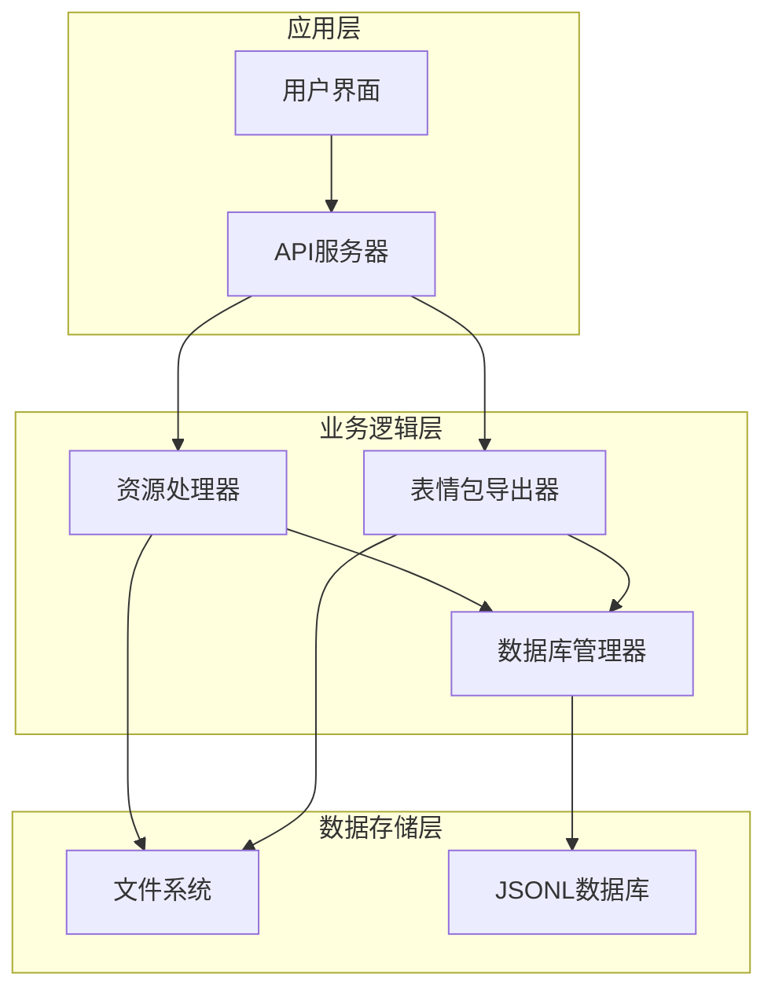
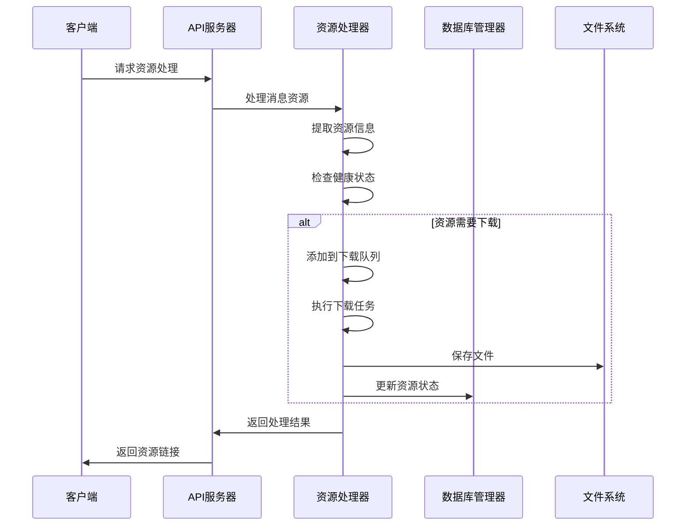
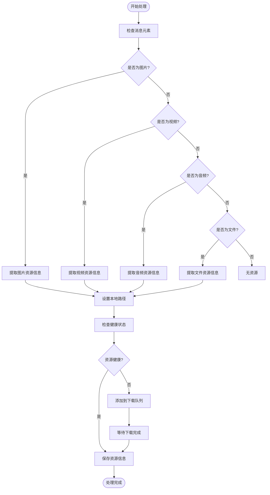
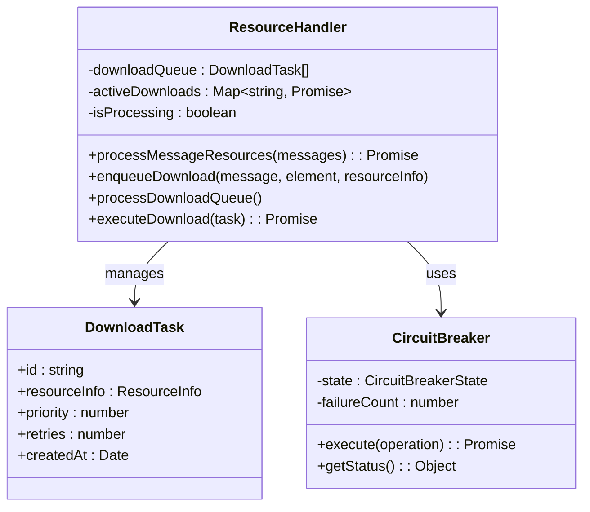
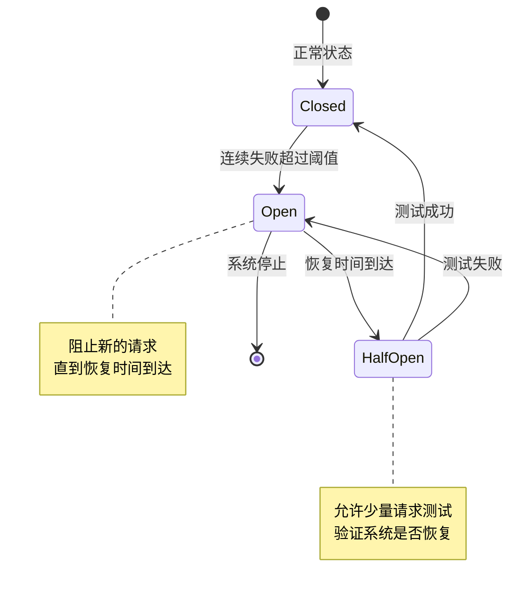
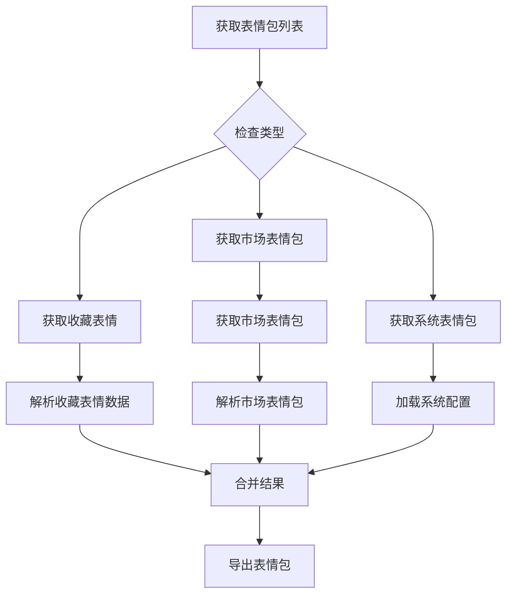
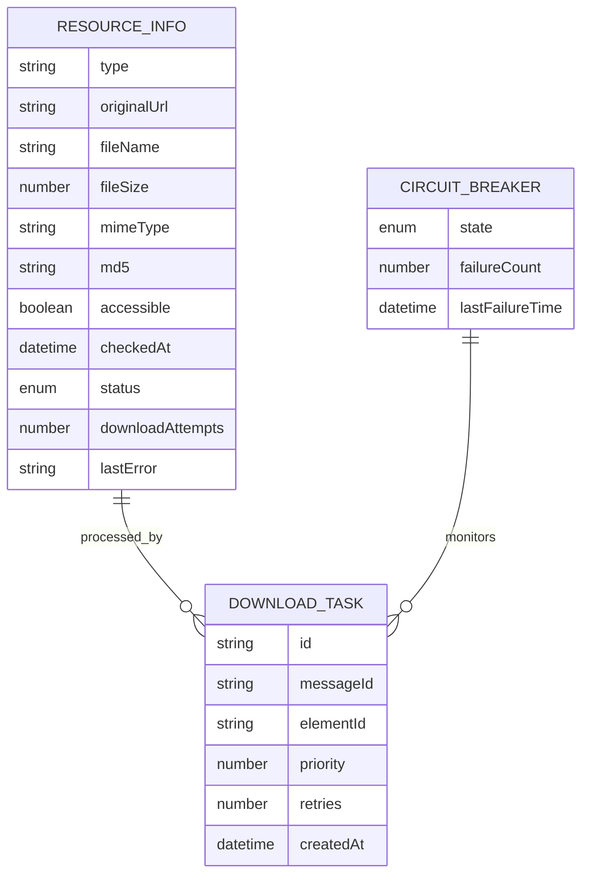
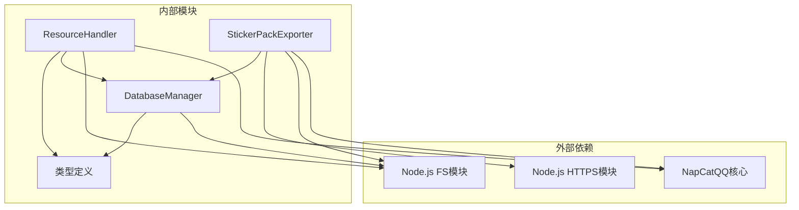
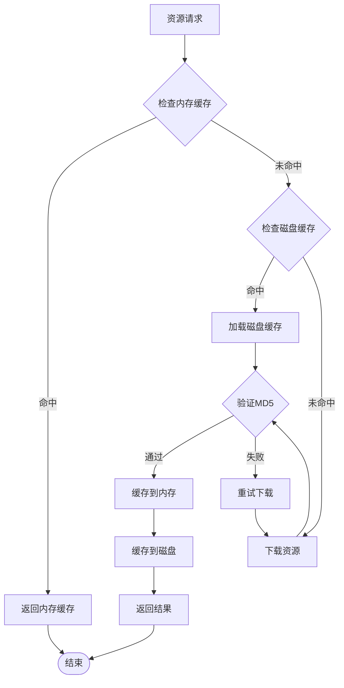
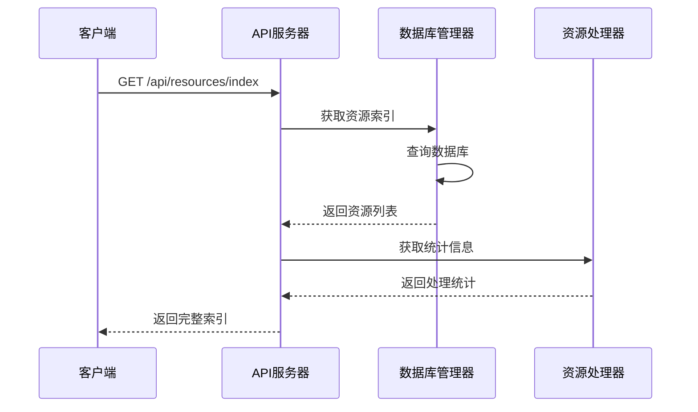

# 资源处理

<cite>
**本文档引用的文件**
- [ResourceHandler.ts](file://plugins/qq-chat-exporter/lib/core/resource/ResourceHandler.ts)
- [StickerPackExporter.ts](file://plugins/qq-chat-exporter/lib/core/sticker/StickerPackExporter.ts)
- [DatabaseManager.ts](file://plugins/qq-chat-exporter/lib/core/storage/DatabaseManager.ts)
- [index.ts](file://plugins/qq-chat-exporter/lib/types/index.ts)
- [ApiServer.ts](file://plugins/qq-chat-exporter/lib/api/ApiServer.ts)
- [ModernHtmlExporter.ts](file://plugins/qq-chat-exporter/lib/core/exporter/ModernHtmlExporter.ts)
- [use-resource-index.ts](file://qce-v4-tool/hooks/use-resource-index.ts)
</cite>

## 目录
1. [简介](#简介)
2. [项目结构](#项目结构)
3. [核心组件](#核心组件)
4. [架构概览](#架构概览)
5. [详细组件分析](#详细组件分析)
6. [依赖关系分析](#依赖关系分析)
7. [性能考虑](#性能考虑)
8. [故障排除指南](#故障排除指南)
9. [结论](#结论)

## 简介

资源处理模块是QQ聊天导出器的核心功能之一，负责处理和管理各种类型的多媒体资源文件。该模块实现了完整的资源生命周期管理，包括资源识别、分类、下载、缓存、健康检查、完整性验证等功能。

本模块主要处理以下类型的资源：
- **图片资源**：支持多种图片格式，包括JPEG、PNG、GIF、WebP等
- **视频资源**：支持MP4、AVI、MOV、MKV等常见视频格式
- **音频资源**：支持WAV、MP3等音频格式
- **文件资源**：支持各种文档和压缩文件
- **表情包资源**：支持QQ表情包的批量导出和管理

## 项目结构

资源处理模块采用分层架构设计，主要包含以下几个核心层次：

**图表来源**
- [ResourceHandler.ts](file://plugins/qq-chat-exporter/lib/core/resource/ResourceHandler.ts#L277-L321)
- [StickerPackExporter.ts](file://plugins/qq-chat-exporter/lib/core/sticker/StickerPackExporter.ts#L113-L132)
- [DatabaseManager.ts](file://plugins/qq-chat-exporter/lib/core/storage/DatabaseManager.ts#L57-L99)

**章节来源**
- [ResourceHandler.ts](file://plugins/qq-chat-exporter/lib/core/resource/ResourceHandler.ts#L1-L100)
- [StickerPackExporter.ts](file://plugins/qq-chat-exporter/lib/core/sticker/StickerPackExporter.ts#L1-L50)
- [DatabaseManager.ts](file://plugins/qq-chat-exporter/lib/core/storage/DatabaseManager.ts#L1-L60)

## 核心组件

### 资源处理器 (ResourceHandler)

资源处理器是整个资源处理系统的核心组件，负责处理各种类型的媒体资源。它实现了智能的资源管理策略，包括优先级调度、并发控制、熔断机制等高级特性。

#### 主要功能特性

1. **多类型资源支持**：支持图片、视频、音频、文件四种基本资源类型
2. **智能优先级调度**：根据资源类型和大小动态调整下载优先级
3. **并发控制**：可配置的最大并发下载数，避免过度占用系统资源
4. **熔断机制**：智能熔断器防止系统在故障时被压垮
5. **健康检查**：定期检查资源文件的完整性和可用性
6. **缓存管理**：本地缓存和过期清理机制

#### 配置参数

| 参数名 | 默认值 | 描述 |
|--------|--------|------|
| storageRoot | 用户配置目录 | 资源存储根目录 |
| downloadTimeout | 30000ms | 下载超时时间 |
| maxConcurrentDownloads | 2 | 最大并发下载数 |
| maxRetries | 5 | 最大重试次数 |
| circuitBreakerThreshold | 20 | 熔断阈值 |
| healthCheckInterval | 600000ms | 健康检查间隔 |

**章节来源**
- [ResourceHandler.ts](file://plugins/qq-chat-exporter/lib/core/resource/ResourceHandler.ts#L24-L43)
- [ResourceHandler.ts](file://plugins/qq-chat-exporter/lib/core/resource/ResourceHandler.ts#L295-L321)

### 表情包导出器 (StickerPackExporter)

表情包导出器专门负责处理QQ表情包的导出功能，支持三种类型的表情包：收藏的表情、市场表情包、系统表情包。

#### 表情包类型

1. **收藏的表情**：用户手动收藏的表情
2. **市场表情包**：QQ商店提供的表情包
3. **系统表情包**：QQ内置的表情包

#### 导出策略

表情包导出器采用批量导出策略，支持以下功能：
- 并发下载控制（默认10个并发）
- 自动重试机制
- 导出记录管理
- 汇总信息生成

**章节来源**
- [StickerPackExporter.ts](file://plugins/qq-chat-exporter/lib/core/sticker/StickerPackExporter.ts#L19-L26)
- [StickerPackExporter.ts](file://plugins/qq-chat-exporter/lib/core/sticker/StickerPackExporter.ts#L113-L170)

### 数据库管理器 (DatabaseManager)

数据库管理器负责所有数据的持久化存储，采用高性能的JSONL格式，提供实时写入和快速查询能力。

#### 存储格式

系统使用JSONL（JSON Lines）格式存储数据，每行一个JSON对象，具有以下优势：
- **高性能**：无需解析整个文件即可读取单行数据
- **原子性**：追加写入保证数据完整性
- **兼容性**：纯文本格式，易于备份和迁移
- **扩展性**：支持动态添加字段

#### 内存索引

为了提高查询性能，系统维护了内存索引：
- **任务索引**：按任务ID快速查找任务
- **消息索引**：按任务ID和消息ID快速查找消息
- **资源索引**：按MD5快速查找资源
- **系统信息索引**：存储系统配置和状态

**章节来源**
- [DatabaseManager.ts](file://plugins/qq-chat-exporter/lib/core/storage/DatabaseManager.ts#L57-L70)
- [DatabaseManager.ts](file://plugins/qq-chat-exporter/lib/core/storage/DatabaseManager.ts#L105-L148)

## 架构概览

资源处理模块采用事件驱动的异步架构，通过消息队列和回调机制实现松耦合的组件通信。

**图表来源**
- [ResourceHandler.ts](file://plugins/qq-chat-exporter/lib/core/resource/ResourceHandler.ts#L353-L403)
- [ResourceHandler.ts](file://plugins/qq-chat-exporter/lib/core/resource/ResourceHandler.ts#L717-L775)

**章节来源**
- [ResourceHandler.ts](file://plugins/qq-chat-exporter/lib/core/resource/ResourceHandler.ts#L350-L403)
- [ApiServer.ts](file://plugins/qq-chat-exporter/lib/api/ApiServer.ts#L3065-L3077)

## 详细组件分析

### 资源处理器详细分析

#### 资源识别和分类

资源处理器通过检查消息元素的属性来识别不同类型的资源：

**图表来源**
- [ResourceHandler.ts](file://plugins/qq-chat-exporter/lib/core/resource/ResourceHandler.ts#L408-L434)
- [ResourceHandler.ts](file://plugins/qq-chat-exporter/lib/core/resource/ResourceHandler.ts#L440-L512)

#### 下载队列管理

资源处理器实现了智能的下载队列管理系统：

**图表来源**
- [ResourceHandler.ts](file://plugins/qq-chat-exporter/lib/core/resource/ResourceHandler.ts#L48-L56)
- [ResourceHandler.ts](file://plugins/qq-chat-exporter/lib/core/resource/ResourceHandler.ts#L71-L193)

#### 熔断机制实现

熔断器是资源处理器的重要安全机制，防止系统在故障时被压垮：

**图表来源**
- [ResourceHandler.ts](file://plugins/qq-chat-exporter/lib/core/resource/ResourceHandler.ts#L61-L65)
- [ResourceHandler.ts](file://plugins/qq-chat-exporter/lib/core/resource/ResourceHandler.ts#L85-L104)

**章节来源**
- [ResourceHandler.ts](file://plugins/qq-chat-exporter/lib/core/resource/ResourceHandler.ts#L596-L649)
- [ResourceHandler.ts](file://plugins/qq-chat-exporter/lib/core/resource/ResourceHandler.ts#L717-L775)

### 表情包导出器详细分析

#### 表情包获取流程

表情包导出器支持从多个来源获取表情包信息：

**图表来源**
- [StickerPackExporter.ts](file://plugins/qq-chat-exporter/lib/core/sticker/StickerPackExporter.ts#L217-L243)
- [StickerPackExporter.ts](file://plugins/qq-chat-exporter/lib/core/sticker/StickerPackExporter.ts#L248-L278)

#### 导出策略对比

| 导出方式 | 并发数 | 重试机制 | 错误处理 | 适用场景 |
|----------|--------|----------|----------|----------|
| 单个表情包导出 | 10个 | 自动重试 | 跳过失败项 | 小规模导出 |
| 所有表情包导出 | 10个 | 自动重试 | 聚合错误报告 | 大规模导出 |
| 批量导出 | 可配置 | 指数退避 | 统一处理 | 高效批量处理 |

**章节来源**
- [StickerPackExporter.ts](file://plugins/qq-chat-exporter/lib/core/sticker/StickerPackExporter.ts#L496-L609)
- [StickerPackExporter.ts](file://plugins/qq-chat-exporter/lib/core/sticker/StickerPackExporter.ts#L614-L787)

### 数据模型分析

#### 资源信息数据模型

资源处理器使用标准化的数据模型来描述各种资源：

**图表来源**
- [index.ts](file://plugins/qq-chat-exporter/lib/types/index.ts#L187-L212)
- [ResourceHandler.ts](file://plugins/qq-chat-exporter/lib/core/resource/ResourceHandler.ts#L48-L56)

**章节来源**
- [index.ts](file://plugins/qq-chat-exporter/lib/types/index.ts#L168-L212)
- [DatabaseManager.ts](file://plugins/qq-chat-exporter/lib/core/storage/DatabaseManager.ts#L1024-L1042)

## 依赖关系分析

资源处理模块的依赖关系相对简单，主要依赖于核心的NapCatQQ框架和本地文件系统。

**图表来源**
- [ResourceHandler.ts](file://plugins/qq-chat-exporter/lib/core/resource/ResourceHandler.ts#L7-L19)
- [StickerPackExporter.ts](file://plugins/qq-chat-exporter/lib/core/sticker/StickerPackExporter.ts#L6-L10)

**章节来源**
- [ResourceHandler.ts](file://plugins/qq-chat-exporter/lib/core/resource/ResourceHandler.ts#L1-L20)
- [StickerPackExporter.ts](file://plugins/qq-chat-exporter/lib/core/sticker/StickerPackExporter.ts#L1-L15)

## 性能考虑

### 内存管理策略

资源处理模块采用了多项内存管理策略来确保系统的稳定运行：

1. **流式处理**：对于大型文件采用流式处理，避免一次性加载到内存
2. **内存索引限制**：数据库管理器只维护必要的内存索引
3. **垃圾回收优化**：及时释放不再使用的对象引用
4. **并发控制**：通过配置参数限制同时进行的操作数量

### 缓存策略

系统实现了多层次的缓存机制：

**图表来源**
- [ResourceHandler.ts](file://plugins/qq-chat-exporter/lib/core/resource/ResourceHandler.ts#L205-L238)
- [ResourceHandler.ts](file://plugins/qq-chat-exporter/lib/core/resource/ResourceHandler.ts#L1026-L1034)

### 性能优化建议

1. **合理配置并发数**：根据系统资源调整最大并发下载数
2. **启用健康检查**：定期检查资源文件的完整性
3. **使用合适的存储介质**：将资源存储在高速存储设备上
4. **监控系统资源**：定期检查CPU、内存、磁盘使用情况

**章节来源**
- [ResourceHandler.ts](file://plugins/qq-chat-exporter/lib/core/resource/ResourceHandler.ts#L1026-L1057)
- [DatabaseManager.ts](file://plugins/qq-chat-exporter/lib/core/storage/DatabaseManager.ts#L347-L382)

## 故障排除指南

### 常见问题及解决方案

#### 资源下载失败

**问题症状**：资源文件下载失败，状态显示为FAILED

**可能原因**：
1. 网络连接不稳定
2. 文件权限问题
3. 存储空间不足
4. 资源已被删除或过期

**解决步骤**：
1. 检查网络连接状态
2. 验证存储目录权限
3. 确认磁盘空间充足
4. 重新尝试下载

#### 资源完整性验证失败

**问题症状**：资源文件存在但无法正常使用

**可能原因**：
1. 文件传输过程中损坏
2. MD5校验失败
3. 文件格式不兼容

**解决步骤**：
1. 删除损坏的文件
2. 重新下载资源
3. 检查文件格式支持情况

#### 熔断器触发

**问题症状**：系统停止接受新的下载请求

**可能原因**：
1. 连续多次下载失败
2. 服务器不可用
3. 网络连接问题

**解决步骤**：
1. 等待熔断器自动恢复
2. 检查服务器状态
3. 优化网络连接

**章节来源**
- [ResourceHandler.ts](file://plugins/qq-chat-exporter/lib/core/resource/ResourceHandler.ts#L732-L775)
- [ResourceHandler.ts](file://plugins/qq-chat-exporter/lib/core/resource/ResourceHandler.ts#L119-L158)

### 调试工具和方法

#### 资源索引查看

系统提供了资源索引查看功能，可以通过API获取当前的资源状态：

**图表来源**
- [use-resource-index.ts](file://qce-v4-tool/hooks/use-resource-index.ts#L68-L91)
- [ApiServer.ts](file://plugins/qq-chat-exporter/lib/api/ApiServer.ts#L5843-L5864)

#### 资源清理功能

系统提供了资源清理功能，可以删除过期或损坏的资源文件：

**章节来源**
- [DatabaseManager.ts](file://plugins/qq-chat-exporter/lib/core/storage/DatabaseManager.ts#L1125-L1153)
- [ResourceHandler.ts](file://plugins/qq-chat-exporter/lib/core/resource/ResourceHandler.ts#L1125-L1148)

## 结论

资源处理模块通过精心设计的架构和完善的机制，为QQ聊天导出器提供了强大的多媒体资源管理能力。模块的主要优势包括：

1. **全面的资源支持**：支持图片、视频、音频、文件和表情包等多种资源类型
2. **智能的处理策略**：通过优先级调度、并发控制、熔断机制等确保系统稳定性
3. **高效的存储机制**：采用JSONL格式和内存索引提供高性能的数据访问
4. **完善的错误处理**：提供详细的错误信息和自动重试机制
5. **灵活的配置选项**：支持根据环境需求调整各项参数

该模块的设计充分考虑了实际使用场景的需求，在保证功能完整性的同时，也注重了系统的性能和可靠性。通过合理的架构设计和优化策略，能够有效处理大规模的资源文件，为用户提供流畅的使用体验。

未来可以在以下方面进一步改进：
- 增加更多的资源类型支持
- 优化大文件的处理性能
- 提供更丰富的监控和诊断功能
- 增强与其他系统的集成能力