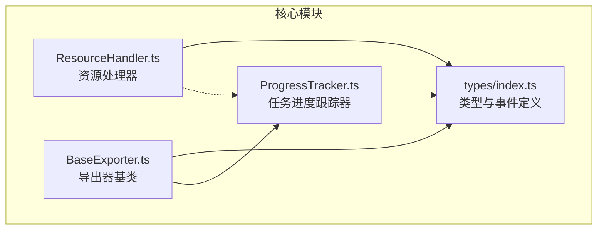
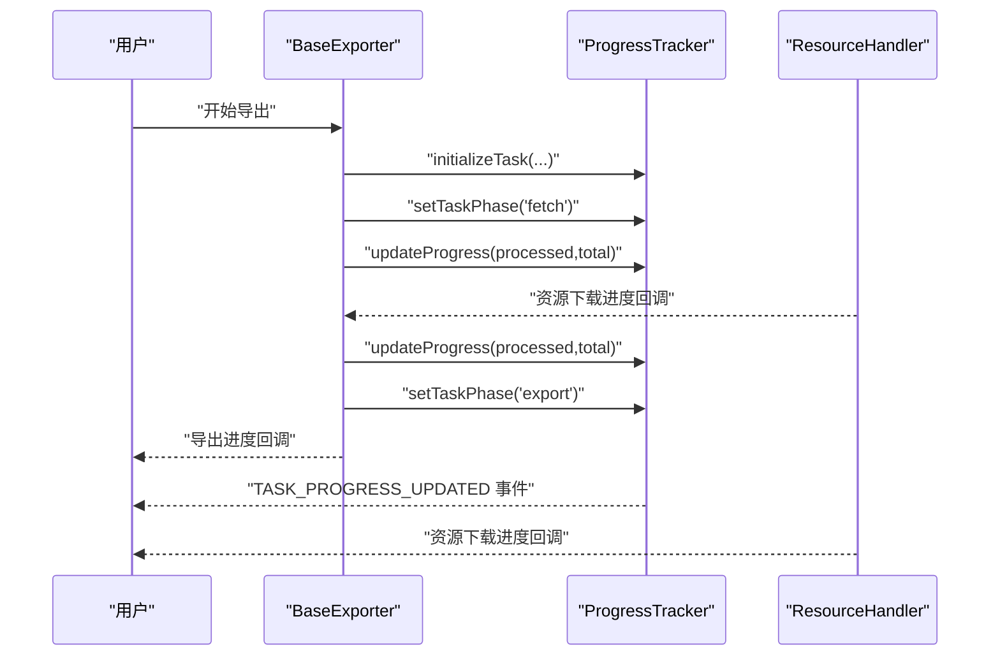
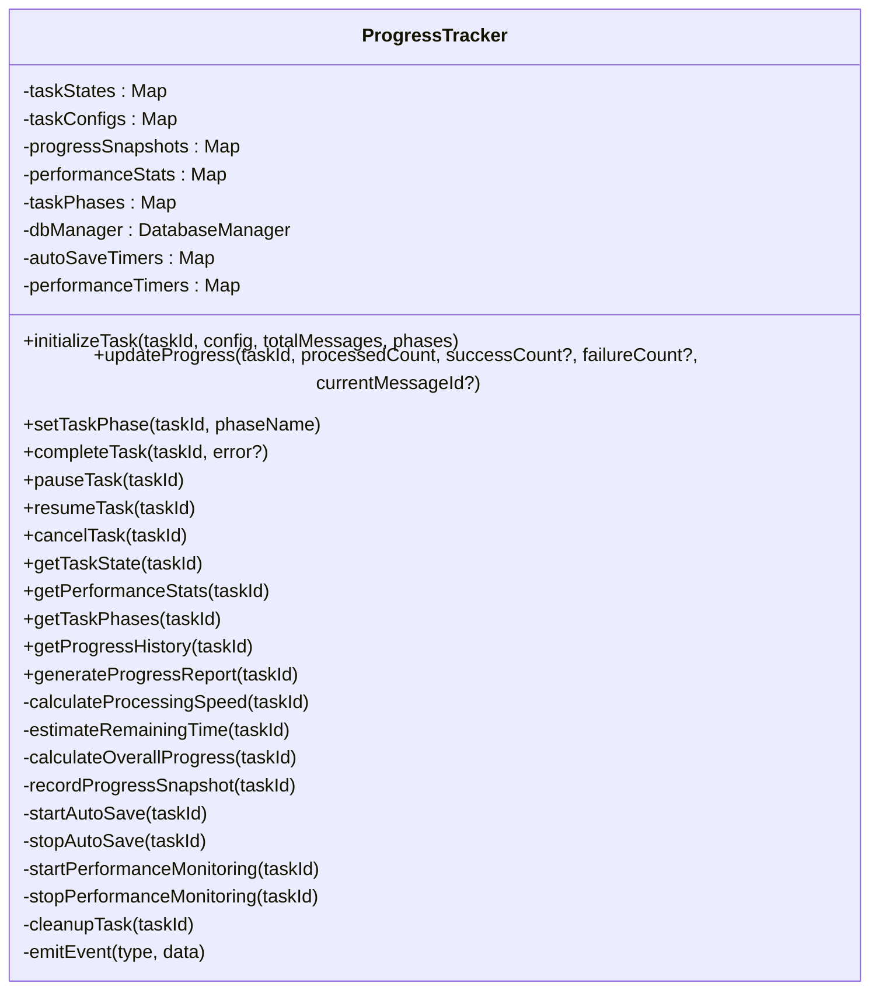
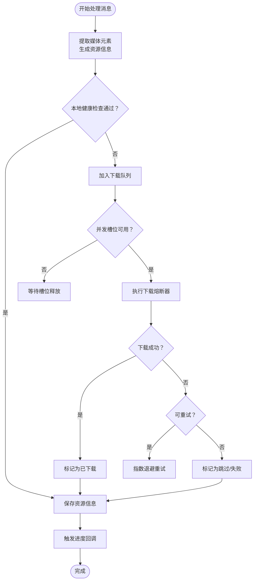
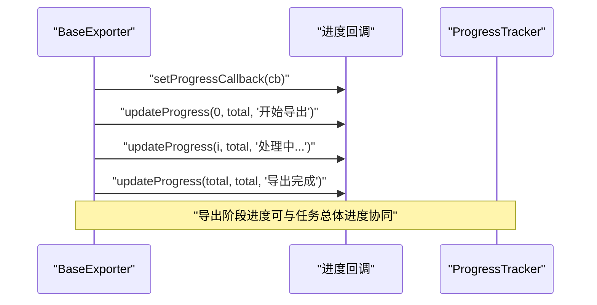
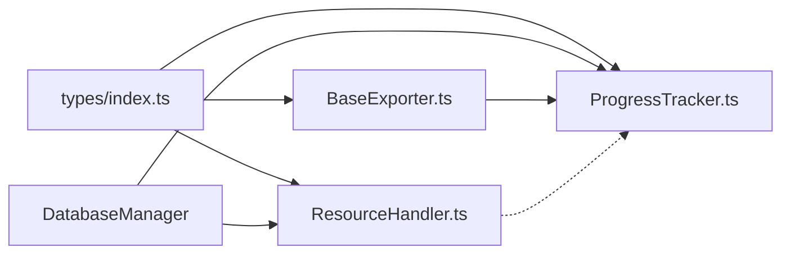

# 进度跟踪

<cite>
**本文引用的文件**
- [ProgressTracker.ts](file://plugins/qq-chat-exporter/lib/core/progress/ProgressTracker.ts)
- [ResourceHandler.ts](file://plugins/qq-chat-exporter/lib/core/resource/ResourceHandler.ts)
- [BaseExporter.ts](file://plugins/qq-chat-exporter/lib/core/exporter/BaseExporter.ts)
- [index.ts](file://plugins/qq-chat-exporter/lib/types/index.ts)
</cite>

## 目录
1. [简介](#简介)
2. [项目结构](#项目结构)
3. [核心组件](#核心组件)
4. [架构总览](#架构总览)
5. [详细组件分析](#详细组件分析)
6. [依赖关系分析](#依赖关系分析)
7. [性能考量](#性能考量)
8. [故障排查指南](#故障排查指南)
9. [结论](#结论)
10. [附录](#附录)

## 简介
本文件围绕“进度跟踪”模块进行系统化说明，重点覆盖 ProgressTracker 进度跟踪器的设计与实现，包括进度计算逻辑、状态更新机制、事件驱动的用户反馈系统、阶段化进度与资源下载进度的协同工作方式。文档还解释了在大规模数据导出场景下的实现策略、进度回调的注册与管理机制，并提供使用示例、性能影响与优化建议、以及用户体验优化最佳实践。

## 项目结构
进度跟踪相关的核心代码位于插件目录的 core 子模块中，主要涉及：
- 进度跟踪器：负责任务级进度、阶段进度、性能统计与事件广播
- 资源处理器：负责资源下载进度回调，与导出流程中的资源处理阶段配合
- 导出器基类：提供导出进度回调接口，便于与进度跟踪器联动
- 类型定义：统一导出任务状态、事件类型、错误类型等关键枚举与接口

图示来源
- [ProgressTracker.ts](file://plugins/qq-chat-exporter/lib/core/progress/ProgressTracker.ts#L89-L115)
- [ResourceHandler.ts](file://plugins/qq-chat-exporter/lib/core/resource/ResourceHandler.ts#L277-L321)
- [BaseExporter.ts](file://plugins/qq-chat-exporter/lib/core/exporter/BaseExporter.ts#L58-L88)
- [index.ts](file://plugins/qq-chat-exporter/lib/types/index.ts#L13-L370)

章节来源
- [ProgressTracker.ts](file://plugins/qq-chat-exporter/lib/core/progress/ProgressTracker.ts#L1-L120)
- [ResourceHandler.ts](file://plugins/qq-chat-exporter/lib/core/resource/ResourceHandler.ts#L1-L60)
- [BaseExporter.ts](file://plugins/qq-chat-exporter/lib/core/exporter/BaseExporter.ts#L1-L60)
- [index.ts](file://plugins/qq-chat-exporter/lib/types/index.ts#L1-L120)

## 核心组件
- 进度跟踪器（ProgressTracker）
  - 负责任务初始化、进度更新、阶段切换、性能统计、事件广播、自动保存与清理
  - 支持多任务并发、断点续传、阶段权重计算、速度估算与剩余时间预测
- 资源处理器（ResourceHandler）
  - 负责资源下载队列、健康检查、智能熔断、重试与进度回调
  - 提供资源下载进度回调接口，便于与导出流程集成
- 导出器基类（BaseExporter）
  - 提供导出进度回调接口，便于在导出各阶段上报进度
- 类型与事件（types/index.ts）
  - 定义任务状态、事件类型、错误类型、任务状态接口等，统一跨模块契约

章节来源
- [ProgressTracker.ts](file://plugins/qq-chat-exporter/lib/core/progress/ProgressTracker.ts#L89-L115)
- [ResourceHandler.ts](file://plugins/qq-chat-exporter/lib/core/resource/ResourceHandler.ts#L277-L321)
- [BaseExporter.ts](file://plugins/qq-chat-exporter/lib/core/exporter/BaseExporter.ts#L58-L88)
- [index.ts](file://plugins/qq-chat-exporter/lib/types/index.ts#L13-L370)

## 架构总览
进度跟踪模块采用事件驱动与状态机结合的方式，通过 ProgressTracker 统一管理任务生命周期与进度，ResourceHandler 在资源下载阶段提供独立的进度回调，BaseExporter 在导出阶段提供进度回调。三者通过事件与回调协同，形成“消息获取—资源下载—内容处理—导出”的完整进度闭环。

图示来源
- [ProgressTracker.ts](file://plugins/qq-chat-exporter/lib/core/progress/ProgressTracker.ts#L126-L192)
- [ResourceHandler.ts](file://plugins/qq-chat-exporter/lib/core/resource/ResourceHandler.ts#L330-L348)
- [BaseExporter.ts](file://plugins/qq-chat-exporter/lib/core/exporter/BaseExporter.ts#L232-L242)

## 详细组件分析

### 进度跟踪器（ProgressTracker）
- 设计要点
  - 任务状态与配置管理：Map 存储任务状态、配置、阶段、快照与性能统计
  - 阶段化进度：预设阶段权重，运行中阶段按消息处理进度折算权重贡献
  - 性能统计：平均速度、峰值速度、当前速度、速度历史（最多60个）
  - 自动保存与清理：定时自动保存至数据库，完成后延时清理内存数据
  - 事件驱动：通过 EventEmitter 广播任务状态、进度、阶段、健康状态等事件
- 关键算法
  - 处理速度：基于总处理时长与已处理消息数计算
  - 剩余时间：基于剩余消息数与当前处理速度估算
  - 总体进度：加权阶段进度之和，运行中阶段按消息比例折算
- 事件类型
  - 任务状态变更、任务进度更新、消息获取进度、导出进度、系统错误、健康状态变更

图示来源
- [ProgressTracker.ts](file://plugins/qq-chat-exporter/lib/core/progress/ProgressTracker.ts#L89-L115)
- [ProgressTracker.ts](file://plugins/qq-chat-exporter/lib/core/progress/ProgressTracker.ts#L126-L203)
- [ProgressTracker.ts](file://plugins/qq-chat-exporter/lib/core/progress/ProgressTracker.ts#L214-L254)
- [ProgressTracker.ts](file://plugins/qq-chat-exporter/lib/core/progress/ProgressTracker.ts#L262-L300)
- [ProgressTracker.ts](file://plugins/qq-chat-exporter/lib/core/progress/ProgressTracker.ts#L308-L359)
- [ProgressTracker.ts](file://plugins/qq-chat-exporter/lib/core/progress/ProgressTracker.ts#L458-L502)
- [ProgressTracker.ts](file://plugins/qq-chat-exporter/lib/core/progress/ProgressTracker.ts#L518-L543)
- [ProgressTracker.ts](file://plugins/qq-chat-exporter/lib/core/progress/ProgressTracker.ts#L548-L576)
- [ProgressTracker.ts](file://plugins/qq-chat-exporter/lib/core/progress/ProgressTracker.ts#L581-L647)
- [ProgressTracker.ts](file://plugins/qq-chat-exporter/lib/core/progress/ProgressTracker.ts#L669-L679)
- [ProgressTracker.ts](file://plugins/qq-chat-exporter/lib/core/progress/ProgressTracker.ts#L697-L731)

章节来源
- [ProgressTracker.ts](file://plugins/qq-chat-exporter/lib/core/progress/ProgressTracker.ts#L89-L115)
- [ProgressTracker.ts](file://plugins/qq-chat-exporter/lib/core/progress/ProgressTracker.ts#L126-L203)
- [ProgressTracker.ts](file://plugins/qq-chat-exporter/lib/core/progress/ProgressTracker.ts#L214-L254)
- [ProgressTracker.ts](file://plugins/qq-chat-exporter/lib/core/progress/ProgressTracker.ts#L262-L300)
- [ProgressTracker.ts](file://plugins/qq-chat-exporter/lib/core/progress/ProgressTracker.ts#L308-L359)
- [ProgressTracker.ts](file://plugins/qq-chat-exporter/lib/core/progress/ProgressTracker.ts#L458-L502)
- [ProgressTracker.ts](file://plugins/qq-chat-exporter/lib/core/progress/ProgressTracker.ts#L518-L543)
- [ProgressTracker.ts](file://plugins/qq-chat-exporter/lib/core/progress/ProgressTracker.ts#L548-L576)
- [ProgressTracker.ts](file://plugins/qq-chat-exporter/lib/core/progress/ProgressTracker.ts#L581-L647)
- [ProgressTracker.ts](file://plugins/qq-chat-exporter/lib/core/progress/ProgressTracker.ts#L669-L679)
- [ProgressTracker.ts](file://plugins/qq-chat-exporter/lib/core/progress/ProgressTracker.ts#L697-L731)

### 资源处理器（ResourceHandler）
- 设计要点
  - 下载队列与并发控制：最大并发数限制，优先级调度
  - 健康检查：本地文件存在性、大小与MD5校验
  - 智能熔断：区分可重试与不可重试错误，动态恢复
  - 进度回调：资源总数、已完成、失败、剩余、当前项与消息提示
- 与进度跟踪的协作
  - ResourceHandler 提供资源下载进度回调，可在导出流程中作为“资源处理阶段”的进度来源
  - ProgressTracker 也可在导出阶段通过 updateProgress 上报总体进度

图示来源
- [ResourceHandler.ts](file://plugins/qq-chat-exporter/lib/core/resource/ResourceHandler.ts#L408-L434)
- [ResourceHandler.ts](file://plugins/qq-chat-exporter/lib/core/resource/ResourceHandler.ts#L545-L572)
- [ResourceHandler.ts](file://plugins/qq-chat-exporter/lib/core/resource/ResourceHandler.ts#L596-L649)
- [ResourceHandler.ts](file://plugins/qq-chat-exporter/lib/core/resource/ResourceHandler.ts#L717-L775)
- [ResourceHandler.ts](file://plugins/qq-chat-exporter/lib/core/resource/ResourceHandler.ts#L330-L348)

章节来源
- [ResourceHandler.ts](file://plugins/qq-chat-exporter/lib/core/resource/ResourceHandler.ts#L277-L321)
- [ResourceHandler.ts](file://plugins/qq-chat-exporter/lib/core/resource/ResourceHandler.ts#L330-L348)
- [ResourceHandler.ts](file://plugins/qq-chat-exporter/lib/core/resource/ResourceHandler.ts#L408-L434)
- [ResourceHandler.ts](file://plugins/qq-chat-exporter/lib/core/resource/ResourceHandler.ts#L545-L572)
- [ResourceHandler.ts](file://plugins/qq-chat-exporter/lib/core/resource/ResourceHandler.ts#L596-L649)
- [ResourceHandler.ts](file://plugins/qq-chat-exporter/lib/core/resource/ResourceHandler.ts#L717-L775)

### 导出器基类（BaseExporter）
- 设计要点
  - 提供导出进度回调接口 setProgressCallback 与内部 updateProgress 方法
  - 在导出开始、中间与完成时上报进度，便于与 ProgressTracker 的总体进度协同
- 与进度跟踪的协作
  - 导出阶段进度由 BaseExporter 上报，ProgressTracker 可将其纳入总体进度计算或作为阶段进度的一部分

图示来源
- [BaseExporter.ts](file://plugins/qq-chat-exporter/lib/core/exporter/BaseExporter.ts#L93-L95)
- [BaseExporter.ts](file://plugins/qq-chat-exporter/lib/core/exporter/BaseExporter.ts#L232-L242)
- [BaseExporter.ts](file://plugins/qq-chat-exporter/lib/core/exporter/BaseExporter.ts#L110-L137)

章节来源
- [BaseExporter.ts](file://plugins/qq-chat-exporter/lib/core/exporter/BaseExporter.ts#L58-L88)
- [BaseExporter.ts](file://plugins/qq-chat-exporter/lib/core/exporter/BaseExporter.ts#L93-L95)
- [BaseExporter.ts](file://plugins/qq-chat-exporter/lib/core/exporter/BaseExporter.ts#L110-L137)
- [BaseExporter.ts](file://plugins/qq-chat-exporter/lib/core/exporter/BaseExporter.ts#L232-L242)

### 事件与类型定义
- 事件类型（EventType）
  - 任务状态变更、任务进度更新、任务完成/失败、消息获取进度、导出进度、系统错误、健康状态变更
- 任务状态（ExportTaskStatus）
  - 等待中、执行中、已暂停、已完成、失败、已取消
- 错误类型（ErrorType）
  - API错误、网络错误、数据库错误、资源错误、文件系统错误、配置错误、验证错误、权限错误、超时错误、认证错误、未知错误

章节来源
- [index.ts](file://plugins/qq-chat-exporter/lib/types/index.ts#L13-L370)

## 依赖关系分析
- ProgressTracker 依赖 DatabaseManager 进行任务状态持久化
- ResourceHandler 依赖 DatabaseManager 保存资源信息
- BaseExporter 与 ProgressTracker 通过事件与回调协同
- 三者共同依赖 types/index.ts 中的枚举与接口

图示来源
- [ProgressTracker.ts](file://plugins/qq-chat-exporter/lib/core/progress/ProgressTracker.ts#L16-L17)
- [ResourceHandler.ts](file://plugins/qq-chat-exporter/lib/core/resource/ResourceHandler.ts#L18-L19)
- [BaseExporter.ts](file://plugins/qq-chat-exporter/lib/core/exporter/BaseExporter.ts#L10-L16)
- [index.ts](file://plugins/qq-chat-exporter/lib/types/index.ts#L13-L370)

章节来源
- [ProgressTracker.ts](file://plugins/qq-chat-exporter/lib/core/progress/ProgressTracker.ts#L16-L17)
- [ResourceHandler.ts](file://plugins/qq-chat-exporter/lib/core/resource/ResourceHandler.ts#L18-L19)
- [BaseExporter.ts](file://plugins/qq-chat-exporter/lib/core/exporter/BaseExporter.ts#L10-L16)
- [index.ts](file://plugins/qq-chat-exporter/lib/types/index.ts#L13-L370)

## 性能考量
- 进度计算复杂度
  - 处理速度与剩余时间：O(1)，基于时间差与已处理消息数
  - 阶段权重进度：O(P)，P为阶段数
  - 速度历史：最多60个数据点，近似O(1)维护
- 内存占用
  - 进度快照最多1000条，阶段性清理避免长期驻留
  - 性能统计与阶段信息按任务维度存储，任务结束后延时清理
- I/O与事件频率
  - 自动保存间隔默认5秒，避免频繁写库
  - 性能监控每10秒检查一次速度变化，避免高频事件风暴
- 并发与阻塞
  - 导出与资源下载采用异步与队列，避免阻塞主线程
  - 资源下载并发受控，避免对远端服务造成过大压力

[本节为通用性能讨论，无需列出具体文件来源]

## 故障排查指南
- 任务状态异常
  - 检查 initializeTask 是否正确传入 totalMessages 与 phases
  - 确认 setTaskPhase 的 phaseName 与预设阶段一致
- 进度不更新
  - 确认 updateProgress 的 processedCount 严格递增
  - 检查 calculateProcessingSpeed 是否能获取到有效时间差
- 剩余时间异常
  - 确认 processingSpeed > 0，否则不会估算剩余时间
- 资源下载卡住
  - 检查并发数与重试策略配置
  - 查看熔断器状态与错误分类，确认是否为可重试错误
- 事件未到达前端
  - 确认事件监听器已注册，ProgressTracker 的事件广播正常

章节来源
- [ProgressTracker.ts](file://plugins/qq-chat-exporter/lib/core/progress/ProgressTracker.ts#L126-L203)
- [ProgressTracker.ts](file://plugins/qq-chat-exporter/lib/core/progress/ProgressTracker.ts#L214-L254)
- [ProgressTracker.ts](file://plugins/qq-chat-exporter/lib/core/progress/ProgressTracker.ts#L458-L502)
- [ResourceHandler.ts](file://plugins/qq-chat-exporter/lib/core/resource/ResourceHandler.ts#L312-L321)
- [ResourceHandler.ts](file://plugins/qq-chat-exporter/lib/core/resource/ResourceHandler.ts#L717-L775)

## 结论
进度跟踪模块通过“阶段化+加权进度+事件驱动+自动保存”的设计，在大规模数据导出场景下提供了稳定、可观测、可扩展的进度管理能力。ProgressTracker 负责总体进度与状态，ResourceHandler 负责资源下载阶段的细粒度反馈，BaseExporter 负责导出阶段的进度上报，三者协同实现了从消息获取到最终导出的全链路进度可视化与可控性。

[本节为总结性内容，无需列出具体文件来源]

## 附录

### 使用示例（步骤说明）
- 初始化任务
  - 调用 initializeTask(taskId, config, totalMessages, phases)
  - 设置阶段：setTaskPhase(taskId, 'fetch')
- 更新进度
  - 导出阶段：BaseExporter.updateProgress(...) 或 ProgressTracker.updateProgress(...)
  - 资源阶段：ResourceHandler 触发进度回调
- 完成/暂停/恢复/取消
  - completeTask(taskId, error?) / pauseTask(taskId) / resumeTask(taskId) / cancelTask(taskId)
- 事件监听
  - 监听 TASK_PROGRESS_UPDATED、MESSAGE_FETCH_PROGRESS、HEALTH_STATUS_CHANGED 等事件

章节来源
- [ProgressTracker.ts](file://plugins/qq-chat-exporter/lib/core/progress/ProgressTracker.ts#L126-L203)
- [ProgressTracker.ts](file://plugins/qq-chat-exporter/lib/core/progress/ProgressTracker.ts#L214-L254)
- [ProgressTracker.ts](file://plugins/qq-chat-exporter/lib/core/progress/ProgressTracker.ts#L262-L300)
- [ProgressTracker.ts](file://plugins/qq-chat-exporter/lib/core/progress/ProgressTracker.ts#L308-L359)
- [BaseExporter.ts](file://plugins/qq-chat-exporter/lib/core/exporter/BaseExporter.ts#L232-L242)
- [ResourceHandler.ts](file://plugins/qq-chat-exporter/lib/core/resource/ResourceHandler.ts#L330-L348)

### 用户体验优化建议
- 显示双进度：总体百分比 + 当前阶段进度
- 显示速率与剩余时间：帮助用户预估完成时间
- 阶段提示：明确当前阶段与阶段描述，提升透明度
- 错误与警告：及时发出健康状态变更事件，引导用户关注性能波动
- 进度回调频率：避免过于频繁的UI刷新，建议节流或合并更新

[本节为通用建议，无需列出具体文件来源]