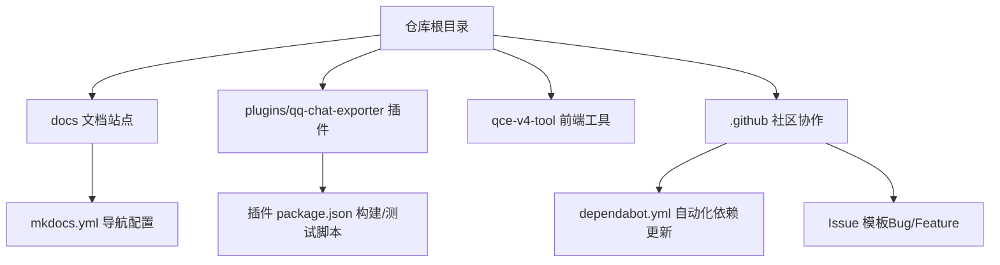
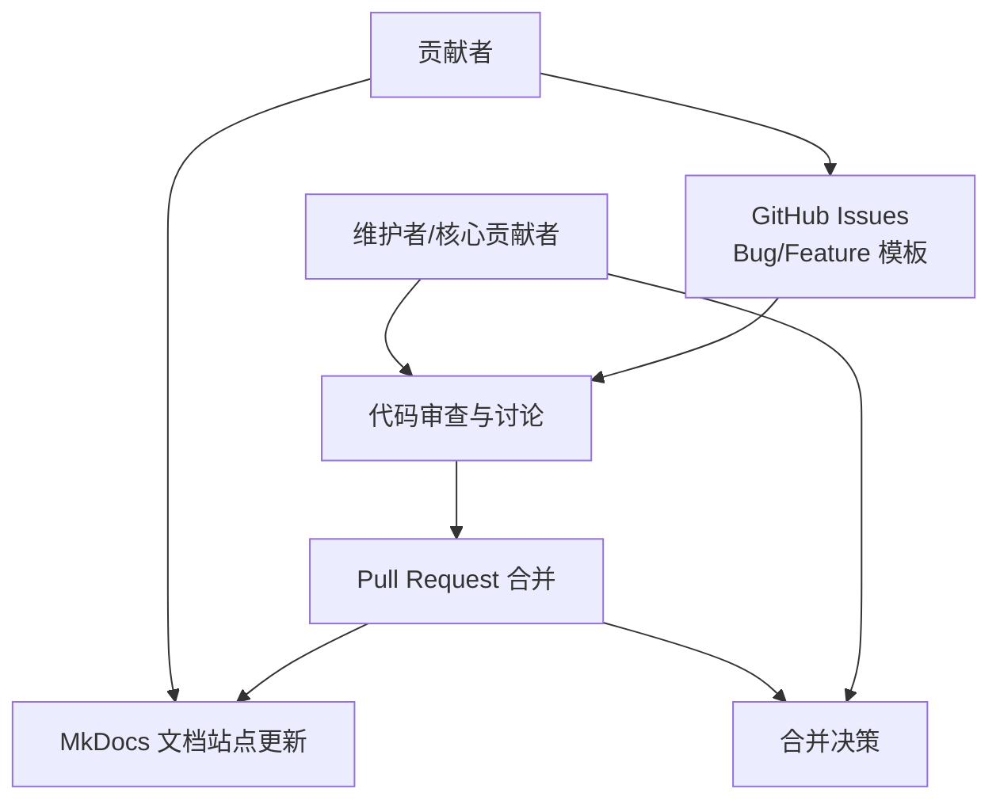
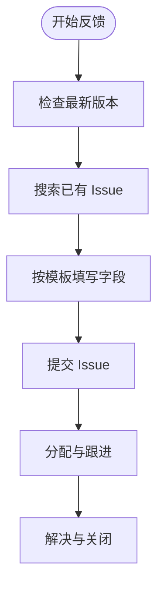
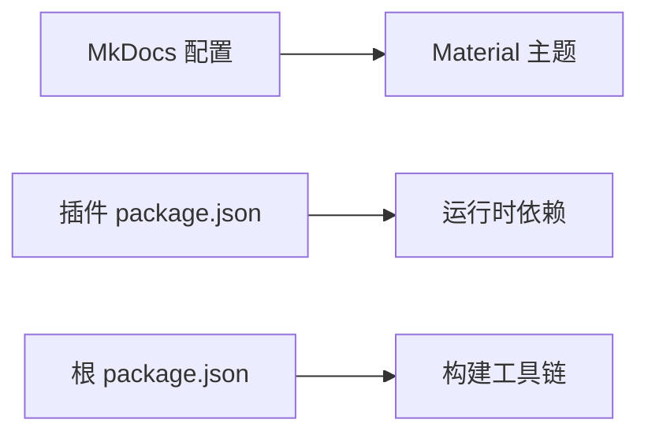

# 贡献与社区

<cite>
**本文引用的文件**
- [README.md](file://README.md)
- [docs/index.md](file://docs/index.md)
- [docs/guide.md](file://docs/guide.md)
- [docs/feedback.md](file://docs/feedback.md)
- [.github/dependabot.yml](file://.github/dependabot.yml)
- [.github/ISSUE_TEMPLATE/bug_report.yml](file://.github/ISSUE_TEMPLATE/bug_report.yml)
- [.github/ISSUE_TEMPLATE/feature_request.yml](file://.github/ISSUE_TEMPLATE/feature_request.yml)
- [plugins/qq-chat-exporter/package.json](file://plugins/qq-chat-exporter/package.json)
- [package.json](file://package.json)
- [mkdocs.yml](file://mkdocs.yml)
</cite>

## 目录
1. [简介](#简介)
2. [项目结构](#项目结构)
3. [核心组件](#核心组件)
4. [架构总览](#架构总览)
5. [详细组件分析](#详细组件分析)
6. [依赖分析](#依赖分析)
7. [性能考虑](#性能考虑)
8. [故障排查指南](#故障排查指南)
9. [结论](#结论)
10. [附录](#附录)

## 简介
本文件旨在为 QQ 聊天导出器（QCE）项目提供“贡献与社区”指南，帮助新老贡献者理解如何参与项目，包括代码贡献、文档改进、翻译支持与功能建议；明确提交规范、代码审查流程与合并要求；提供社区行为准则与沟通指南（含 GitHub Issues 使用、Pull Request 流程与讨论参与方式）；说明项目治理结构与决策流程；并给出新贡献者的入门指导与学习资源推荐。同时，文档覆盖知识产权、许可证与法律相关事项，并提供交流平台与联系方式，促进项目健康有序发展。

## 项目结构
QCE 仓库包含多个子模块与文档站点，主要结构如下：
- 顶层文档与导航：docs 目录提供使用手册、反馈与贡献入口；mkdocs.yml 驱动文档站点导航。
- 核心插件：plugins/qq-chat-exporter 为 NapCat 生态下的 QCE 插件，包含构建脚本、测试脚本与依赖配置。
- 主工程与脚手架：根目录 package.json 提供通用构建脚本与开发依赖；qce-v4-tool 为前端管理工具（Next.js）。
- 社区协作：.github 目录包含 Issue 模板与 Dependabot 配置，规范问题反馈与依赖更新。

图表来源
- [docs/index.md](file://docs/index.md#L1-L14)
- [mkdocs.yml](file://mkdocs.yml#L1-L51)
- [plugins/qq-chat-exporter/package.json](file://plugins/qq-chat-exporter/package.json#L1-L42)
- [.github/dependabot.yml](file://.github/dependabot.yml#L1-L7)
- [.github/ISSUE_TEMPLATE/bug_report.yml](file://.github/ISSUE_TEMPLATE/bug_report.yml#L1-L115)
- [.github/ISSUE_TEMPLATE/feature_request.yml](file://.github/ISSUE_TEMPLATE/feature_request.yml#L1-L62)

章节来源
- [docs/index.md](file://docs/index.md#L1-L14)
- [mkdocs.yml](file://mkdocs.yml#L1-L51)
- [plugins/qq-chat-exporter/package.json](file://plugins/qq-chat-exporter/package.json#L1-L42)
- [.github/dependabot.yml](file://.github/dependabot.yml#L1-L7)
- [.github/ISSUE_TEMPLATE/bug_report.yml](file://.github/ISSUE_TEMPLATE/bug_report.yml#L1-L115)
- [.github/ISSUE_TEMPLATE/feature_request.yml](file://.github/ISSUE_TEMPLATE/feature_request.yml#L1-L62)

## 核心组件
- 文档与导航：docs/index.md 提供文档入口与链接；mkdocs.yml 配置主题、语言与导航项，确保用户可便捷访问使用手册、反馈与贡献页面。
- 插件工程：plugins/qq-chat-exporter/package.json 定义插件名称、版本、脚本（生成 overlay、修复导入、测试）、关键字、作者、依赖与 Node 引擎要求。
- 顶层工程：package.json 提供通用构建脚本（如构建不同模式）、开发依赖与脚手架命令，支撑整体开发与发布流程。
- 社区模板：.github/ISSUE_TEMPLATE 下的 bug_report.yml 与 feature_request.yml 规范问题反馈与功能建议的填写字段，提升沟通效率。
- 依赖维护：.github/dependabot.yml 配置 NPM 生态的自动更新策略，降低安全风险与维护成本。

章节来源
- [docs/index.md](file://docs/index.md#L1-L14)
- [mkdocs.yml](file://mkdocs.yml#L1-L51)
- [plugins/qq-chat-exporter/package.json](file://plugins/qq-chat-exporter/package.json#L1-L42)
- [package.json](file://package.json#L1-L76)
- [.github/dependabot.yml](file://.github/dependabot.yml#L1-L7)
- [.github/ISSUE_TEMPLATE/bug_report.yml](file://.github/ISSUE_TEMPLATE/bug_report.yml#L1-L115)
- [.github/ISSUE_TEMPLATE/feature_request.yml](file://.github/ISSUE_TEMPLATE/feature_request.yml#L1-L62)

## 架构总览
下图展示贡献与社区相关的关键交互路径：贡献者通过 GitHub Issues 提交问题与建议，遵循模板规范；PR 提交后由维护者进行审查与合并；文档站点由 MkDocs 驱动，便于用户查阅与贡献文档。

图表来源
- [.github/ISSUE_TEMPLATE/bug_report.yml](file://.github/ISSUE_TEMPLATE/bug_report.yml#L1-L115)
- [.github/ISSUE_TEMPLATE/feature_request.yml](file://.github/ISSUE_TEMPLATE/feature_request.yml#L1-L62)
- [mkdocs.yml](file://mkdocs.yml#L1-L51)

## 详细组件分析

### 贡献入口与文档协作
- 文档入口：docs/index.md 提供“使用手册”“如何反馈问题”“如何贡献”的链接，引导用户到相应页面。
- 文档站点：mkdocs.yml 配置站点语言、主题特性与导航项，确保文档可读性与一致性。
- 贡献建议：鼓励对文档进行改进与翻译支持，通过 Pull Request 提交修改，经审查后合并。

章节来源
- [docs/index.md](file://docs/index.md#L1-L14)
- [mkdocs.yml](file://mkdocs.yml#L1-L51)

### 问题反馈与模板规范
- Bug 反馈：在提交前建议确认最新版本并搜索已有问题；模板包含操作系统、QQNT 版本、QCE 版本、安装方式、复现步骤、期望结果、错误日志与截图等字段。
- 功能建议：描述使用场景与期望效果，提供替代方案与功能类别、重要程度等信息。

图表来源
- [.github/ISSUE_TEMPLATE/bug_report.yml](file://.github/ISSUE_TEMPLATE/bug_report.yml#L1-L115)
- [.github/ISSUE_TEMPLATE/feature_request.yml](file://.github/ISSUE_TEMPLATE/feature_request.yml#L1-L62)

章节来源
- [docs/feedback.md](file://docs/feedback.md#L1-L23)
- [.github/ISSUE_TEMPLATE/bug_report.yml](file://.github/ISSUE_TEMPLATE/bug_report.yml#L1-L115)
- [.github/ISSUE_TEMPLATE/feature_request.yml](file://.github/ISSUE_TEMPLATE/feature_request.yml#L1-L62)

### 代码贡献与测试
- 插件脚本：plugins/qq-chat-exporter/package.json 提供生成 overlay、修复导入、测试（单测/全量测试）等脚本，建议在提交 PR 前执行测试。
- 顶层脚本：package.json 提供通用构建脚本与开发依赖，便于本地联调与打包。
- 提交规范：建议遵循语义化提交信息、保持变更聚焦、附带必要说明与测试结果。

章节来源
- [plugins/qq-chat-exporter/package.json](file://plugins/qq-chat-exporter/package.json#L1-L42)
- [package.json](file://package.json#L1-L76)

### 依赖维护与安全
- 自动化更新：.github/dependabot.yml 配置 NPM 生态的每周自动更新，减少安全漏洞与兼容性问题。
- 建议：在 PR 中同步更新依赖锁文件，确保 CI 通过与运行稳定。

章节来源
- [.github/dependabot.yml](file://.github/dependabot.yml#L1-L7)

### 行为准则与沟通指南
- 基本原则：尊重他人、保持友善与专业；聚焦问题本身，避免人身攻击；优先使用 Issue 讨论，必要时私下沟通。
- 沟通渠道：GitHub Issues 为主，PR 评论区为辅；重大变更建议先开 Discussion 或在 Issue 中征询意见。
- 决策流程：一般问题由维护者决定；重大变更（如架构调整、协议变更、许可变更）需在 Issue 中公开讨论并达成共识。

章节来源
- [docs/feedback.md](file://docs/feedback.md#L1-L23)
- [.github/ISSUE_TEMPLATE/bug_report.yml](file://.github/ISSUE_TEMPLATE/bug_report.yml#L1-L115)
- [.github/ISSUE_TEMPLATE/feature_request.yml](file://.github/ISSUE_TEMPLATE/feature_request.yml#L1-L62)

### 新贡献者入门与学习资源
- 入门步骤：阅读使用手册与快速开始，熟悉导出流程与界面；确认运行环境与依赖；从最小改动入手（如修复拼写、补充示例）。
- 学习资源：使用手册、API 文档、Issue 模板与现有 PR/Issue 作为参考；关注文档站点导航项以获取最新资料。
- 交流平台：GitHub Issues 与 Discussions（如启用）；必要时通过邮件或即时通讯工具私下联系维护者。

章节来源
- [docs/guide.md](file://docs/guide.md#L1-L200)
- [docs/index.md](file://docs/index.md#L1-L14)
- [README.md](file://README.md#L1-L42)

### 法律与知识产权
- 许可证：项目采用 GPL-3.0，贡献者需遵守许可证条款；在提交前确认代码来源合法、无第三方侵权风险。
- 使用声明：工具仅供学习与个人使用，遵守相关法律法规与平台服务条款；禁止商业倒卖或二次售卖。
- 知识产权：贡献代码默认同意以项目许可证开源；涉及第三方代码需注明来源与许可。

章节来源
- [README.md](file://README.md#L39-L42)

## 依赖分析
- 文档站点依赖：mkdocs.yml 配置 Material 主题、中文语言与搜索扩展，确保文档可读性与检索能力。
- 插件依赖：plugins/qq-chat-exporter/package.json 定义 Express、WS、XLSX、Archiver 等运行时依赖，以及 TypeScript 开发依赖。
- 顶层依赖：package.json 提供构建工具链与开发依赖，支撑多模式构建与调试。

图表来源
- [mkdocs.yml](file://mkdocs.yml#L1-L51)
- [plugins/qq-chat-exporter/package.json](file://plugins/qq-chat-exporter/package.json#L20-L41)
- [package.json](file://package.json#L20-L76)

章节来源
- [mkdocs.yml](file://mkdocs.yml#L1-L51)
- [plugins/qq-chat-exporter/package.json](file://plugins/qq-chat-exporter/package.json#L20-L41)
- [package.json](file://package.json#L20-L76)

## 性能考虑
- 导出性能：针对超大群聊建议使用流式导出与分段资源打包，减少内存占用与卡顿。
- 定时备份：合理设置时间范围与合并策略，避免频繁全量导出造成资源浪费。
- 前端工具：在 qce-v4-tool 中优化资源加载与缓存策略，提升交互体验。

章节来源
- [docs/guide.md](file://docs/guide.md#L153-L200)

## 故障排查指南
- 常见问题：确认最新版本、搜索已有 Issue、提供操作系统、运行模式、QQNT 版本、QCE 版本、复现步骤与日志。
- 日志收集：控制台日志与 Web 界面日志均有助于定位问题。
- 反馈模板：严格按模板填写字段，提高问题解决效率。

章节来源
- [docs/feedback.md](file://docs/feedback.md#L1-L23)
- [.github/ISSUE_TEMPLATE/bug_report.yml](file://.github/ISSUE_TEMPLATE/bug_report.yml#L1-L115)

## 结论
本指南明确了 QCE 项目的贡献路径、沟通规范与治理流程，强调以 Issue 模板与 PR 审查为核心的协作机制，结合文档站点与自动化依赖维护，保障项目质量与可持续发展。欢迎新老贡献者积极参与，共同推动项目进步。

## 附录
- 交流平台与联系方式：GitHub Issues；必要时可通过邮件或即时通讯工具私下联系维护者。
- 参考链接：使用手册、API 文档、下载地址与贡献入口。

章节来源
- [docs/index.md](file://docs/index.md#L9-L14)
- [docs/guide.md](file://docs/guide.md#L199-L200)
- [README.md](file://README.md#L7-L11)