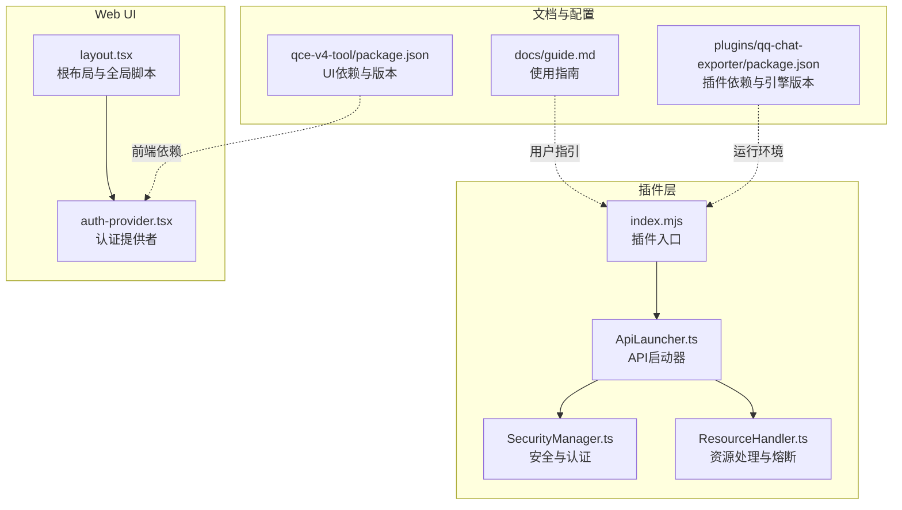
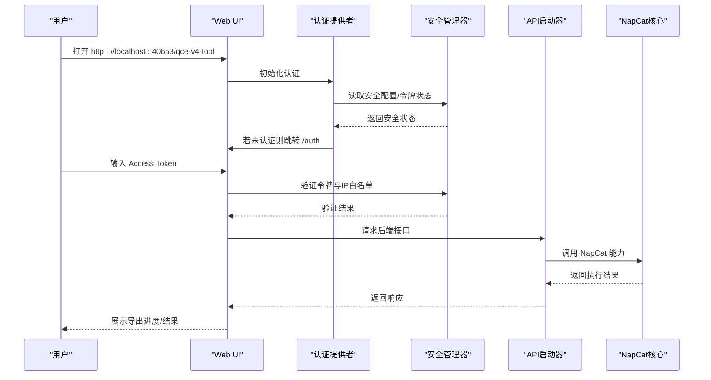
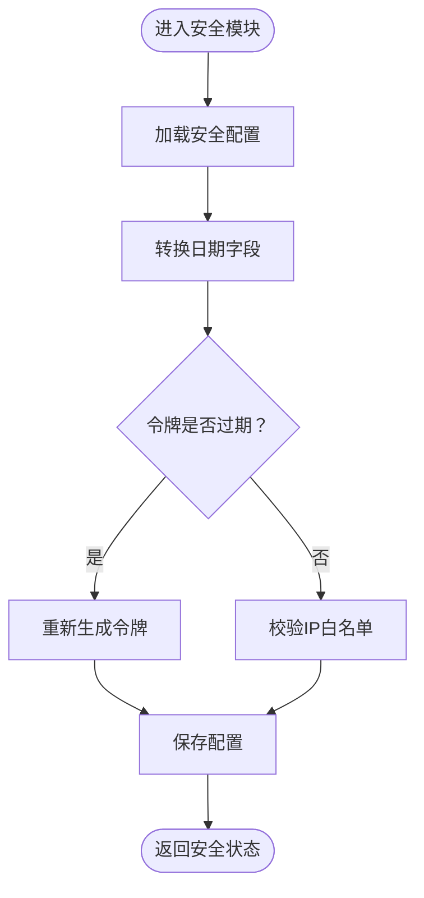
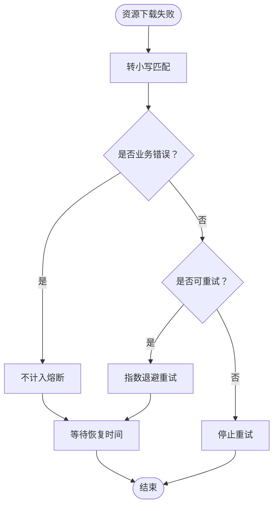
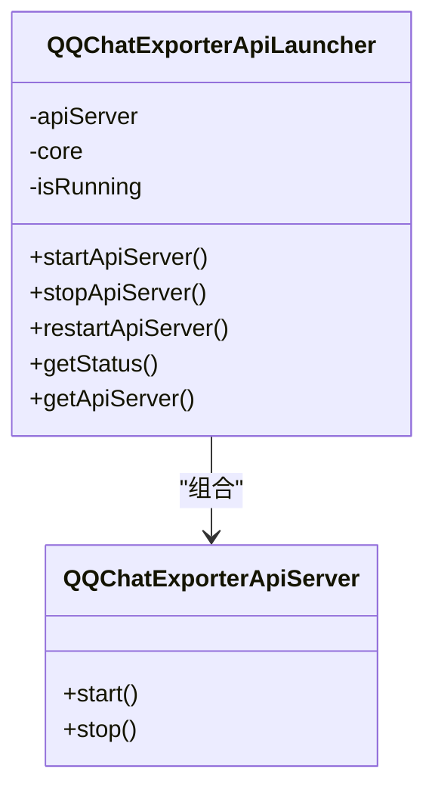
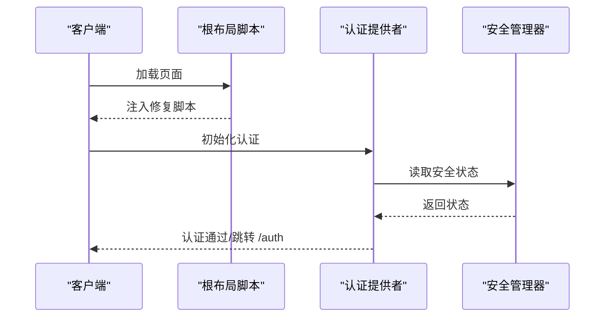
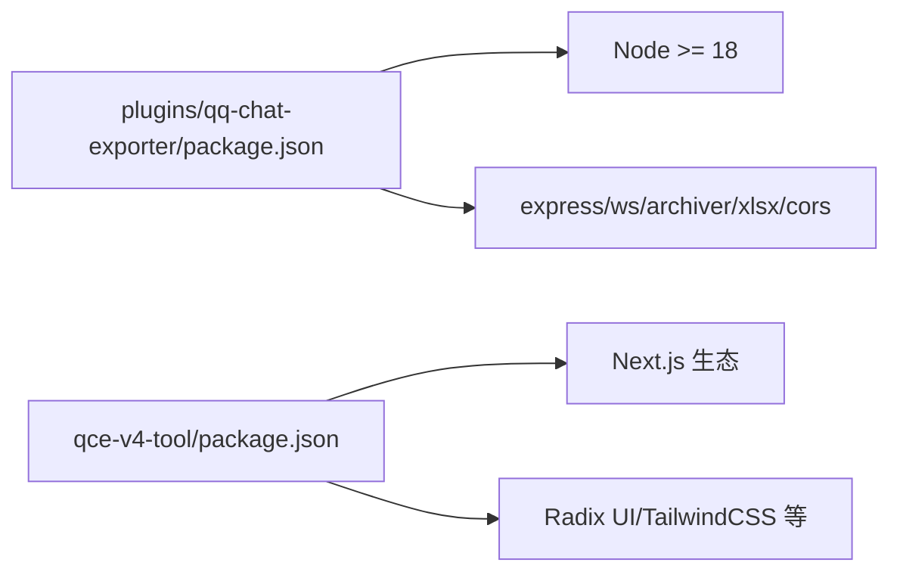

# 故障排除与常见问题

<cite>
**本文引用的文件**
- [README.md](file://README.md)
- [package.json](file://plugins/qq-chat-exporter/package.json)
- [index.mjs](file://plugins/qq-chat-exporter/index.mjs)
- [ApiLauncher.ts](file://plugins/qq-chat-exporter/lib/api/ApiLauncher.ts)
- [SecurityManager.ts](file://plugins/qq-chat-exporter/lib/security/SecurityManager.ts)
- [ResourceHandler.ts](file://plugins/qq-chat-exporter/lib/core/resource/ResourceHandler.ts)
- [guide.md](file://docs/guide.md)
- [layout.tsx](file://qce-v4-tool/app/layout.tsx)
- [auth-provider.tsx](file://qce-v4-tool/components/auth-provider.tsx)
- [package.json](file://qce-v4-tool/package.json)
</cite>

## 目录
1. [简介](#简介)
2. [项目结构](#项目结构)
3. [核心组件](#核心组件)
4. [架构总览](#架构总览)
5. [详细组件分析](#详细组件分析)
6. [依赖关系分析](#依赖关系分析)
7. [性能考虑](#性能考虑)
8. [故障排除指南](#故障排除指南)
9. [结论](#结论)
10. [附录](#附录)

## 简介
本文件面向使用 QQ 聊天导出器（QCE）的用户与技术支持团队，提供系统化的故障排除与常见问题解答。内容覆盖安装与启动、网络与权限、导出失败与性能问题、系统兼容性排查、日志收集与分析、性能优化与资源监控、紧急恢复与数据保护，以及技术支持的标准流程与知识库建设建议。

## 项目结构
QCE 由三部分组成：
- 插件层（Node/TS）：负责与 NapCat 框架集成、启动 API 服务、安全校验与资源处理。
- Web UI（Next.js）：提供前端界面，包含认证、任务管理、设置等功能。
- 文档与使用指南：帮助用户完成下载、启动、导出与进阶使用。

**图表来源**
- [index.mjs](file://plugins/qq-chat-exporter/index.mjs#L1-L77)
- [ApiLauncher.ts](file://plugins/qq-chat-exporter/lib/api/ApiLauncher.ts#L1-L68)
- [SecurityManager.ts](file://plugins/qq-chat-exporter/lib/security/SecurityManager.ts#L262-L521)
- [ResourceHandler.ts](file://plugins/qq-chat-exporter/lib/core/resource/ResourceHandler.ts#L137-L823)
- [layout.tsx](file://qce-v4-tool/app/layout.tsx#L1-L69)
- [auth-provider.tsx](file://qce-v4-tool/components/auth-provider.tsx#L1-L90)
- [guide.md](file://docs/guide.md#L1-L200)
- [package.json](file://plugins/qq-chat-exporter/package.json#L1-L42)
- [package.json](file://qce-v4-tool/package.json#L1-L74)

**章节来源**
- [README.md](file://README.md#L1-L42)
- [guide.md](file://docs/guide.md#L1-L200)
- [package.json](file://plugins/qq-chat-exporter/package.json#L1-L42)
- [package.json](file://qce-v4-tool/package.json#L1-L74)

## 核心组件
- 插件入口与运行模式检测：根据 NapCat 上下文判断 Shell/Framework 模式，并注入桥接对象，动态注册 TSX 加载器，启动 API 服务。
- API 启动器：封装 API 服务的启停与状态查询，统一错误上报。
- 安全管理器：负责首次生成安全配置、令牌过期处理、IP 白名单、服务器地址标准化、配置持久化与状态查询。
- 资源处理器：对资源下载进行熔断与重试判定，区分可重试与不可重试错误，避免业务错误计入熔断统计。
- Web UI 认证：在客户端侧进行认证检查与令牌有效性验证，支持独立模式与完整模式切换。

**章节来源**
- [index.mjs](file://plugins/qq-chat-exporter/index.mjs#L12-L64)
- [ApiLauncher.ts](file://plugins/qq-chat-exporter/lib/api/ApiLauncher.ts#L17-L66)
- [SecurityManager.ts](file://plugins/qq-chat-exporter/lib/security/SecurityManager.ts#L262-L521)
- [ResourceHandler.ts](file://plugins/qq-chat-exporter/lib/core/resource/ResourceHandler.ts#L137-L823)
- [auth-provider.tsx](file://qce-v4-tool/components/auth-provider.tsx#L26-L71)

## 架构总览

**图表来源**
- [auth-provider.tsx](file://qce-v4-tool/components/auth-provider.tsx#L26-L71)
- [SecurityManager.ts](file://plugins/qq-chat-exporter/lib/security/SecurityManager.ts#L262-L521)
- [ApiLauncher.ts](file://plugins/qq-chat-exporter/lib/api/ApiLauncher.ts#L17-L32)
- [index.mjs](file://plugins/qq-chat-exporter/index.mjs#L28-L64)

## 详细组件分析

### 组件A：认证与安全（SecurityManager）
- 功能要点
  - 首次启动生成安全配置（访问令牌、密钥、创建时间、过期时间、默认本地白名单）。
  - 令牌过期自动重新生成，确保可用性。
  - IP 白名单与禁用开关，支持 Docker 环境识别。
  - 提供安全状态查询接口，便于 UI 显示与诊断。
- 常见问题
  - 令牌过期：若访问提示“令牌无效”，需重新获取或生成新令牌。
  - IP 白名单限制：若非本机访问受限，需将客户端 IP 加入白名单或关闭白名单校验。
  - 外部访问地址：当监听地址非 localhost 时，UI 会显示外部地址，需确认防火墙与网络可达性。
- 诊断步骤
  - 检查安全配置文件是否存在与可写。
  - 校验令牌与过期时间。
  - 校验 allowedIPs 与 disableIPWhitelist。
  - 确认服务器地址标准化逻辑（0.0.0.0/空地址归一化为 127.0.0.1）。

**图表来源**
- [SecurityManager.ts](file://plugins/qq-chat-exporter/lib/security/SecurityManager.ts#L262-L303)
- [SecurityManager.ts](file://plugins/qq-chat-exporter/lib/security/SecurityManager.ts#L322-L329)
- [SecurityManager.ts](file://plugins/qq-chat-exporter/lib/security/SecurityManager.ts#L447-L496)

**章节来源**
- [SecurityManager.ts](file://plugins/qq-chat-exporter/lib/security/SecurityManager.ts#L262-L521)

### 组件B：资源处理与熔断（ResourceHandler）
- 功能要点
  - 对资源下载错误进行分类：可重试（网络/临时错误）、不可重试（401/403/404/磁盘配额等）、业务错误（不计入熔断）。
  - 提供“距离恢复尝试剩余时间”计算，避免频繁重试造成雪崩。
- 常见问题
  - 导出资源失败：检查网络波动、目标资源是否过期、存储空间是否充足。
  - 大量失败导致性能下降：系统会自动熔断与退避，等待恢复时间。
- 诊断步骤
  - 查看错误信息关键词（timeout/connect/network/temporary/server error/4xx/5xx）。
  - 区分业务错误与系统错误，避免将“文件不存在/权限不足”误判为可重试。
  - 观察恢复时间，避免在熔断期内重复触发。

**图表来源**
- [ResourceHandler.ts](file://plugins/qq-chat-exporter/lib/core/resource/ResourceHandler.ts#L137-L158)
- [ResourceHandler.ts](file://plugins/qq-chat-exporter/lib/core/resource/ResourceHandler.ts#L777-L800)
- [ResourceHandler.ts](file://plugins/qq-chat-exporter/lib/core/resource/ResourceHandler.ts#L802-L823)

**章节来源**
- [ResourceHandler.ts](file://plugins/qq-chat-exporter/lib/core/resource/ResourceHandler.ts#L137-L823)

### 组件C：API 启动与生命周期（ApiLauncher）
- 功能要点
  - 启动/停止 API 服务，记录运行状态与端口。
  - 与 NapCat 核心交互，统一错误上报。
- 常见问题
  - 端口占用：40653 被占用会导致启动失败。
  - 启动异常：检查核心上下文与依赖加载。
- 诊断步骤
  - 查询状态接口，确认端口与运行时长。
  - 查看日志中的错误堆栈，定位具体模块。

**图表来源**
- [ApiLauncher.ts](file://plugins/qq-chat-exporter/lib/api/ApiLauncher.ts#L1-L68)

**章节来源**
- [ApiLauncher.ts](file://plugins/qq-chat-exporter/lib/api/ApiLauncher.ts#L17-L66)

### 组件D：Web UI 认证与兼容性（layout.tsx, auth-provider.tsx）
- 功能要点
  - 根布局内嵌脚本修复浏览器翻译导致的 DOM 操作异常，提升跨浏览器稳定性。
  - 认证提供者在客户端侧进行令牌有效性验证，支持独立模式与完整模式切换。
- 常见问题
  - 浏览器翻译导致界面异常：根布局脚本已内置修复。
  - 未认证跳转：若 UI 一直停留在 /auth，请检查令牌有效性与后端连通性。
- 诊断步骤
  - 检查认证提供者的初始化与重定向逻辑。
  - 确认 fetch 拦截器已正确初始化（网络错误时允许继续）。

**图表来源**
- [layout.tsx](file://qce-v4-tool/app/layout.tsx#L23-L55)
- [auth-provider.tsx](file://qce-v4-tool/components/auth-provider.tsx#L26-L71)

**章节来源**
- [layout.tsx](file://qce-v4-tool/app/layout.tsx#L1-L69)
- [auth-provider.tsx](file://qce-v4-tool/components/auth-provider.tsx#L1-L90)

## 依赖关系分析
- 运行时要求
  - Node.js 版本：插件层要求 Node >= 18；UI 使用 Next.js 生态。
- 关键依赖
  - 插件层：express、ws、archiver、xlsx、cors、tsx。
  - UI 层：Next.js、Radix UI、Framer Motion、TailwindCSS 等。
- 依赖冲突与版本问题
  - 确保 Node 版本满足插件要求，避免因引擎版本不兼容导致的编译/运行失败。
  - UI 依赖较多，建议使用推荐包管理器并保持依赖同步。

**图表来源**
- [package.json](file://plugins/qq-chat-exporter/package.json#L38-L40)
- [package.json](file://plugins/qq-chat-exporter/package.json#L22-L30)
- [package.json](file://qce-v4-tool/package.json#L12-L73)

**章节来源**
- [package.json](file://plugins/qq-chat-exporter/package.json#L1-L42)
- [package.json](file://qce-v4-tool/package.json#L1-L74)

## 性能考虑
- 资源下载熔断与退避
  - 对网络与临时错误采用指数退避重试，避免雪崩效应。
  - 业务错误不计入熔断，减少无效重试。
- 大文件与超大群导出
  - 使用流式导出（Stream Export）分片处理，降低内存峰值与卡顿风险。
- 媒体资源处理
  - 建议勾选“导出为 ZIP”，避免资源分离导致加载失败。
- 前端兼容性
  - 根布局脚本修复浏览器翻译导致的 DOM 异常，提升跨浏览器稳定性。

**章节来源**
- [ResourceHandler.ts](file://plugins/qq-chat-exporter/lib/core/resource/ResourceHandler.ts#L137-L158)
- [ResourceHandler.ts](file://plugins/qq-chat-exporter/lib/core/resource/ResourceHandler.ts#L777-L823)
- [guide.md](file://docs/guide.md#L170-L176)
- [layout.tsx](file://qce-v4-tool/app/layout.tsx#L35-L53)

## 故障排除指南

### 一、安装与启动问题
- 症状
  - 启动后无法访问 Web UI。
  - 控制台提示“请先安装 tsx”。
- 诊断步骤
  - 确认 Node 版本满足要求（>=18）。
  - 检查插件入口是否成功注册 tsx 加载器并启动 API 服务。
  - 确认端口 40653 未被占用。
- 解决方案
  - 升级 Node 或安装缺失依赖。
  - 更换端口或释放占用端口。
  - 重新运行启动脚本，观察控制台输出。

**章节来源**
- [index.mjs](file://plugins/qq-chat-exporter/index.mjs#L43-L51)
- [index.mjs](file://plugins/qq-chat-exporter/index.mjs#L56-L63)
- [ApiLauncher.ts](file://plugins/qq-chat-exporter/lib/api/ApiLauncher.ts#L17-L32)

### 二、网络连接问题
- 症状
  - 导出资源失败，错误包含 timeout/connect/network/temporary/server error/5xx。
- 诊断步骤
  - 区分可重试与不可重试错误，避免对 401/403/404/磁盘配额等业务错误进行重试。
  - 观察熔断剩余恢复时间，避免在熔断期内重复触发。
- 解决方案
  - 优化网络环境，减少丢包与抖动。
  - 调整导出策略（缩小时间范围、关闭资源下载、启用流式导出）。

**章节来源**
- [ResourceHandler.ts](file://plugins/qq-chat-exporter/lib/core/resource/ResourceHandler.ts#L777-L823)
- [ResourceHandler.ts](file://plugins/qq-chat-exporter/lib/core/resource/ResourceHandler.ts#L137-L158)

### 三、权限与认证错误
- 症状
  - “令牌无效”、“认证失败”、“IP 不在白名单”。
- 诊断步骤
  - 检查安全配置文件是否存在与可写。
  - 校验令牌与过期时间，必要时重新生成。
  - 校验 allowedIPs 与 disableIPWhitelist。
- 解决方案
  - 重新生成访问令牌或延长过期时间。
  - 将客户端 IP 加入白名单，或在开发环境关闭白名单校验。
  - 确认服务器地址标准化逻辑（0.0.0.0/空地址归一化为 127.0.0.1）。

**章节来源**
- [SecurityManager.ts](file://plugins/qq-chat-exporter/lib/security/SecurityManager.ts#L262-L303)
- [SecurityManager.ts](file://plugins/qq-chat-exporter/lib/security/SecurityManager.ts#L322-L329)
- [SecurityManager.ts](file://plugins/qq-chat-exporter/lib/security/SecurityManager.ts#L447-L496)

### 四、导出失败与性能问题
- 症状
  - 导出卡顿、内存飙升、超大群崩溃。
- 诊断步骤
  - 检查是否启用流式导出与资源下载策略。
  - 分析导出时间范围与消息规模。
- 解决方案
  - 启用流式导出（Stream Export），分片处理。
  - 缩短时间范围，或选择 TXT/JSON 等轻量格式。
  - 勾选“导出为 ZIP”，避免资源分离。

**章节来源**
- [guide.md](file://docs/guide.md#L170-L176)
- [guide.md](file://docs/guide.md#L140-L151)

### 五、系统兼容性问题
- 症状
  - 浏览器翻译导致界面异常、DOM 操作报错。
- 诊断步骤
  - 检查根布局脚本是否注入修复逻辑。
  - 确认浏览器版本与 UI 依赖兼容性。
- 解决方案
  - 使用已测试的浏览器版本。
  - 关闭浏览器翻译功能或等待修复生效。

**章节来源**
- [layout.tsx](file://qce-v4-tool/app/layout.tsx#L35-L53)

### 六、日志收集与分析
- 日志来源
  - 插件入口控制台输出（初始化、错误堆栈）。
  - API 启动器错误上报（核心上下文 logger）。
  - 安全管理器配置加载/保存错误。
- 收集建议
  - 截图控制台关键错误与堆栈。
  - 记录时间戳、操作步骤、导出参数（格式、时间范围、是否资源下载）。
  - 附带安全配置状态（令牌过期、IP 白名单、服务器地址）。

**章节来源**
- [index.mjs](file://plugins/qq-chat-exporter/index.mjs#L60-L63)
- [ApiLauncher.ts](file://plugins/qq-chat-exporter/lib/api/ApiLauncher.ts#L26-L31)
- [SecurityManager.ts](file://plugins/qq-chat-exporter/lib/security/SecurityManager.ts#L118-L122)

### 七、紧急恢复与数据保护
- 紧急恢复
  - 重新生成访问令牌，确保短期可用。
  - 关闭 IP 白名单进行临时放行，定位问题后恢复。
  - 检查并释放 40653 端口占用，重启服务。
- 数据保护
  - 始终勾选“导出为 ZIP”，避免资源分离。
  - 对关键导出包进行多地点备份（本地+云盘）。

**章节来源**
- [SecurityManager.ts](file://plugins/qq-chat-exporter/lib/security/SecurityManager.ts#L514-L520)
- [guide.md](file://docs/guide.md#L140-L145)

### 八、技术支持标准流程与知识库建设
- 标准流程
  - 信息收集：版本、平台、运行模式（Shell/Framework）、错误截图与日志。
  - 环境复现：按使用指南重新执行启动与导出步骤。
  - 逐项验证：令牌/白名单/端口/网络/资源下载策略。
  - 记录与闭环：形成知识库条目，附带解决方案与预防措施。
- 知识库建设
  - 按“症状—原因—诊断步骤—解决方案—预防措施”结构组织。
  - 维护常见场景模板（安装失败、导出失败、性能问题、兼容性问题）。

**章节来源**
- [README.md](file://README.md#L11-L18)
- [guide.md](file://docs/guide.md#L1-L200)

## 结论
通过理解 QCE 的插件入口、API 启动器、安全管理器与资源处理机制，结合 Web UI 的认证与兼容性设计，用户与技术支持团队可以高效定位并解决安装、网络、权限、导出与性能等问题。建议在日常运维中完善日志收集与知识库建设，持续优化用户体验与系统稳定性。

## 附录

### A. 错误类型与参考表
- 错误类型
  - API 错误、网络错误、数据库错误、资源错误、文件系统错误、配置错误、验证错误、权限错误、超时错误、认证错误、未知错误。
- 适用场景
  - API 错误：后端接口调用失败。
  - 网络错误：连接超时、DNS 解析失败、服务器无响应。
  - 权限错误：401/403，访问令牌无效或 IP 不在白名单。
  - 资源错误：资源不存在、空路径、无法找到有效文件。
  - 文件系统错误：磁盘配额、文件已存在、路径不可写。
  - 超时错误：请求超时、连接中断。
  - 认证错误：令牌过期、签名不匹配。
  - 未知错误：未归类的异常。

**章节来源**
- [ResourceHandler.ts](file://plugins/qq-chat-exporter/lib/core/resource/ResourceHandler.ts#L137-L158)
- [ResourceHandler.ts](file://plugins/qq-chat-exporter/lib/core/resource/ResourceHandler.ts#L777-L823)
- [SecurityManager.ts](file://plugins/qq-chat-exporter/lib/security/SecurityManager.ts#L262-L303)