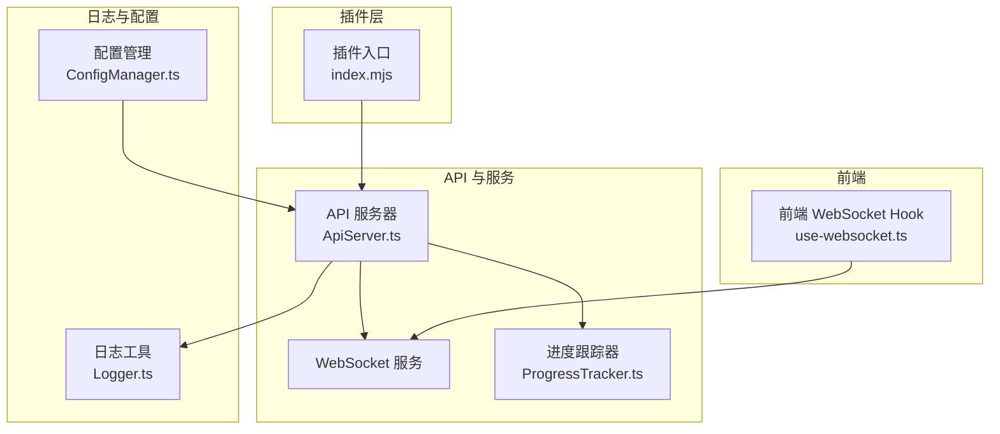
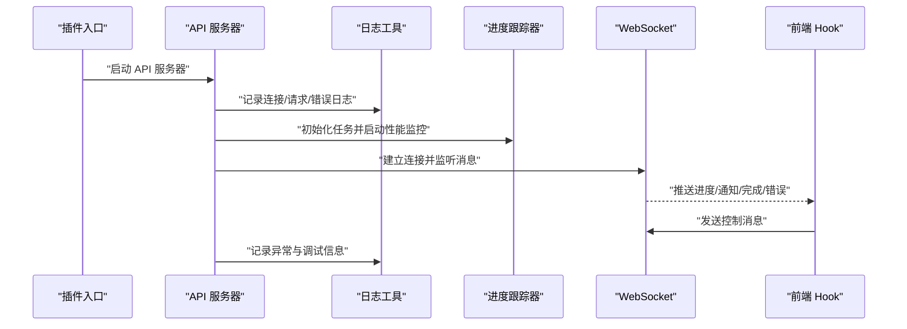
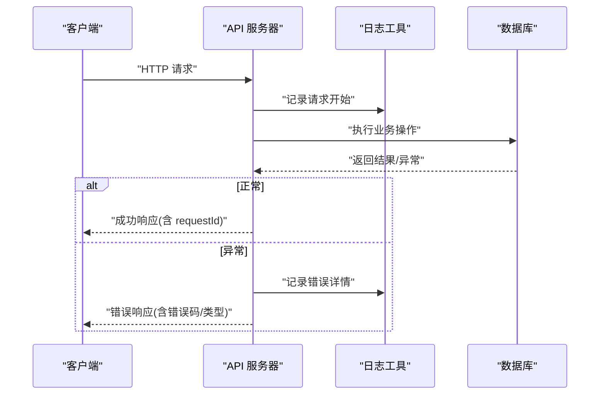
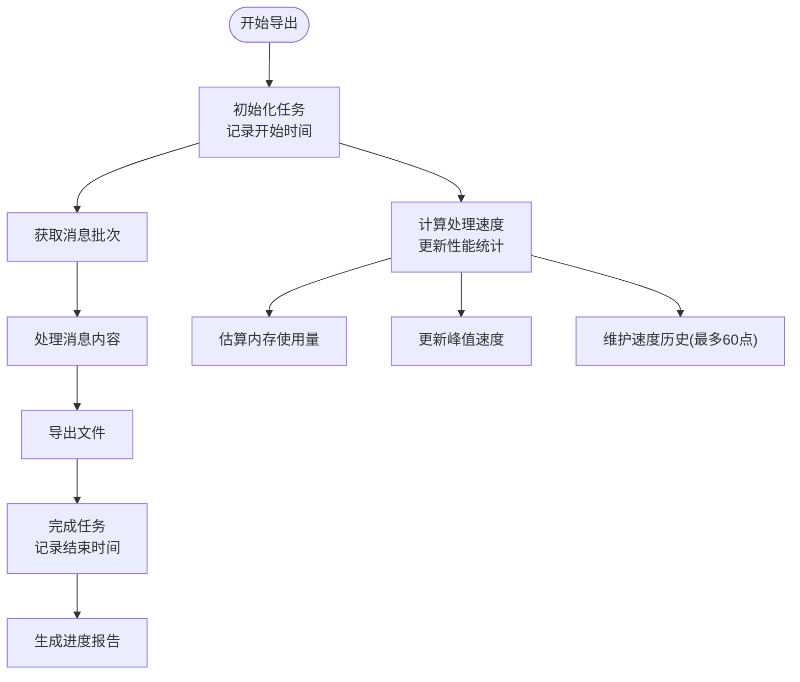
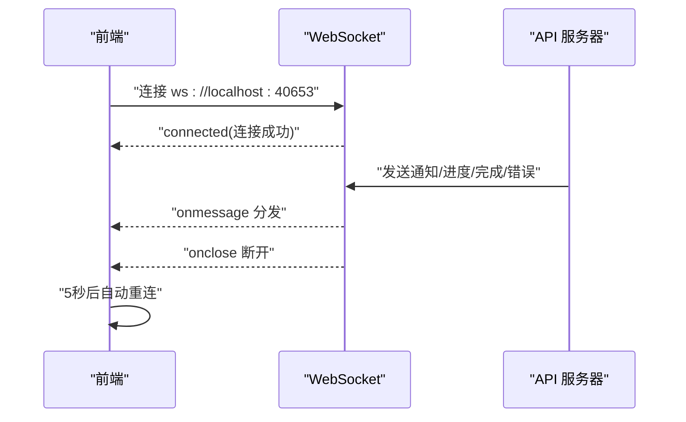
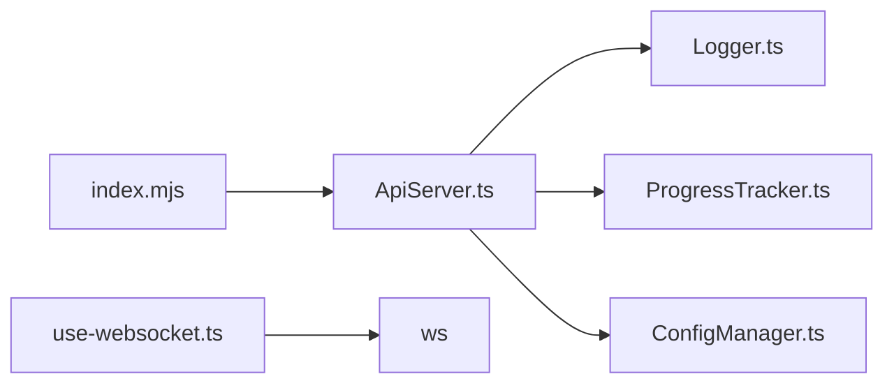

# 监控与日志

<cite>
**本文引用的文件**
- [plugins/qq-chat-exporter/index.mjs](file://plugins/qq-chat-exporter/index.mjs)
- [plugins/qq-chat-exporter/lib/utils/Logger.ts](file://plugins/qq-chat-exporter/lib/utils/Logger.ts)
- [plugins/qq-chat-exporter/lib/api/ApiServer.ts](file://plugins/qq-chat-exporter/lib/api/ApiServer.ts)
- [plugins/qq-chat-exporter/lib/core/progress/ProgressTracker.ts](file://plugins/qq-chat-exporter/lib/core/progress/ProgressTracker.ts)
- [plugins/qq-chat-exporter/dist/core/progress/ProgressTracker.js](file://plugins/qq-chat-exporter/dist/core/progress/ProgressTracker.js)
- [plugins/qq-chat-exporter/lib/core/exporter/JsonStatsAccumulator.ts](file://plugins/qq-chat-exporter/lib/core/exporter/JsonStatsAccumulator.ts)
- [plugins/qq-chat-exporter/lib/core/fetcher/BatchMessageFetcher.ts](file://plugins/qq-chat-exporter/lib/core/fetcher/BatchMessageFetcher.ts)
- [plugins/qq-chat-exporter/lib/core/storage/ConfigManager.ts](file://plugins/qq-chat-exporter/lib/core/storage/ConfigManager.ts)
- [plugins/qq-chat-exporter/package.json](file://plugins/qq-chat-exporter/package.json)
- [qce-v4-tool/hooks/use-websocket.ts](file://qce-v4-tool/hooks/use-websocket.ts)
</cite>

## 目录
1. [简介](#简介)
2. [项目结构](#项目结构)
3. [核心组件](#核心组件)
4. [架构总览](#架构总览)
5. [详细组件分析](#详细组件分析)
6. [依赖关系分析](#依赖关系分析)
7. [性能考量](#性能考量)
8. [故障排查指南](#故障排查指南)
9. [结论](#结论)
10. [附录](#附录)

## 简介
本文件面向运维与开发团队，系统性阐述 QQ 聊天导出器的监控与日志体系，涵盖以下主题：
- 日志系统架构：日志级别、输出格式、默认开关与可调项
- API 服务器日志记录：请求日志、错误日志、调试日志与统一响应包装
- 性能监控指标：导出速度、内存使用估算、并发处理能力
- WebSocket 连接状态监控与实时数据传输监控
- 错误追踪机制与异常处理策略
- 日志轮转与清理策略建议
- 运维仪表板配置与使用指南

## 项目结构
围绕监控与日志的关键模块分布如下：
- 插件入口负责运行模式检测与 API 服务器启动
- 统一日志工具提供彩色输出与按标签分类的日志实例
- API 服务器封装 Express 与 WebSocket，统一错误响应与连接日志
- 进度跟踪器提供处理速度、性能统计与阶段进度
- 配置管理器支持环境变量覆盖与调试日志开关
- 前端 Hook 提供 WebSocket 连接状态与消息分发

图表来源
- [plugins/qq-chat-exporter/index.mjs](file://plugins/qq-chat-exporter/index.mjs#L28-L64)
- [plugins/qq-chat-exporter/lib/utils/Logger.ts](file://plugins/qq-chat-exporter/lib/utils/Logger.ts#L103-L110)
- [plugins/qq-chat-exporter/lib/api/ApiServer.ts](file://plugins/qq-chat-exporter/lib/api/ApiServer.ts#L84-L187)
- [plugins/qq-chat-exporter/lib/core/progress/ProgressTracker.ts](file://plugins/qq-chat-exporter/lib/core/progress/ProgressTracker.ts#L89-L115)
- [plugins/qq-chat-exporter/lib/core/storage/ConfigManager.ts](file://plugins/qq-chat-exporter/lib/core/storage/ConfigManager.ts#L130-L161)
- [qce-v4-tool/hooks/use-websocket.ts](file://qce-v4-tool/hooks/use-websocket.ts#L12-L99)

章节来源
- [plugins/qq-chat-exporter/index.mjs](file://plugins/qq-chat-exporter/index.mjs#L1-L77)
- [plugins/qq-chat-exporter/lib/utils/Logger.ts](file://plugins/qq-chat-exporter/lib/utils/Logger.ts#L1-L114)
- [plugins/qq-chat-exporter/lib/api/ApiServer.ts](file://plugins/qq-chat-exporter/lib/api/ApiServer.ts#L1-L200)

## 核心组件
- 统一日志工具：提供 info/highlight/debug/warn/error/success 六级日志，并内置按标签的预定义实例；支持 ANSI 彩色输出与调试开关
- API 服务器：封装 Express 路由与 WebSocket，统一错误响应包装与连接生命周期日志
- 进度跟踪器：计算处理速度、维护性能统计、阶段进度与历史快照
- 配置管理器：加载系统/用户配置、应用环境变量覆盖、验证配置并设置目录
- 前端 WebSocket Hook：连接、自动重连、消息分发与错误回调

章节来源
- [plugins/qq-chat-exporter/lib/utils/Logger.ts](file://plugins/qq-chat-exporter/lib/utils/Logger.ts#L41-L100)
- [plugins/qq-chat-exporter/lib/api/ApiServer.ts](file://plugins/qq-chat-exporter/lib/api/ApiServer.ts#L84-L187)
- [plugins/qq-chat-exporter/lib/core/progress/ProgressTracker.ts](file://plugins/qq-chat-exporter/lib/core/progress/ProgressTracker.ts#L89-L115)
- [plugins/qq-chat-exporter/lib/core/storage/ConfigManager.ts](file://plugins/qq-chat-exporter/lib/core/storage/ConfigManager.ts#L130-L161)
- [qce-v4-tool/hooks/use-websocket.ts](file://qce-v4-tool/hooks/use-websocket.ts#L12-L99)

## 架构总览
下图展示日志与监控在系统中的交互关系：插件入口启动 API 服务器，API 服务器在路由与 WebSocket 层面产生日志；进度跟踪器提供性能指标；前端通过 WebSocket 实时接收进度与通知。

图表来源
- [plugins/qq-chat-exporter/index.mjs](file://plugins/qq-chat-exporter/index.mjs#L54-L58)
- [plugins/qq-chat-exporter/lib/api/ApiServer.ts](file://plugins/qq-chat-exporter/lib/api/ApiServer.ts#L3268-L3306)
- [plugins/qq-chat-exporter/lib/utils/Logger.ts](file://plugins/qq-chat-exporter/lib/utils/Logger.ts#L41-L100)
- [plugins/qq-chat-exporter/lib/core/progress/ProgressTracker.ts](file://plugins/qq-chat-exporter/lib/core/progress/ProgressTracker.ts#L126-L193)
- [qce-v4-tool/hooks/use-websocket.ts](file://qce-v4-tool/hooks/use-websocket.ts#L48-L99)

## 详细组件分析

### 日志系统架构设计
- 日志级别与输出
  - 级别：info、highlight、debug、warn、error、success
  - 输出：基于终端 ANSI 支持动态启用彩色；支持高亮与灰色调试文本
  - 开关：调试日志默认关闭，可通过环境变量开启
- 日志实例与标签
  - 预定义实例：QCE、QCE.API、QCE.DB、QCE.Security、QCE.Scheduler、QCE.Frontend
  - 默认开关：部分实例默认关闭（如数据库与前端），便于生产环境降噪
- 调试模式
  - 通过环境变量控制调试日志输出，便于问题定位

章节来源
- [plugins/qq-chat-exporter/lib/utils/Logger.ts](file://plugins/qq-chat-exporter/lib/utils/Logger.ts#L6-L25)
- [plugins/qq-chat-exporter/lib/utils/Logger.ts](file://plugins/qq-chat-exporter/lib/utils/Logger.ts#L41-L100)
- [plugins/qq-chat-exporter/lib/utils/Logger.ts](file://plugins/qq-chat-exporter/lib/utils/Logger.ts#L103-L110)

### API 服务器日志记录机制
- 请求日志
  - 连接建立、消息处理、关闭与错误均记录；包含请求 ID 以便关联
- 错误日志
  - 统一错误响应包装，包含类型、代码、时间戳与上下文；错误中间件捕获未处理异常
- 调试日志
  - 调试开关控制；API 层在关键路径输出调试信息
- 统一响应
  - 成功/失败响应包含 requestId、timestamp，便于前端与日志关联

图表来源
- [plugins/qq-chat-exporter/lib/api/ApiServer.ts](file://plugins/qq-chat-exporter/lib/api/ApiServer.ts#L3259-L3263)
- [plugins/qq-chat-exporter/lib/api/ApiServer.ts](file://plugins/qq-chat-exporter/lib/api/ApiServer.ts#L3268-L3306)
- [plugins/qq-chat-exporter/lib/api/ApiServer.ts](file://plugins/qq-chat-exporter/lib/api/ApiServer.ts#L3275-L3288)

章节来源
- [plugins/qq-chat-exporter/lib/api/ApiServer.ts](file://plugins/qq-chat-exporter/lib/api/ApiServer.ts#L56-L79)
- [plugins/qq-chat-exporter/lib/api/ApiServer.ts](file://plugins/qq-chat-exporter/lib/api/ApiServer.ts#L3259-L3263)
- [plugins/qq-chat-exporter/lib/api/ApiServer.ts](file://plugins/qq-chat-exporter/lib/api/ApiServer.ts#L3268-L3306)

### 性能监控指标
- 导出速度
  - 基于任务处理的消息计数与耗时计算平均速度；维护速度历史与峰值
- 内存使用率
  - 提供性能统计中的内存使用量估算字段（单位 MB），便于监控与告警
- 并发处理能力
  - 通过配置项限制最大并发任务数；批量抓取器支持批大小与超时重试
- 阶段进度
  - 预定义阶段权重，综合计算总体进度；支持阶段起止时间与状态

图表来源
- [plugins/qq-chat-exporter/lib/core/progress/ProgressTracker.ts](file://plugins/qq-chat-exporter/lib/core/progress/ProgressTracker.ts#L460-L491)
- [plugins/qq-chat-exporter/lib/core/progress/ProgressTracker.ts](file://plugins/qq-chat-exporter/lib/core/progress/ProgressTracker.ts#L697-L731)
- [plugins/qq-chat-exporter/dist/core/progress/ProgressTracker.js](file://plugins/qq-chat-exporter/dist/core/progress/ProgressTracker.js#L344-L371)

章节来源
- [plugins/qq-chat-exporter/lib/core/progress/ProgressTracker.ts](file://plugins/qq-chat-exporter/lib/core/progress/ProgressTracker.ts#L41-L54)
- [plugins/qq-chat-exporter/lib/core/progress/ProgressTracker.ts](file://plugins/qq-chat-exporter/lib/core/progress/ProgressTracker.ts#L460-L491)
- [plugins/qq-chat-exporter/lib/core/progress/ProgressTracker.ts](file://plugins/qq-chat-exporter/lib/core/progress/ProgressTracker.ts#L697-L731)
- [plugins/qq-chat-exporter/lib/core/exporter/JsonStatsAccumulator.ts](file://plugins/qq-chat-exporter/lib/core/exporter/JsonStatsAccumulator.ts#L74-L104)
- [plugins/qq-chat-exporter/lib/core/fetcher/BatchMessageFetcher.ts](file://plugins/qq-chat-exporter/lib/core/fetcher/BatchMessageFetcher.ts#L663-L684)

### WebSocket 连接状态监控与实时数据传输
- 连接管理
  - 建立连接、消息处理、关闭与错误事件均有日志；发送连接确认消息
- 自动重连
  - 前端 Hook 在断开后 5 秒自动重连，保持连接可用性
- 消息分发
  - 对不同类型消息进行分流处理（通知、进度、完成、错误）

图表来源
- [qce-v4-tool/hooks/use-websocket.ts](file://qce-v4-tool/hooks/use-websocket.ts#L48-L99)
- [plugins/qq-chat-exporter/lib/api/ApiServer.ts](file://plugins/qq-chat-exporter/lib/api/ApiServer.ts#L3268-L3306)

章节来源
- [qce-v4-tool/hooks/use-websocket.ts](file://qce-v4-tool/hooks/use-websocket.ts#L12-L99)
- [plugins/qq-chat-exporter/lib/api/ApiServer.ts](file://plugins/qq-chat-exporter/lib/api/ApiServer.ts#L3268-L3306)

### 错误追踪机制与异常处理策略
- 统一错误类型
  - 系统错误类包含类型、代码、时间戳与上下文；支持栈信息捕获
- API 错误响应
  - 404、通用错误中间件统一包装；包含 requestId 与错误详情
- WebSocket 错误
  - 消息解析失败、发送失败均记录错误并回传错误消息
- 配置错误
  - 配置管理器在初始化、保存配置时抛出系统错误，便于上层捕获

章节来源
- [plugins/qq-chat-exporter/lib/api/ApiServer.ts](file://plugins/qq-chat-exporter/lib/api/ApiServer.ts#L67-L79)
- [plugins/qq-chat-exporter/lib/api/ApiServer.ts](file://plugins/qq-chat-exporter/lib/api/ApiServer.ts#L3259-L3263)
- [plugins/qq-chat-exporter/lib/api/ApiServer.ts](file://plugins/qq-chat-exporter/lib/api/ApiServer.ts#L3275-L3288)
- [plugins/qq-chat-exporter/lib/core/storage/ConfigManager.ts](file://plugins/qq-chat-exporter/lib/core/storage/ConfigManager.ts#L154-L161)

### 日志轮转与清理策略
- 日志输出位置
  - 控制台输出为主，便于容器与 systemd 管理；建议结合系统日志轮转工具进行归档
- 建议策略
  - 使用系统级日志轮转（如 journald、logrotate）按大小/时间轮转
  - 将调试日志默认关闭，仅在问题定位时开启，降低生产环境日志体量
  - 对大文件导出与资源下载场景，建议在 API 层增加访问日志（可选），配合上游反向代理记录请求日志

章节来源
- [plugins/qq-chat-exporter/lib/utils/Logger.ts](file://plugins/qq-chat-exporter/lib/utils/Logger.ts#L69-L73)
- [plugins/qq-chat-exporter/lib/api/ApiServer.ts](file://plugins/qq-chat-exporter/lib/api/ApiServer.ts#L3240-L3247)

### 运维仪表板配置与使用指南
- 指标采集
  - 从进度跟踪器获取：当前/平均/峰值速度、速度历史、阶段进度、总体进度
  - 从配置管理器获取：最大并发任务数、批大小、超时与重试配置
- 前端集成
  - 前端 Hook 监听进度与通知消息，自动重连，便于构建可视化面板
- 告警建议
  - 速度持续低于阈值、峰值速度骤降、阶段长时间停滞、错误率上升

章节来源
- [plugins/qq-chat-exporter/lib/core/progress/ProgressTracker.ts](file://plugins/qq-chat-exporter/lib/core/progress/ProgressTracker.ts#L697-L731)
- [plugins/qq-chat-exporter/lib/core/storage/ConfigManager.ts](file://plugins/qq-chat-exporter/lib/core/storage/ConfigManager.ts#L255-L277)
- [qce-v4-tool/hooks/use-websocket.ts](file://qce-v4-tool/hooks/use-websocket.ts#L12-L99)

## 依赖关系分析
- 插件入口依赖 API 服务器启动
- API 服务器依赖日志工具、进度跟踪器、配置管理器
- 前端 Hook 依赖 WebSocket 服务
- 包管理器声明了核心依赖（Express、ws、cors、xlsx、archiver 等）

图表来源
- [plugins/qq-chat-exporter/index.mjs](file://plugins/qq-chat-exporter/index.mjs#L54-L58)
- [plugins/qq-chat-exporter/lib/api/ApiServer.ts](file://plugins/qq-chat-exporter/lib/api/ApiServer.ts#L84-L187)
- [plugins/qq-chat-exporter/lib/utils/Logger.ts](file://plugins/qq-chat-exporter/lib/utils/Logger.ts#L103-L110)
- [plugins/qq-chat-exporter/lib/core/progress/ProgressTracker.ts](file://plugins/qq-chat-exporter/lib/core/progress/ProgressTracker.ts#L89-L115)
- [plugins/qq-chat-exporter/lib/core/storage/ConfigManager.ts](file://plugins/qq-chat-exporter/lib/core/storage/ConfigManager.ts#L130-L161)
- [qce-v4-tool/hooks/use-websocket.ts](file://qce-v4-tool/hooks/use-websocket.ts#L48-L48)

章节来源
- [plugins/qq-chat-exporter/package.json](file://plugins/qq-chat-exporter/package.json#L22-L30)

## 性能考量
- 导出速度
  - 通过处理速度与历史数据评估吞吐稳定性；峰值速度可用于识别瓶颈
- 内存使用
  - 提供内存使用量估算字段，建议结合系统监控工具观察趋势
- 并发能力
  - 通过最大并发任务数与批大小配置影响整体吞吐；需结合资源与网络状况调优
- I/O 与网络
  - 资源下载与静态文件服务采用流式传输，减少内存占用

章节来源
- [plugins/qq-chat-exporter/lib/core/progress/ProgressTracker.ts](file://plugins/qq-chat-exporter/lib/core/progress/ProgressTracker.ts#L41-L54)
- [plugins/qq-chat-exporter/lib/core/progress/ProgressTracker.ts](file://plugins/qq-chat-exporter/lib/core/progress/ProgressTracker.ts#L460-L491)
- [plugins/qq-chat-exporter/lib/api/ApiServer.ts](file://plugins/qq-chat-exporter/lib/api/ApiServer.ts#L3165-L3238)

## 故障排查指南
- 启动失败
  - 检查插件入口运行模式检测与 tsx 加载器注册
- WebSocket 连接失败
  - 查看前端 Hook 的自动重连逻辑与错误回调；确认 API 服务器 WebSocket 配置
- 导出卡顿或速度异常
  - 检查进度跟踪器的速度历史与峰值；核对批大小、超时与重试配置
- 文件下载失败
  - 核对路径安全检查、扩展名白名单与文件存在性；关注流式读取错误
- 配置异常
  - 通过配置管理器的环境变量覆盖与验证流程定位问题

章节来源
- [plugins/qq-chat-exporter/index.mjs](file://plugins/qq-chat-exporter/index.mjs#L12-L26)
- [plugins/qq-chat-exporter/index.mjs](file://plugins/qq-chat-exporter/index.mjs#L44-L48)
- [qce-v4-tool/hooks/use-websocket.ts](file://qce-v4-tool/hooks/use-websocket.ts#L83-L96)
- [plugins/qq-chat-exporter/lib/core/progress/ProgressTracker.ts](file://plugins/qq-chat-exporter/lib/core/progress/ProgressTracker.ts#L460-L491)
- [plugins/qq-chat-exporter/lib/core/storage/ConfigManager.ts](file://plugins/qq-chat-exporter/lib/core/storage/ConfigManager.ts#L255-L277)
- [plugins/qq-chat-exporter/lib/api/ApiServer.ts](file://plugins/qq-chat-exporter/lib/api/ApiServer.ts#L3165-L3238)

## 结论
本监控与日志体系以“统一日志、统一错误、统一进度”为核心，结合 WebSocket 实时反馈与配置驱动的性能指标，形成闭环的可观测性方案。建议在生产环境中：
- 默认关闭调试日志，启用关键日志标签
- 使用系统级日志轮转与集中化收集
- 基于进度跟踪器指标构建仪表板与告警
- 通过前端 Hook 与 WebSocket 实时监控导出状态

## 附录
- 环境变量与配置项
  - 数据库路径、输出目录、批大小、超时、重试次数、最大并发任务数、调试日志开关、WebUI 端口等
- 关键日志标签
  - QCE、QCE.API、QCE.DB、QCE.Security、QCE.Scheduler、QCE.Frontend

章节来源
- [plugins/qq-chat-exporter/lib/core/storage/ConfigManager.ts](file://plugins/qq-chat-exporter/lib/core/storage/ConfigManager.ts#L255-L277)
- [plugins/qq-chat-exporter/lib/utils/Logger.ts](file://plugins/qq-chat-exporter/lib/utils/Logger.ts#L103-L110)