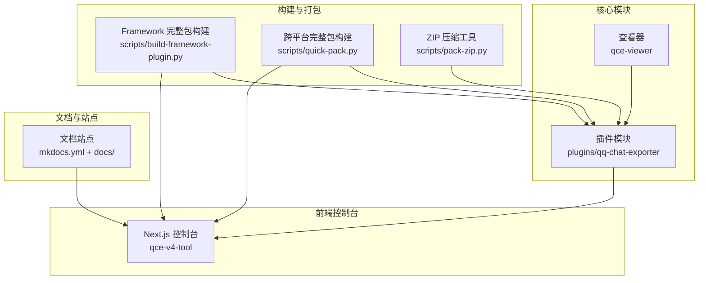
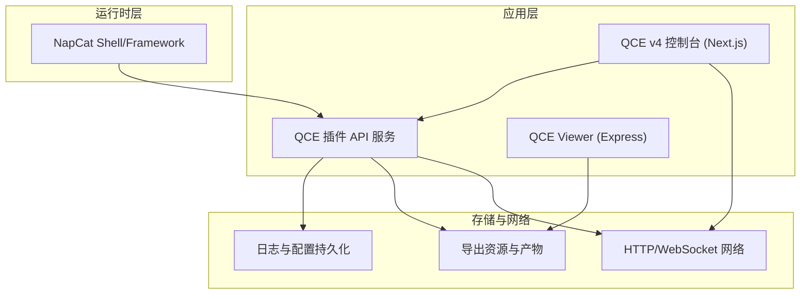
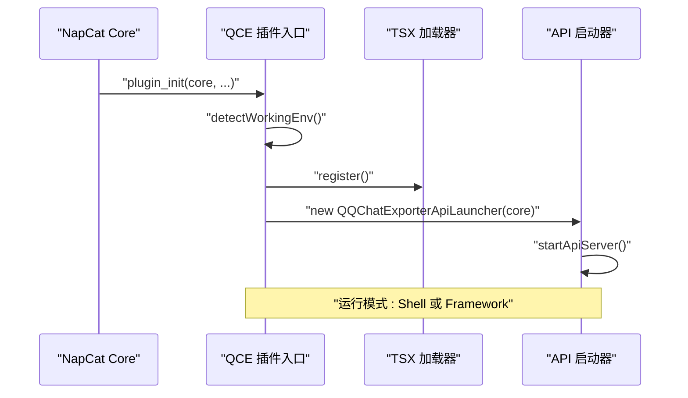
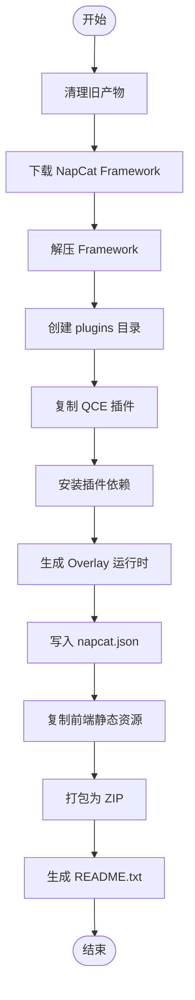
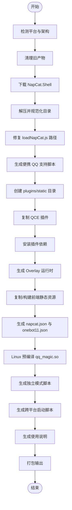
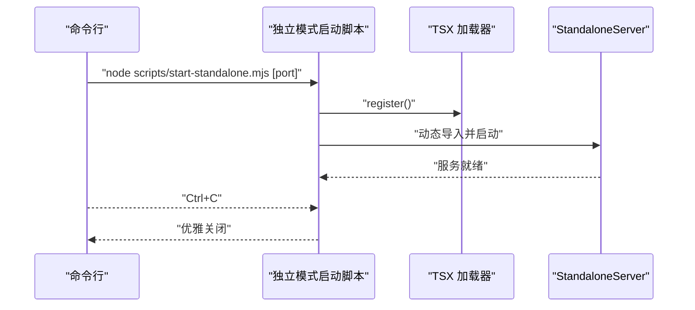
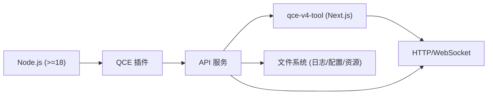

# 部署与运维

<cite>
**本文引用的文件**
- [README.md](file://README.md)
- [package.json](file://package.json)
- [plugins/qq-chat-exporter/package.json](file://plugins/qq-chat-exporter/package.json)
- [plugins/qq-chat-exporter/index.mjs](file://plugins/qq-chat-exporter/index.mjs)
- [qce-v4-tool/package.json](file://qce-v4-tool/package.json)
- [scripts/build-framework-plugin.py](file://scripts/build-framework-plugin.py)
- [scripts/quick-pack.py](file://scripts/quick-pack.py)
- [scripts/pack-zip.py](file://scripts/pack-zip.py)
- [scripts/start-standalone.mjs](file://scripts/start-standalone.mjs)
- [qce-viewer/package.json](file://qce-viewer/package.json)
- [mkdocs.yml](file://mkdocs.yml)
- [docs/guide.md](file://docs/guide.md)
- [docs/index.md](file://docs/index.md)
</cite>

## 目录
1. [简介](#简介)
2. [项目结构](#项目结构)
3. [核心组件](#核心组件)
4. [架构总览](#架构总览)
5. [详细组件分析](#详细组件分析)
6. [依赖关系分析](#依赖关系分析)
7. [性能考虑](#性能考虑)
8. [故障排除指南](#故障排除指南)
9. [结论](#结论)
10. [附录](#附录)

## 简介
本指南面向生产环境的部署与运维团队，围绕 QQ 聊天导出器（QCE）提供从服务器要求、环境变量、依赖安装、自动化构建脚本到监控与日志、备份恢复、安全加固与性能调优的完整操作手册。文档同时覆盖 Docker 容器化部署思路与清单，并给出运维最佳实践。

## 项目结构
该项目采用多模块组织方式：
- 核心插件模块：plugins/qq-chat-exporter，提供导出能力与 Web UI 集成
- 前端管理界面：qce-v4-tool，基于 Next.js 构建的 Web 控制台
- 自动化构建脚本：scripts 目录下的 Python/JS 脚本，负责打包、依赖安装与前端静态资源注入
- 独立查看器：qce-viewer，轻量 Express 服务用于本地浏览导出资源
- 文档与站点：docs 与 mkdocs.yml，用于生成静态文档站点

图表来源
- [plugins/qq-chat-exporter/index.mjs](file://plugins/qq-chat-exporter/index.mjs#L1-L77)
- [qce-v4-tool/package.json](file://qce-v4-tool/package.json#L1-L74)
- [scripts/build-framework-plugin.py](file://scripts/build-framework-plugin.py#L1-L262)
- [scripts/quick-pack.py](file://scripts/quick-pack.py#L1-L915)
- [scripts/pack-zip.py](file://scripts/pack-zip.py#L1-L55)
- [qce-viewer/package.json](file://qce-viewer/package.json#L1-L22)
- [mkdocs.yml](file://mkdocs.yml#L1-L51)

章节来源
- [README.md](file://README.md#L1-L42)
- [docs/index.md](file://docs/index.md#L1-L14)

## 核心组件
- 插件入口与运行模式检测：插件通过入口文件检测运行模式（Shell/Framework），并动态加载 TSX 以启动 API 服务。
- 构建脚本链路：Framework 完整包构建脚本负责下载 NapCat Framework、集成 QCE 插件、安装依赖、生成运行时、注入前端静态资源与配置；跨平台完整包构建脚本负责 Shell 模式包的下载、提取、补丁修复、依赖安装、前端注入与配置生成。
- 独立模式启动：提供独立模式脚本，无需登录即可浏览已导出资源。
- 前端控制台：Next.js 应用，提供会话管理、任务调度、定时备份、合并备份等功能。
- 查看器：Express 服务，便于本地预览导出资源。

章节来源
- [plugins/qq-chat-exporter/index.mjs](file://plugins/qq-chat-exporter/index.mjs#L1-L77)
- [scripts/build-framework-plugin.py](file://scripts/build-framework-plugin.py#L1-L262)
- [scripts/quick-pack.py](file://scripts/quick-pack.py#L1-L915)
- [scripts/start-standalone.mjs](file://scripts/start-standalone.mjs#L1-L55)
- [qce-v4-tool/package.json](file://qce-v4-tool/package.json#L1-L74)
- [qce-viewer/package.json](file://qce-viewer/package.json#L1-L22)

## 架构总览
下图展示生产环境典型部署形态：NapCat Shell/Framework 作为运行时，QCE 插件提供 API 与导出能力，前端控制台通过 HTTP 访问 API，日志与配置持久化至磁盘，资源导出产物落盘。

图表来源
- [plugins/qq-chat-exporter/index.mjs](file://plugins/qq-chat-exporter/index.mjs#L1-L77)
- [qce-v4-tool/package.json](file://qce-v4-tool/package.json#L1-L74)
- [qce-viewer/package.json](file://qce-viewer/package.json#L1-L22)

## 详细组件分析

### 组件一：插件入口与运行模式检测
- 运行模式识别：优先从上下文工作环境字段判断，其次通过 Electron/Shell 环境变量辅助判定。
- 动态加载：使用 tsx 注册加载器，动态导入 API 启动器并启动 API 服务。
- 生命周期：提供初始化与清理钩子，确保服务停止与全局桥接对象释放。

图表来源
- [plugins/qq-chat-exporter/index.mjs](file://plugins/qq-chat-exporter/index.mjs#L1-L77)

章节来源
- [plugins/qq-chat-exporter/index.mjs](file://plugins/qq-chat-exporter/index.mjs#L1-L77)

### 组件二：Framework 完整包构建流程
- 版本与下载：自动获取最新 NapCat 版本并下载 Framework 包。
- 目录与依赖：解压后创建 plugins 目录，复制 QCE 插件，安装依赖，生成 Overlay 运行时。
- 配置注入：写入 napcat.json，启用 QCE 插件并配置日志级别。
- 前端注入：复制 qce-v4-tool/out 到 static 目录，便于内嵌访问。
- 归档与说明：打包为 ZIP，生成 README.txt 说明安装与使用要点。

图表来源
- [scripts/build-framework-plugin.py](file://scripts/build-framework-plugin.py#L1-L262)

章节来源
- [scripts/build-framework-plugin.py](file://scripts/build-framework-plugin.py#L1-L262)

### 组件三：跨平台完整包构建流程（Shell 模式）
- 平台检测：根据操作系统与架构选择输出格式（zip/tar.gz）。
- 下载与提取：下载 NapCat.Shell，处理可能存在的子目录结构。
- 补丁修复：修正 loadNapCat.js 路径问题，避免加载失败。
- 便携 QQ 支持：生成多套启动脚本，支持 GUI 文件选择、环境变量与路径记忆。
- 依赖与运行时：安装插件依赖，生成 Overlay 运行时。
- 前端注入：若前端未构建则先执行构建，再复制静态资源。
- 配置生成：生成 napcat.json 与 onebot11.json。
- Linux 预编译：尝试预编译 qq_magic.so 以解决符号缺失问题。
- 独立模式脚本：生成 standalone.mjs 与跨平台启动脚本。
- Launcher 脚本：为 Linux/macOS 生成带自动探测 QQ 路径的启动脚本。
- README 与归档：生成使用说明并打包输出。

图表来源
- [scripts/quick-pack.py](file://scripts/quick-pack.py#L1-L915)

章节来源
- [scripts/quick-pack.py](file://scripts/quick-pack.py#L1-L915)

### 组件四：独立模式启动流程
- 参数解析：支持传入端口，默认 40653。
- TSX 注册：在插件目录注册 TSX 加载器。
- 动态导入：动态导入 StandaloneServer 并启动。
- 信号处理：监听 SIGINT，优雅退出。

图表来源
- [scripts/start-standalone.mjs](file://scripts/start-standalone.mjs#L1-L55)

章节来源
- [scripts/start-standalone.mjs](file://scripts/start-standalone.mjs#L1-L55)

### 组件五：前端控制台（Next.js）
- 技术栈：Next.js + Radix UI + TailwindCSS + Recharts 等。
- 功能：会话管理、批量导出、定时任务、合并备份、设置面板等。
- 构建与运行：提供 build/dev/start/lint 脚本。

章节来源
- [qce-v4-tool/package.json](file://qce-v4-tool/package.json#L1-L74)

### 组件六：查看器（Express）
- 用途：本地浏览导出资源，自动打开浏览器。
- 依赖：Express、Open。

章节来源
- [qce-viewer/package.json](file://qce-viewer/package.json#L1-L22)

## 依赖关系分析
- Node.js 版本要求：插件模块声明 Node >= 18；根工程与前端控制台亦依赖较新版本 Node。
- 关键运行时：NapCat Shell/Framework 提供运行时与 QQNT 集成；QCE 插件通过 API 提供导出能力。
- 前端静态资源：构建脚本将 qce-v4-tool/out 复制到 static 目录，实现内嵌访问。
- 日志与配置：构建脚本生成 napcat.json 与 onebot11.json，控制日志级别与网络配置。

图表来源
- [plugins/qq-chat-exporter/package.json](file://plugins/qq-chat-exporter/package.json#L1-L42)
- [qce-v4-tool/package.json](file://qce-v4-tool/package.json#L1-L74)
- [scripts/build-framework-plugin.py](file://scripts/build-framework-plugin.py#L135-L162)
- [scripts/quick-pack.py](file://scripts/quick-pack.py#L516-L563)

章节来源
- [plugins/qq-chat-exporter/package.json](file://plugins/qq-chat-exporter/package.json#L1-L42)
- [qce-v4-tool/package.json](file://qce-v4-tool/package.json#L1-L74)
- [scripts/build-framework-plugin.py](file://scripts/build-framework-plugin.py#L135-L162)
- [scripts/quick-pack.py](file://scripts/quick-pack.py#L516-L563)

## 性能考虑
- 流式导出：针对超大群聊，建议使用流式导出以降低内存占用与卡顿风险。
- 媒体资源处理：导出 HTML 时需保留资源目录完整性，推荐打包为 ZIP 以便传输与存储。
- 定时备份策略：按天增量备份，月末合并，减少单次处理压力。
- 前端静态资源：构建阶段统一注入，避免运行时重复构建带来的延迟。
- 独立模式：仅浏览已导出资源，无需登录，适合离线预览与低负载场景。

章节来源
- [docs/guide.md](file://docs/guide.md#L153-L200)

## 故障排除指南
- 无法找到 Token
  - 检查 %USERPROFILE%\.qq-chat-exporter 下的 security.json，确认 accessToken 字段。
  - 若未生成，先以完整模式启动并扫码登录，再在控制台查看 Token。
- 启动失败（缺少 tsx）
  - 插件初始化需要 tsx，请先安装依赖后再启动。
- Linux/macOS 启动异常
  - 确认已安装 Node.js 18+。
  - 若存在 qq_magic 符号缺失，可使用预编译的 qq_magic.so 或手动安装构建工具。
- QQ 版本不兼容
  - 仅支持 QQNT（QQ 9.9.x 及以上），若检测到旧版 QQ 将提示错误。
- 端口冲突
  - 默认端口为 40653，可通过独立模式脚本传入自定义端口。

章节来源
- [docs/guide.md](file://docs/guide.md#L88-L118)
- [plugins/qq-chat-exporter/index.mjs](file://plugins/qq-chat-exporter/index.mjs#L43-L48)
- [scripts/quick-pack.py](file://scripts/quick-pack.py#L568-L596)
- [scripts/start-standalone.mjs](file://scripts/start-standalone.mjs#L46-L51)

## 结论
通过明确的运行模式、完善的自动化构建脚本与清晰的部署流程，QCE 可在多种环境中稳定运行。建议在生产环境中结合定时备份、资源打包与独立模式预览，配合日志与配置持久化，形成可靠的备份恢复与运维体系。

## 附录

### A. 生产环境部署清单
- 服务器要求
  - 操作系统：Windows/Linux/macOS（Shell 模式）
  - Node.js：>= 18（建议使用长期支持版本）
  - 存储：充足磁盘空间（导出资源与日志）
- 环境变量
  - NAPCAT_QQ_PATH：指定 QQ 可执行文件路径（便携模式）
  - NAPCAT_MAIN_PATH：指向 napcat.mjs（Linux/macOS 启动脚本）
  - QCE_VERSION：构建脚本用于指定 QCE 版本（可选）
- 依赖安装
  - 插件依赖：在插件目录执行安装（构建脚本已内置）
  - 前端依赖：在 qce-v4-tool 目录执行安装（构建脚本已内置）
- 端口与网络
  - 默认端口：40653
  - 网络协议：HTTP/WebSocket（API 与前端交互）

章节来源
- [plugins/qq-chat-exporter/package.json](file://plugins/qq-chat-exporter/package.json#L38-L40)
- [qce-v4-tool/package.json](file://qce-v4-tool/package.json#L1-L74)
- [scripts/quick-pack.py](file://scripts/quick-pack.py#L726-L791)

### B. Docker 支持与容器化部署方案
- 方案概述
  - 使用 Shell 模式镜像：基于 Linux 发行版，安装 Node.js 与 QQNT，挂载导出目录与配置目录。
  - 使用独立模式镜像：仅运行前端与查看器，适合离线资源浏览。
- 关键步骤
  - 准备基础镜像：选择带图形库与 Node.js 的基础镜像。
  - 安装 QQNT：通过包管理器或官方安装包安装 QQNT。
  - 挂载卷：映射导出目录、配置目录与日志目录。
  - 端口暴露：开放 40653 端口。
  - 启动顺序：先启动 NapCat，再启动 QCE 控制台。
- 注意事项
  - QQNT 登录：容器内需支持图形界面或使用无头模式。
  - 资源权限：确保容器内用户对挂载目录有读写权限。
  - 安全：限制容器网络访问，必要时使用反向代理与鉴权。

[本节为概念性方案，不直接对应具体源文件，故不提供图表来源]

### C. 监控与日志系统设计
- 日志采集
  - 控制台日志：构建脚本已配置 napcat.json 的日志级别与输出目标。
  - 导出任务日志：记录任务状态、耗时与错误信息。
- 指标收集
  - 导出速率、资源下载大小、任务并发数等。
- 错误追踪
  - 异常捕获与堆栈记录，便于定位问题。
- 告警机制
  - 结合日志与指标，设置阈值告警（如导出失败率、任务超时）。

章节来源
- [scripts/build-framework-plugin.py](file://scripts/build-framework-plugin.py#L140-L147)
- [scripts/quick-pack.py](file://scripts/quick-pack.py#L520-L527)

### D. 备份恢复策略
- 备份范围
  - 导出资源目录（HTML/JSON/TXT/ZIP）
  - 配置文件（napcat.json、onebot11.json、security.json）
  - 日志目录
- 备份频率
  - 增量：每日备份新增资源
  - 全量：每月一次全量归档
- 恢复流程
  - 停止服务
  - 恢复配置与资源
  - 启动服务并验证

章节来源
- [docs/guide.md](file://docs/guide.md#L161-L169)

### E. 安全加固措施
- 访问控制
  - 限制允许访问 IP（security.json 中的 allowedIPs）
  - 使用 Token 鉴权（Access Token）
- 传输安全
  - 建议在反向代理层启用 HTTPS
- 权限最小化
  - 仅授予必要的文件系统权限
  - 避免在容器中使用 root 用户

章节来源
- [docs/guide.md](file://docs/guide.md#L44-L61)

### F. 性能调优建议
- 导出参数优化
  - 合理设置时间范围，避免一次性处理过多数据
  - 使用流式导出处理超大群聊
- 资源管理
  - 导出 HTML 时打包为 ZIP，减少文件碎片
  - 媒体资源按需下载，避免不必要的网络与存储开销
- 并发与资源
  - 控制并发任务数量，避免 CPU/IO 抖动
  - 定期清理临时文件与缓存

章节来源
- [docs/guide.md](file://docs/guide.md#L132-L176)

### G. 自动化构建脚本使用说明
- Framework 完整包构建
  - 运行脚本，自动下载最新 NapCat Framework，集成 QCE 插件，安装依赖，生成运行时与前端静态资源，最终输出 ZIP 包。
- 跨平台完整包构建
  - 运行脚本，自动下载 NapCat.Shell，处理补丁与便携 QQ 支持，安装依赖，生成运行时与前端静态资源，输出对应平台的压缩包。
- ZIP 压缩工具
  - 将指定目录压缩为 ZIP，支持进度与统计信息输出。
- 独立模式启动
  - 在插件目录安装依赖后，通过脚本启动独立模式服务，支持自定义端口。

章节来源
- [scripts/build-framework-plugin.py](file://scripts/build-framework-plugin.py#L56-L262)
- [scripts/quick-pack.py](file://scripts/quick-pack.py#L107-L915)
- [scripts/pack-zip.py](file://scripts/pack-zip.py#L1-L55)
- [scripts/start-standalone.mjs](file://scripts/start-standalone.mjs#L1-L55)

### H. 文档与站点
- 文档站点：使用 MkDocs 生成，主题为 Material Design，支持中文导航与搜索。
- 文档内容：包含首页、使用手册、反馈与贡献指南等。

章节来源
- [mkdocs.yml](file://mkdocs.yml#L1-L51)
- [docs/index.md](file://docs/index.md#L1-L14)