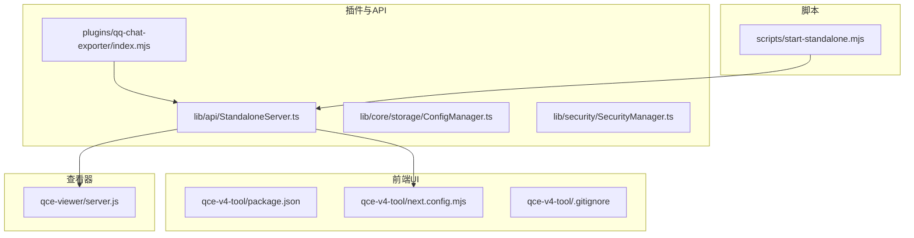
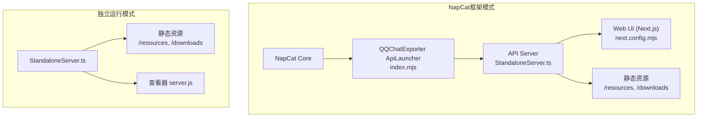
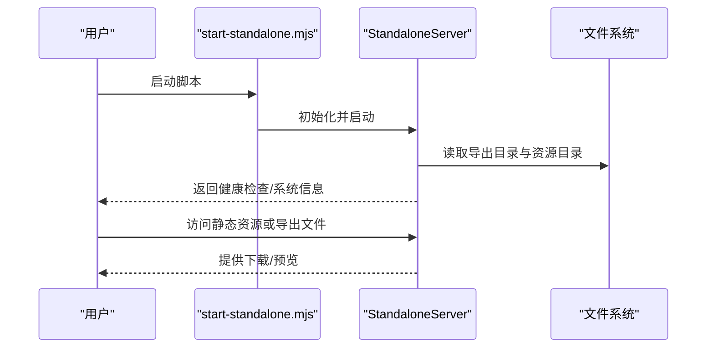
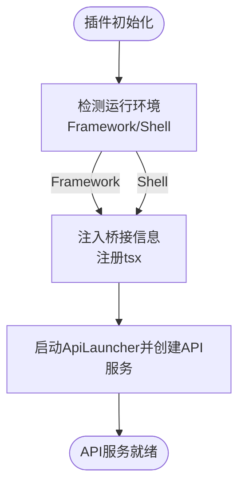
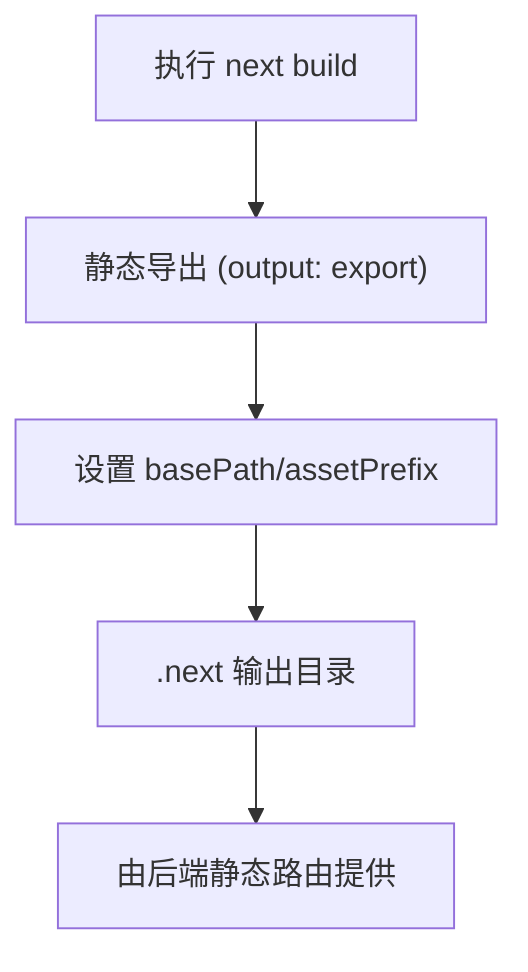
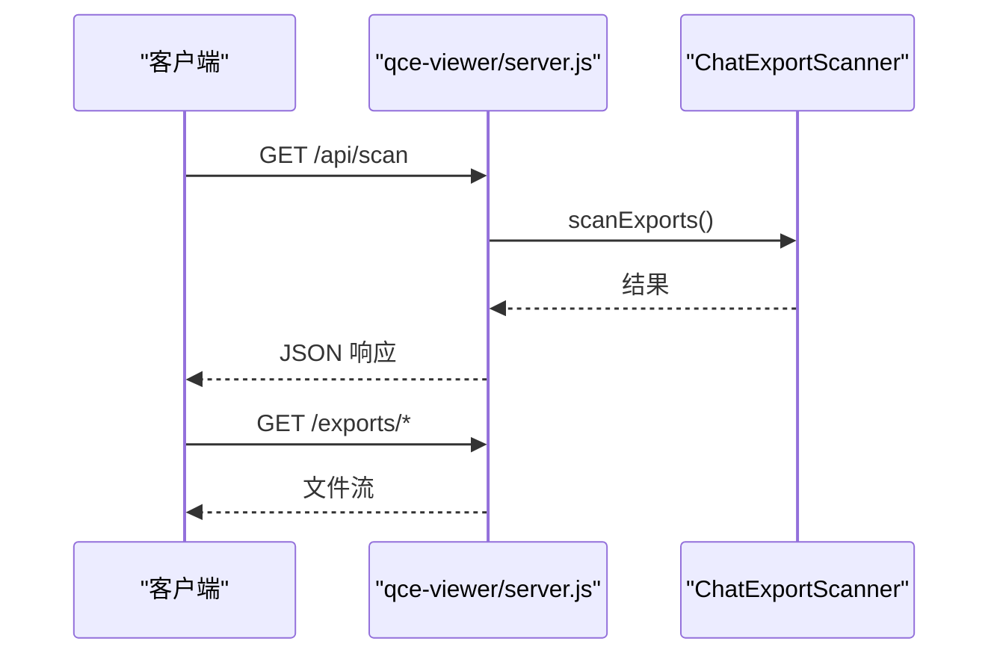
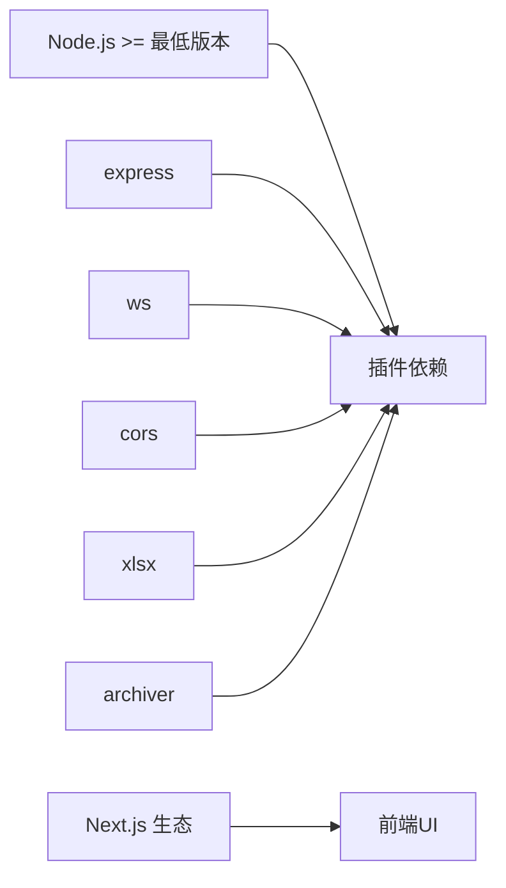

# 部署配置

<cite>
**本文引用的文件**
- [README.md](file://README.md)
- [package.json](file://package.json)
- [plugins/qq-chat-exporter/package.json](file://plugins/qq-chat-exporter/package.json)
- [plugins/qq-chat-exporter/index.mjs](file://plugins/qq-chat-exporter/index.mjs)
- [plugins/qq-chat-exporter/lib/api/StandaloneServer.ts](file://plugins/qq-chat-exporter/lib/api/StandaloneServer.ts)
- [scripts/start-standalone.mjs](file://scripts/start-standalone.mjs)
- [qce-v4-tool/package.json](file://qce-v4-tool/package.json)
- [qce-v4-tool/next.config.mjs](file://qce-v4-tool/next.config.mjs)
- [qce-v4-tool/.gitignore](file://qce-v4-tool/.gitignore)
- [qce-viewer/server.js](file://qce-viewer/server.js)
- [plugins/qq-chat-exporter/lib/core/storage/ConfigManager.ts](file://plugins/qq-chat-exporter/lib/core/storage/ConfigManager.ts)
- [plugins/qq-chat-exporter/lib/security/SecurityManager.ts](file://plugins/qq-chat-exporter/lib/security/SecurityManager.ts)
</cite>

## 目录
1. [简介](#简介)
2. [项目结构](#项目结构)
3. [核心组件](#核心组件)
4. [架构总览](#架构总览)
5. [详细组件分析](#详细组件分析)
6. [依赖关系分析](#依赖关系分析)
7. [性能考虑](#性能考虑)
8. [故障排查指南](#故障排查指南)
9. [结论](#结论)
10. [附录](#附录)

## 简介
本指南面向生产环境部署“QQ聊天导出器”，覆盖系统要求、两种部署模式（独立运行模式与NapCat框架模式）、环境变量与端口配置、网络要求、安装清单、前端静态资源部署、Docker容器化方案以及最佳实践与配置模板。目标是帮助运维与开发人员快速、稳定地完成部署与上线。

## 项目结构
该仓库包含以下与部署密切相关的模块：
- 插件主体与API：位于 plugins/qq-chat-exporter，提供 NapCat 插件入口、独立模式服务器、配置与安全能力。
- Web UI（Next.js）：位于 qce-v4-tool，提供前端界面与静态导出产物。
- 聊天记录查看器：位于 qce-viewer，提供独立的静态资源浏览与API服务。
- 启动脚本：位于 scripts，提供独立模式启动脚本。
- 根级工程：位于根目录，包含通用脚本与打包命令。

图表来源
- [plugins/qq-chat-exporter/index.mjs](file://plugins/qq-chat-exporter/index.mjs#L1-L77)
- [plugins/qq-chat-exporter/lib/api/StandaloneServer.ts](file://plugins/qq-chat-exporter/lib/api/StandaloneServer.ts#L1-L120)
- [qce-v4-tool/next.config.mjs](file://qce-v4-tool/next.config.mjs#L1-L41)
- [qce-viewer/server.js](file://qce-viewer/server.js#L1-L50)
- [scripts/start-standalone.mjs](file://scripts/start-standalone.mjs#L1-L55)

章节来源
- [README.md](file://README.md#L1-L42)
- [package.json](file://package.json#L1-L76)

## 核心组件
- NapCat插件入口与运行模式检测：负责在 NapCat Shell 或 Framework 模式下启动API服务，并注入桥接信息。
- 独立模式服务器：提供健康检查、认证（始终通过）、系统信息、导出文件管理、资源索引与静态文件服务，适用于仅浏览已导出数据的场景。
- 配置管理器：支持通过环境变量覆盖系统配置项，便于生产环境定制。
- 安全管理器：提供IP白名单、私有网段识别等安全能力。
- Next.js前端工具：提供静态导出、基础路径与资源前缀配置，适配反向代理部署。
- 聊天记录查看器：提供独立的Express服务，用于浏览导出目录与资源。

章节来源
- [plugins/qq-chat-exporter/index.mjs](file://plugins/qq-chat-exporter/index.mjs#L12-L26)
- [plugins/qq-chat-exporter/lib/api/StandaloneServer.ts](file://plugins/qq-chat-exporter/lib/api/StandaloneServer.ts#L38-L134)
- [plugins/qq-chat-exporter/lib/core/storage/ConfigManager.ts](file://plugins/qq-chat-exporter/lib/core/storage/ConfigManager.ts#L255-L277)
- [plugins/qq-chat-exporter/lib/security/SecurityManager.ts](file://plugins/qq-chat-exporter/lib/security/SecurityManager.ts#L133-L138)
- [qce-v4-tool/next.config.mjs](file://qce-v4-tool/next.config.mjs#L17-L38)
- [qce-viewer/server.js](file://qce-viewer/server.js#L1-L25)

## 架构总览
下图展示两种部署模式的架构差异与交互关系：

图表来源
- [plugins/qq-chat-exporter/index.mjs](file://plugins/qq-chat-exporter/index.mjs#L28-L64)
- [plugins/qq-chat-exporter/lib/api/StandaloneServer.ts](file://plugins/qq-chat-exporter/lib/api/StandaloneServer.ts#L38-L134)
- [qce-v4-tool/next.config.mjs](file://qce-v4-tool/next.config.mjs#L25-L31)
- [qce-viewer/server.js](file://qce-viewer/server.js#L1-L25)

## 详细组件分析

### 独立运行模式（Standalone）
- 启动方式：通过脚本启动独立服务器，默认监听端口，支持传入自定义端口。
- 功能范围：提供健康检查、认证（始终通过）、系统信息、导出文件管理、资源索引与静态文件服务；对需要登录QQ的功能返回“不支持”友好提示。
- 数据目录：默认在用户主目录下的专属目录中维护导出文件、资源与定时导出目录。
- 静态资源服务：提供导出文件下载、资源文件访问与前端静态路由。

图表来源
- [scripts/start-standalone.mjs](file://scripts/start-standalone.mjs#L25-L52)
- [plugins/qq-chat-exporter/lib/api/StandaloneServer.ts](file://plugins/qq-chat-exporter/lib/api/StandaloneServer.ts#L50-L134)

章节来源
- [scripts/start-standalone.mjs](file://scripts/start-standalone.mjs#L1-L55)
- [plugins/qq-chat-exporter/lib/api/StandaloneServer.ts](file://plugins/qq-chat-exporter/lib/api/StandaloneServer.ts#L38-L134)

### NapCat框架模式（Framework/Shell）
- 插件入口：根据运行环境自动检测模式（Framework或Shell），注册tsx加载器并启动API服务。
- API服务：由插件内部的ApiLauncher创建并启动，提供与独立模式一致的API能力。
- 运行环境：Framework模式通常具备Electron上下文，Shell模式为无头运行。

图表来源
- [plugins/qq-chat-exporter/index.mjs](file://plugins/qq-chat-exporter/index.mjs#L12-L26)
- [plugins/qq-chat-exporter/index.mjs](file://plugins/qq-chat-exporter/index.mjs#L53-L64)

章节来源
- [plugins/qq-chat-exporter/index.mjs](file://plugins/qq-chat-exporter/index.mjs#L1-L77)

### 前端静态资源部署（Next.js）
- 构建方式：采用静态导出（export），输出目录为默认的.next，支持基础路径与资源前缀配置。
- 基础路径与前缀：生产环境下通过环境变量设置，适配反向代理子路径部署。
- 版本注入：从插件package.json读取版本号注入到前端环境变量。

图表来源
- [qce-v4-tool/next.config.mjs](file://qce-v4-tool/next.config.mjs#L17-L38)
- [qce-v4-tool/package.json](file://qce-v4-tool/package.json#L6-L11)

章节来源
- [qce-v4-tool/next.config.mjs](file://qce-v4-tool/next.config.mjs#L1-L41)
- [qce-v4-tool/package.json](file://qce-v4-tool/package.json#L1-L74)

### 聊天记录查看器（独立Express服务）
- 提供静态文件服务、导出文件与资源文件访问、健康检查、搜索与设置API。
- 默认端口来自环境变量或默认值，支持设置自定义扫描路径。

图表来源
- [qce-viewer/server.js](file://qce-viewer/server.js#L15-L183)

章节来源
- [qce-viewer/server.js](file://qce-viewer/server.js#L1-L233)

## 依赖关系分析
- Node.js版本要求：插件与根工程均要求Node版本满足最低版本要求。
- 关键依赖：Express、ws、cors、xlsx、archiver等用于HTTP服务、WebSocket、跨域与压缩导出。
- 前端依赖：Next.js、Radix UI、TailwindCSS、React等生态组件。
- 运行模式：NapCat插件通过tsx加载TypeScript模块，确保在不同模式下均可启动API服务。

图表来源
- [plugins/qq-chat-exporter/package.json](file://plugins/qq-chat-exporter/package.json#L22-L30)
- [qce-v4-tool/package.json](file://qce-v4-tool/package.json#L12-L73)
- [package.json](file://package.json#L70-L74)

章节来源
- [plugins/qq-chat-exporter/package.json](file://plugins/qq-chat-exporter/package.json#L38-L40)
- [qce-v4-tool/package.json](file://qce-v4-tool/package.json#L1-L74)
- [package.json](file://package.json#L1-L76)

## 性能考虑
- 并发与超时：通过配置管理器支持并发任务数、超时与重试次数等参数，建议在高负载场景下调优。
- 静态资源缓存：独立模式服务器对资源文件设置较长缓存时间，提升访问性能。
- 文件预览优化：HTML预览时对资源路径进行替换，避免跨域与路径问题。
- Docker部署：建议使用只读文件系统挂载导出目录与资源目录，减少写放大。

## 故障排查指南
- 独立模式启动失败：确认插件依赖已安装，按脚本提示执行依赖安装后再启动。
- 端口占用：独立模式默认端口可在启动脚本传参指定；查看器服务端口可通过环境变量配置。
- 跨域与认证：独立模式下认证始终通过；若需限制访问，结合反向代理与安全策略。
- 资源路径异常：独立模式服务器会修正HTML中的资源路径，确保以API路由形式访问资源。
- 安全限制：安全管理器支持私有网段识别与IP匹配，必要时可结合防火墙与反向代理策略。

章节来源
- [scripts/start-standalone.mjs](file://scripts/start-standalone.mjs#L46-L51)
- [plugins/qq-chat-exporter/lib/api/StandaloneServer.ts](file://plugins/qq-chat-exporter/lib/api/StandaloneServer.ts#L637-L658)
- [plugins/qq-chat-exporter/lib/security/SecurityManager.ts](file://plugins/qq-chat-exporter/lib/security/SecurityManager.ts#L111-L128)

## 结论
通过明确区分独立运行模式与NapCat框架模式，结合前端静态导出与后端API服务，可实现灵活、稳定的生产部署。建议在生产环境中统一通过环境变量与配置文件进行参数化管理，并配合反向代理与安全策略保障访问安全与性能。

## 附录

### 系统要求与兼容性
- 操作系统：支持主流桌面与服务器操作系统（Windows/Linux/macOS）。
- Node.js版本：满足插件与根工程的最低版本要求。
- 硬件配置建议：CPU与内存按导出规模与并发需求评估；磁盘容量需满足导出文件与资源存储。

章节来源
- [plugins/qq-chat-exporter/package.json](file://plugins/qq-chat-exporter/package.json#L38-L40)
- [package.json](file://package.json#L1-L76)

### 部署模式对比与配置差异
- 独立运行模式
  - 启动：使用独立启动脚本，支持自定义端口。
  - 功能：提供健康检查、认证（始终通过）、系统信息、导出文件管理、资源索引与静态文件服务。
  - 数据目录：默认在用户主目录下创建专属目录存放导出与资源。
- NapCat框架模式
  - 启动：由NapCat自动加载插件入口，自动检测运行模式并启动API服务。
  - 功能：与独立模式一致，但具备与QQ协议交互的能力（取决于插件功能）。

章节来源
- [scripts/start-standalone.mjs](file://scripts/start-standalone.mjs#L1-L55)
- [plugins/qq-chat-exporter/lib/api/StandaloneServer.ts](file://plugins/qq-chat-exporter/lib/api/StandaloneServer.ts#L38-L134)
- [plugins/qq-chat-exporter/index.mjs](file://plugins/qq-chat-exporter/index.mjs#L12-L26)

### 环境变量与端口配置
- 独立模式端口：启动脚本支持传入端口参数，默认端口见脚本注释。
- 查看器端口：默认端口来自环境变量或默认值。
- 配置覆盖：通过配置管理器支持数据库路径、输出目录、批大小、超时、重试次数、并发任务数、调试日志开关与WebUI端口等环境变量覆盖。

章节来源
- [scripts/start-standalone.mjs](file://scripts/start-standalone.mjs#L25-L27)
- [qce-viewer/server.js](file://qce-viewer/server.js#L8)
- [plugins/qq-chat-exporter/lib/core/storage/ConfigManager.ts](file://plugins/qq-chat-exporter/lib/core/storage/ConfigManager.ts#L255-L277)

### 网络要求
- 内部访问：独立模式与查看器默认监听本地端口，适合内网部署。
- 反向代理：前端静态导出支持基础路径与资源前缀配置，便于通过反向代理发布到子路径。
- 安全策略：结合私有网段识别与IP匹配，建议配合防火墙与反向代理访问控制。

章节来源
- [qce-v4-tool/next.config.mjs](file://qce-v4-tool/next.config.mjs#L27-L29)
- [plugins/qq-chat-exporter/lib/security/SecurityManager.ts](file://plugins/qq-chat-exporter/lib/security/SecurityManager.ts#L111-L128)

### 安装清单
- 依赖安装
  - 插件依赖：在插件目录执行依赖安装。
  - 前端依赖：在前端工具目录执行依赖安装。
  - 根工程依赖：在根目录执行依赖安装。
- 配置文件
  - 前端：Next.js配置文件已内置静态导出与基础路径设置。
  - 查看器：支持设置自定义扫描路径。
- 启动脚本
  - 独立模式：使用独立启动脚本，支持传入端口。
  - NapCat模式：由NapCat自动加载插件入口并启动API服务。

章节来源
- [plugins/qq-chat-exporter/package.json](file://plugins/qq-chat-exporter/package.json#L7-L12)
- [qce-v4-tool/package.json](file://qce-v4-tool/package.json#L6-L11)
- [package.json](file://package.json#L6-L18)
- [scripts/start-standalone.mjs](file://scripts/start-standalone.mjs#L1-L55)
- [qce-viewer/server.js](file://qce-viewer/server.js#L138-L162)

### 前端静态资源部署
- 构建：执行前端构建命令生成静态产物。
- 服务：由后端静态路由提供静态文件服务，支持基础路径与资源前缀。
- 预览：HTML预览时自动修正资源路径，确保资源正确加载。

章节来源
- [qce-v4-tool/package.json](file://qce-v4-tool/package.json#L6-L11)
- [qce-v4-tool/next.config.mjs](file://qce-v4-tool/next.config.mjs#L25-L31)
- [plugins/qq-chat-exporter/lib/api/StandaloneServer.ts](file://plugins/qq-chat-exporter/lib/api/StandaloneServer.ts#L618-L632)

### Docker容器化部署方案
- 建议镜像：基于官方Node.js镜像，安装系统依赖后复制项目代码。
- 卷挂载：挂载导出目录与资源目录为持久卷，避免容器重启丢失数据。
- 端口映射：将容器端口映射到宿主机端口，独立模式默认端口可按需调整。
- 环境变量：通过环境变量传递配置覆盖项，如输出目录、并发任务数、超时等。
- 反向代理：在容器外部署反向代理，配置基础路径与TLS终止。

（本节为通用容器化建议，未直接对应具体源码文件）

### 最佳实践与配置模板
- 独立模式
  - 使用独立启动脚本启动，确保依赖安装完成。
  - 通过环境变量覆盖关键参数，如输出目录、并发任务数、超时等。
  - 结合反向代理提供静态资源服务，设置基础路径与资源前缀。
- NapCat框架模式
  - 在NapCat中启用插件，确保运行模式检测正确。
  - 通过配置管理器覆盖系统参数，按需调整并发与超时。
  - 结合安全策略限制访问，必要时启用私有网段识别。

章节来源
- [scripts/start-standalone.mjs](file://scripts/start-standalone.mjs#L1-L55)
- [plugins/qq-chat-exporter/lib/core/storage/ConfigManager.ts](file://plugins/qq-chat-exporter/lib/core/storage/ConfigManager.ts#L255-L277)
- [qce-v4-tool/next.config.mjs](file://qce-v4-tool/next.config.mjs#L27-L29)
- [plugins/qq-chat-exporter/lib/security/SecurityManager.ts](file://plugins/qq-chat-exporter/lib/security/SecurityManager.ts#L111-L128)