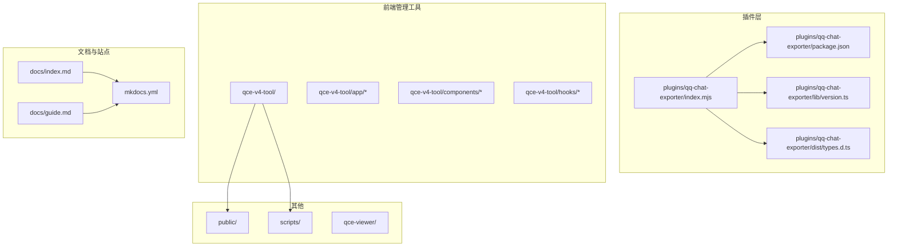
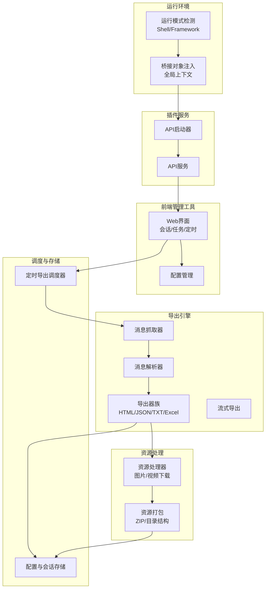
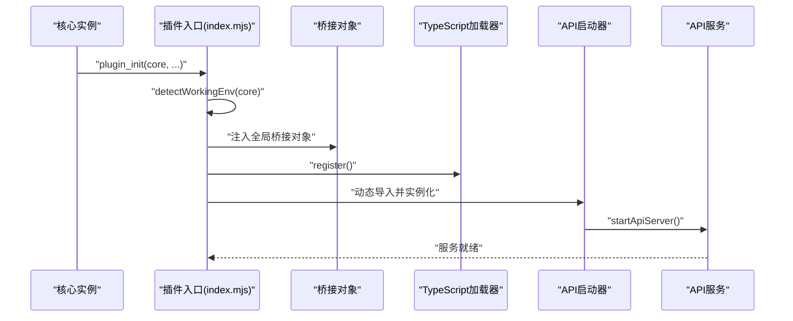
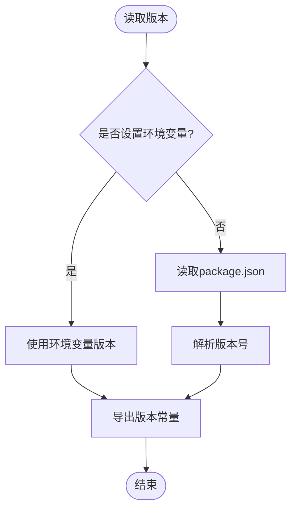
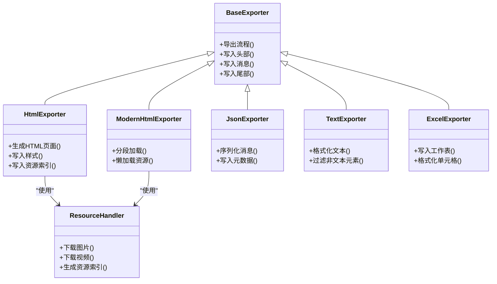
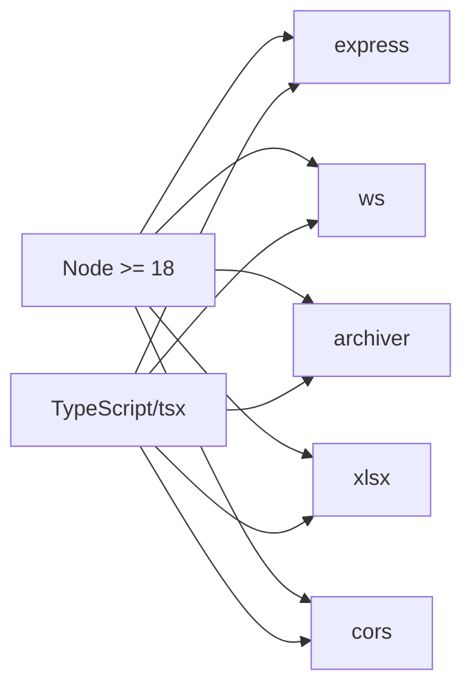

# 项目概述

<cite>
**本文引用的文件**
- [README.md](file://README.md)
- [package.json](file://plugins/qq-chat-exporter/package.json)
- [index.mjs](file://plugins/qq-chat-exporter/index.mjs)
- [version.ts](file://plugins/qq-chat-exporter/lib/version.ts)
- [guide.md](file://docs/guide.md)
- [index.md](file://docs/index.md)
- [mkdocs.yml](file://mkdocs.yml)
- [dist/types.d.ts](file://plugins/qq-chat-exporter/dist/types.d.ts)
</cite>

## 目录
1. [引言](#引言)
2. [项目结构](#项目结构)
3. [核心组件](#核心组件)
4. [架构总览](#架构总览)
5. [详细组件分析](#详细组件分析)
6. [依赖关系分析](#依赖关系分析)
7. [性能考量](#性能考量)
8. [故障排除指南](#故障排除指南)
9. [结论](#结论)
10. [附录](#附录)

## 引言
QQ聊天导出器（简称QCE）是一个面向QQ聊天记录的导出工具，支持将好友与群聊的历史消息导出为多种格式，并配套资源下载能力，确保导出内容的完整性与可复现性。项目基于NapCat框架开发，既可作为独立无头模式运行（Shell模式），也可作为QQNT插件运行（Framework模式），满足不同场景下的使用需求。

QCE的核心价值在于：
- 多格式导出：HTML、JSON、TXT、Excel等，兼顾人类可读与机器可分析。
- 资源完整保留：图片、视频等媒体资源随消息一并导出，保证导出页面的视觉一致性。
- 自动化与批量化：支持定时备份、批量导出、流式导出等能力，适配大规模数据场景。
- 与NapCat生态集成：依托NapCat框架实现与QQ客户端的通信与数据抓取，提供稳定的运行环境。

项目定位为NapCat框架的插件，区别于传统聊天工具的“直接导出”方式，QCE通过插件机制在QQ客户端内部完成消息采集与处理，从而获得更稳定的数据来源与更高的兼容性。

## 项目结构
仓库采用多模块组织方式：
- plugins/qq-chat-exporter：NapCat插件主体，包含TypeScript源码、构建产物与工具脚本。
- qce-v4-tool：基于Next.js的Web前端管理工具，提供会话管理、导出任务、定时备份等功能界面。
- qce-viewer：静态资源查看器，用于本地预览导出的HTML资源包。
- scripts：构建与打包脚本，负责版本同步、框架插件打包等。
- docs：文档站点，使用MkDocs+Material主题，提供中文文档与导航。
- public：前端静态资源与入口页面，配合qce-v4-tool运行。
- 根目录：根级配置与启动脚本，支撑独立运行与发布流程。

图表来源
- [package.json](file://plugins/qq-chat-exporter/package.json#L1-L42)
- [index.mjs](file://plugins/qq-chat-exporter/index.mjs#L1-L77)
- [version.ts](file://plugins/qq-chat-exporter/lib/version.ts#L1-L53)
- [guide.md](file://docs/guide.md#L1-L200)
- [index.md](file://docs/index.md#L1-L14)
- [mkdocs.yml](file://mkdocs.yml#L1-L51)

章节来源
- [README.md](file://README.md#L1-L42)
- [package.json](file://plugins/qq-chat-exporter/package.json#L1-L42)
- [index.mjs](file://plugins/qq-chat-exporter/index.mjs#L1-L77)
- [guide.md](file://docs/guide.md#L1-L200)
- [index.md](file://docs/index.md#L1-L14)
- [mkdocs.yml](file://mkdocs.yml#L1-L51)

## 核心组件
- 插件入口与运行模式检测：插件入口负责检测当前运行模式（Shell或Framework），注入桥接对象并启动API服务，支持动态加载TypeScript模块。
- 版本管理：集中管理应用名称、版本号、版权与仓库链接，支持环境变量覆盖，便于CI构建注入。
- Web管理工具：提供会话列表、导出任务、定时备份、批量导出等界面，支持多种导出格式与资源打包。
- 导出器族：包含基础导出器与多种具体实现（HTML、JSON、TXT、Excel），并提供现代HTML导出与流式导出能力。
- 资源处理器：负责消息中图片、视频等资源的下载与打包，确保导出页面的资源完整性。
- 调度器：支持定时导出任务的创建、执行与合并，满足周期性备份与大数据量场景。
- 解析器：对原始消息进行解析与转换，为导出器提供结构化数据。
- 存储与配置：管理导出配置、会话信息与系统参数，保障任务的持久化与可恢复性。

章节来源
- [index.mjs](file://plugins/qq-chat-exporter/index.mjs#L12-L64)
- [version.ts](file://plugins/qq-chat-exporter/lib/version.ts#L9-L53)
- [guide.md](file://docs/guide.md#L119-L200)
- [dist/types.d.ts](file://plugins/qq-chat-exporter/dist/types.d.ts#L1-L6)

## 架构总览
QCE的整体架构围绕“插件入口—API服务—前端管理工具—导出引擎—资源处理”的链路展开。插件入口根据运行模式注入桥接对象并启动API服务；前端管理工具通过HTTP接口与API交互，发起导出任务；导出引擎负责消息抓取、解析与格式化输出；资源处理器负责媒体资源的下载与打包；调度器负责定时任务的编排与执行。

图表来源
- [index.mjs](file://plugins/qq-chat-exporter/index.mjs#L12-L64)
- [guide.md](file://docs/guide.md#L119-L200)
- [dist/types.d.ts](file://plugins/qq-chat-exporter/dist/types.d.ts#L1-L6)

## 详细组件分析

### 插件入口与运行模式检测
- 功能要点
  - 优先从核心上下文中识别运行模式（Shell或Framework）。
  - 若无法直接识别，则通过进程环境变量与Electron存在性进行备用判断。
  - 注入全局桥接对象，包含核心实例、OneBot上下文、动作与运行模式信息。
  - 动态注册TypeScript加载器，随后动态导入API启动器并启动API服务。
- 技术特色
  - 双模式兼容：既能作为独立无头运行，也能作为QQNT插件运行。
  - 动态加载：通过tsx实现TypeScript模块的即时编译与加载，提升开发与调试效率。
- 适用场景
  - 服务器/自动化：Shell模式适合无人值守的定时备份与批量导出。
  - 桌面用户：Framework模式与桌面QQ共存，共享登录状态，操作便捷。

图表来源
- [index.mjs](file://plugins/qq-chat-exporter/index.mjs#L28-L64)

章节来源
- [index.mjs](file://plugins/qq-chat-exporter/index.mjs#L12-L64)

### 版本管理模块
- 功能要点
  - 从package.json读取版本号，支持环境变量覆盖（CI构建时注入）。
  - 提供应用名称、主版本号、完整应用名、仓库地址与版权信息。
- 设计意义
  - 统一版本来源，避免多处硬编码。
  - 便于发布与升级管理，支持CI/CD流水线。

图表来源
- [version.ts](file://plugins/qq-chat-exporter/lib/version.ts#L9-L26)

章节来源
- [version.ts](file://plugins/qq-chat-exporter/lib/version.ts#L9-L53)

### 导出器族与资源处理
- 导出器族
  - 基础导出器：定义通用导出流程与接口规范。
  - HTML导出器：生成可复现的聊天页面，包含样式与资源索引。
  - 现代HTML导出器：优化页面结构与加载性能，支持分段加载。
  - JSON导出器：输出结构化数据，便于二次分析与可视化。
  - TXT导出器：输出纯文本，体积最小，适合快速检索。
  - Excel导出器：将消息转为表格形式，便于统计与报表。
- 资源处理
  - 图片/视频下载：根据消息元素提取资源URL并下载至本地。
  - 资源打包：将导出页面与资源目录打包为ZIP，确保资源路径正确。
- 流式导出
  - 面向超大群聊的分段处理，避免内存峰值过高，提升稳定性。

图表来源
- [dist/types.d.ts](file://plugins/qq-chat-exporter/dist/types.d.ts#L1-L6)

章节来源
- [dist/types.d.ts](file://plugins/qq-chat-exporter/dist/types.d.ts#L1-L6)

### 调度与存储
- 定时导出调度器
  - 支持周期性任务创建与执行，结合时间范围策略实现增量备份。
  - 提供合并备份功能，将多个时间段的导出结果整合为完整文件。
- 存储与配置
  - 管理导出配置、会话列表与任务状态，确保任务可恢复与可追踪。

章节来源
- [guide.md](file://docs/guide.md#L161-L169)

### 前端管理工具（qce-v4-tool）
- 功能概览
  - 会话管理：展示好友与群聊列表，支持刷新与筛选。
  - 导出任务：单次导出与批量导出，支持格式选择与资源打包。
  - 定时备份：创建定时任务，设置调度策略与时间范围。
  - 资源查看：本地预览导出的HTML资源包，验证导出质量。
- 技术栈
  - Next.js应用，组件化设计，Hook驱动的状态管理，Tailwind CSS样式体系。

章节来源
- [guide.md](file://docs/guide.md#L119-L169)

## 依赖关系分析
- 运行时依赖
  - express：提供HTTP服务与路由，承载API服务。
  - ws：WebSocket支持，用于实时通知与状态推送。
  - archiver：压缩打包，将导出资源与页面打包为ZIP。
  - xlsx：Excel导出能力。
  - cors：跨域支持，便于前端管理工具访问API。
- 开发依赖
  - TypeScript与相关类型定义，确保类型安全与IDE支持。
  - tsx：TypeScript运行与热重载支持。
- 版本要求
  - Node >= 18，确保现代JavaScript特性与性能。

图表来源
- [package.json](file://plugins/qq-chat-exporter/package.json#L22-L30)

章节来源
- [package.json](file://plugins/qq-chat-exporter/package.json#L1-L42)

## 性能考量
- 流式导出
  - 面向超大群聊的消息分段处理，降低内存占用，提升稳定性。
- 资源下载并发控制
  - 控制并发数量与重试策略，平衡速度与稳定性。
- 导出格式选择
  - HTML适合人类阅读与复现，JSON适合分析，TXT体积最小但信息最少。
- 增量备份
  - 定时任务结合“昨天”时间范围，减少重复数据传输与处理时间。
- 资源打包
  - 将页面与资源目录打包为ZIP，避免资源路径错乱导致的加载失败。

章节来源
- [guide.md](file://docs/guide.md#L161-L176)

## 故障排除指南
- Token获取
  - 在控制台或security.json中查找accessToken，确认允许的IP与有效期。
- 无法访问管理界面
  - 确认API服务已启动，端口未被占用，防火墙放行。
- 导出文件资源缺失
  - 确保导出HTML时资源目录与页面在同一层级，推荐使用ZIP打包。
- 超大群导出卡顿
  - 开启流式导出，分段加载页面，避免一次性渲染大量消息。
- 定时任务未执行
  - 检查调度策略与时间范围，确认任务状态与日志。

章节来源
- [guide.md](file://docs/guide.md#L44-L110)
- [guide.md](file://docs/guide.md#L140-L176)

## 结论
QCE通过与NapCat框架的深度集成，提供了稳定、灵活且高性能的QQ聊天记录导出能力。其双模式设计兼顾桌面用户的便捷与服务器场景的自动化需求；多格式导出与资源打包确保了导出内容的完整性与可复现性；流式导出与定时备份进一步提升了大规模数据场景下的可用性。对于需要长期保存聊天记录、进行数据分析或实现自动化备份的用户而言，QCE是一个可靠的选择。

## 附录
- 相关项目与生态
  - 分析工具：ChatLab、QQChatAnalyzer、QQ-Chat-AI-Analyzer。
  - Python封装：napcat-qce-python。
- 文档与社区
  - 使用手册、贡献指南与问题反馈渠道详见文档站点与仓库说明。

章节来源
- [README.md](file://README.md#L19-L28)
- [index.md](file://docs/index.md#L1-L14)
- [mkdocs.yml](file://mkdocs.yml#L1-L51)